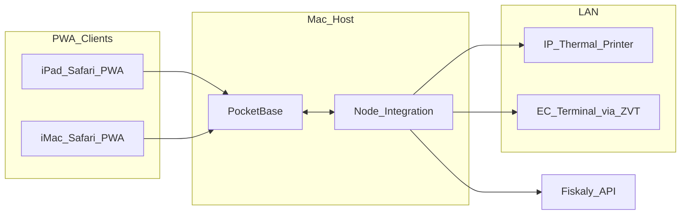

# PROJECT_MEMORY — Oliver Roos POS (Central Reference)

*Language: German/English (professional). Last audit: 2026-05-01.*

## Canonical step index (1–50 — narrative compaction)

Stages **1–28** (foundations — schema, invoicing primitives, GDPR hooks, pairing, agendas, salon catalog where not duplicated above) remain **frozen in Drizzle migrations and `audit:absolute`**; treat them as prerequisites for Steps **29+** enumerated in detail below. Steps **29–37/37.5** cover operational core; **38–42** administration & compliance tooling; **43–44** desktop & hardware bridges; **45–46** design & agenda DnD; **47–47.1** Client 360 elite; **48** Cockpit; **49–50** redundancy + go-live shields.

---

## State of the Union (Steps 29–50 overview)

Design and implementation of the operational, fiscal, and CRM core through **Blind Kassensturz (Step 37)** and **Step 37.5 (inventory checkout + Rezeptur)** are **code-consistent and covered by targeted automated checks** (`npm run audit:sweep`, `npm run smoke:step375`). Full end-to-end runs on a paired device in production are the **operator’s sign-off** before go-live.

| Area | Status |
|------|--------|
| Schedule grid (15 min, Reinigungspuffer, Europe/Berlin) | **Verified** — matches backend `SANITIZATION_BUFFER_MS` and `appointmentsOverlapWithBuffer`. |
| Sunday + BW public holidays (e.g. Neujahr) | **Verified** — `getStaffAvailability` + **server-side** `calendar_day_closed` on `POST/PATCH /api/appointments` (since audit hardening). |
| GoBD soft delete (appointments), price override, audit | **Verified** in code — `DELETE /api/appointments/:id` → `deleted_at` + `appointment_soft_delete` with mandatory reason. |
| Blind Tagesabschluss | **Verified** — `expectedCashCents` is only fetched in `revealExpectedAndGoReview` after blind count; not shown in Phase COUNTING. |
| Inventory usage at checkout | **Implemented (37.5)** — cart sends `inventoryItemId` + `deductMl`; Färbung → demo stock link in `demoSeed`. |
| Rezeptur (client formulas) | **Implemented (37.5)** — `MirrorView` + `/api/clients/:id/formulas`. |
| SSE + Agenda re-fetch | **Verified** — `globalRefreshCounter` triggers staff + availability reload; **`AgendaGrid` restores scroll** (`scrollLeft`/`scrollTop` + `sessionStorage` keyed by `dateYmd`). |
| **Step 38 — Chef-Ansicht + Admin RBAC** | **Completed & verified** — `GET /api/reports/chef-briefing` + `requireAdmin`; UI `/admin`; stylists redirected via `RequireSalonManagement`. |
| **Step 39 — Wareneingang & Barcode** | **Completed & verified** — `POST /api/inventory/restock` (audit `restock`), `GET /api/inventory/items?barcode=`, global `useBarcodeScanner`, `/admin/wareneingang`, German UI. |
| **Step 40 — Steuerberater-Export** | **Implemented** — `GET /api/finance/export/kassenbuch?month=YYYY-MM` (single calendar month, semicolon CSV, German decimals); Chef-Dashboard download; audit `export_downloaded`. |
| **Step 41 — Datenschutz & Backup** | **Implemented** — `POST /api/clients/:id/anonymize` (`requireAdmin`, audit `CLIENT_ANONYMIZED`); `GET /api/system/backup/sqlite` (WAL-`backup()` snapshot); Chef-Dashboard **Lokales Backup herunterladen**; audit `sqlite_backup_downloaded`. |
| **Step 42 — Systemkonfiguration** | **Implemented** — Admin APIs for staff (`POST/PATCH /api/admin/staff`) and catalog (`POST/PATCH /api/admin/catalog/services`), feature toggles (`GET/PATCH /api/admin/settings/features`); UI `/admin/settings` (tabs Team / Leistungen / System · **Externes Backup** seit Step&nbsp;49); Spiegel **Kundendaten anonymisieren**; `catalog_active` soft-hide for services. |
| **Step 43 — Tauri 2 Desktop Shell** | **Initialized** — `src-tauri/` wraps the existing Vite frontend (`beforeDevCommand` / `beforeBuildCommand` on the workspace). Identifier `com.oliverroos.pos`; default window **1280×800**, **maximized**; CSP `connect-src` allows `http(s)://localhost` and `127.0.0.1` for API + SSE; **`tauri-plugin-dialog`** + capability `dialog:default` for native save/open dialogs. Root scripts: `npm run desktop:dev`, `npm run desktop:build`. Production Vite build sets **`VITE_API_BASE=http://127.0.0.1:3000`** in `beforeBuildCommand` so axios/SSE hit the Express API (dev still uses Vite proxy on port 5173). `vite.config.ts` uses **`base: "./"`** for packaged assets. Frontend helper: `frontend/src/lib/deviceContext.ts` (`isTauriShell()` vs browser). |
| **Step 44 — Hardware Bridge** | **Implemented** — Frontend backup action uses Tauri native save dialog + filesystem write when `isTauriShell()` (`@tauri-apps/plugin-dialog`, `@tauri-apps/plugin-fs`), with browser download fallback retained. New backend hardware endpoints: `POST /api/hardware/zvt/pay` (terminal authorization/proof for checkout), `POST /api/hardware/print/invoice/:id` (explicit receipt print trigger + LAN TSE probe), `POST /api/hardware/print/daily-close/:id` (Z-report print queue trigger). Checkout success now exposes **Beleg drucken** (no `window.print` dependency). |
| **Step 49 — External Fortress** | **Implemented** — external USB/HDD sync + scheduled hooks; **`sqlite-maintain`** may follow each successful fortress write only **`vacuumIfDue`** per interval (Step 50 cadence); see Step 49 section. |
| **Step 50 — Readiness Suite** | **Implemented** — `GET /api/admin/diagnostics/preflight` (integrity, LAN TSE TCP, optional ZVT TCP via env, fortress path `{accessSync}`, fiscal tail, HW queue counts); **`GET/POST /api/admin/system/sqlite-maintain/meta|…`** (`VACUUM` cadence default **10 days** via migration **`0030_sqlite_maintenance_settings`**, `ANALYZE`/`PRAGMA optimize` on demand); **`GET /api/admin/system/debug-bundle`** (audit + orphans + HW failure tails; optional **`?enc=1`** AES-GCM+gzip wenn `OLIVER_ROOS_SUPPORT_SECRET` ≥ 24 chars); UI **`AdminDiagnostics.tsx`** (`/admin/diagnostics`), **`HelpHandbuch.tsx`** (`/handbuch`). |

---

## Management tier (Steps 38–42)

- **RBAC (38):** `staff.role` in DB; JWT carries role. `isSalonManagementRole` in `sessionAuth.ts`; middleware `requireAdmin` in `middleware/auth.ts`.
- **Briefing API:** Aggregates today’s closed invoices (Berlin day), appointments, COGS estimate from `usage_session` × `reference_net_per_ml`, low stock via `listMonitoredItemsAtOrBelowThreshold`. Loaded **on screen open** only — not tied to SSE.
- **Frontend:** `AdminDashboard.tsx`, route `/admin`, `RequireSalonManagement` redirects stylists to `/`.
- **Wareneingang (39):** Restock pipeline + barcode listener; link **Wareneingang** on Chef dashboard.
- **Kassenbuch CSV (40):** DATEV-friendly delimiter (`;`), euro formatting with comma decimals; export restricted to **one month per request** (Europe/Berlin month boundaries); download logged in `audit_logs`.
- **DSGVO / Resilience (41):** see **Security & GDPR** below.
- **Systemkonfiguration (42):** Owner/admin manage staff (no hard-delete), service catalog prices/VAT/visibility, and whitelisted `system_settings` flags — all audited.

---

## Security & GDPR (Step 41)

- **Right to erasure vs. GoBD:** Hard-deleting clients would break fiscal retention. **Anonymization** (`POST /api/clients/:id/anonymize` and aligned `DELETE /api/clients/:id`): sets display name to **Anonymisiert**, clears PII (`phone`, `email`, `preferences`, Client-360 ops fields), removes **Rezeptur** (`client_formulas`) and **client_notes** rows; sets `anonymizedAt`; **sessions / invoices** stay linked by stable `client_id` with **unchanged Beleg-IDs**; **appointments** keep rows for history but **`client_name` → Anonymisiert / `client_phone` → null** so search and UI cannot re-identify the person from the raster.
- **Audit:** `CLIENT_ANONYMIZED` with optional JSON body `{ "reason": "…" }` (defaults to a standard Art. 17 German rationale).
- **Backup:** `GET /api/system/backup/sqlite` streams a **consistent SQLite snapshot** via better-sqlite3 `backup()` (works with WAL). Filename `salon_backup_YYYY_MM_DD.sqlite` (Europe/Berlin date). UI: **System & Sicherheit** on Chef dashboard.

---

## Operational Protocols

### Scheduling
- **Slots:** 15 minutes; vertical scale shared with `SLOT_COUNT` in `agendaGridUtils.ts`.
- **Reinigungspuffer:** 15 minutes after each appointment end (`SANITIZATION_BUFFER_MS` = 15 min). Conflicts use `appointmentsOverlapWithBuffer` in `checkAppointmentConflict` and in overlap counting for new bookings.
- **Timezone:** **Europe/Berlin** for calendar days (`berlinYmdFromMs`, `getStaffAvailability`, grid labels).
- **Hierarchy:** `calendarExceptions` (closed / `open_override`) → BW public holidays (`holidayService`) → Sunday (`Sonntagsruhe`) → `staffWeeklySchedules`.

### Finance
- **Mixed payments:** `CheckoutModal` + `runSessionCheckoutPipeline` (cash, card, voucher splits).
- **ZVT limbo / pending TSE:** fiscal state `pending` on partial success; storno and orphan flows documented in API (`/api/.../storno`, orphan queue).
- **Blind Kassensturz:** `GET /api/finance/daily-close-expected` only after user confirms counted cash; `POST /api/finance/daily-close` with `actualCashCents` + optional `differenceReason`.

### GoBD / CRM
- **Appointments:** soft delete only; `deleted_at` set, row retained; audit with reason.
- **Invoices / catalog:** `priceOverrideReason` when line net or VAT deviates from `salon_service_catalog` reference.
- **Audit trail:** `audit_logs` / `createAuditLog` for material changes; immutable where required by project rules.

---

## Hardware Abstraction
- **Network TSE (LAN):** `printerTseProvider` / `escposTse` — `sendBufferOverLan(host, port, ...)`; integration level depends on on-site device (see `tseProvider.ts` stress hooks).
- **ZVT (TCP / terminal):** `modules/hardware/zvt` — Orphan pool + `insertOrphanFromZvtSuccess`; real terminal binding via environment / settings.
- **Print:** text / receipt path tied to TSE and checkout flow; not a generic OS print spooler abstraction.

---

## Design Language & UI Protocol

### Primary Palette (strict)
- **Matte Onyx Black:** `#1A1A1A`
- **Crisp Canvas White:** `#FAFAFA`

### Accents (strict)
- **Oak Wood / Amber:** `#A0522D`
- **Brushed Chrome:** `#E0E0E0`

### Typography (strict)
- **Headings / Bold:** `Montserrat`
- **Body / Regular:** `Open Sans`

### Directives (mandatory — see **CENTRAL_MEMORY.md** for luxury-shell nuance)
- **Warm Minimalism 2.0 floor** (Kassen, Inventur, many admin surfaces): sharp edges, token discipline.
- **Post-login “luxury” shell** (Dashboard chrome, `MotionModal`, `LuxurySelectMenu` panels): may use controlled **`rounded-2xl`**, glass, and motion for readability — **without palette drift** (see **CENTRAL_MEMORY.md**).
- High negative space across layouts and component groups.
- All interactive elements must be at least `min-h-[48px]`.
- Every future UI component or style change must be validated against this protocol. No exceptions to fiscal or token semantics.

### Step 45.1 — Theme Engine (Warm Minimalism 2.0, **implemented**)

Technical foundation only — **no page-layout redesign** in this step beyond global defaults:

- **`frontend/tailwind.config.js`** — Canonical Tailwind colors: **`matte-black`** (`#1A1A1A`), **`canvas-white`** (`#FAFAFA`), **`oak-wood`** (`#A0522D`), **`brushed-chrome`** (`#E0E0E0`). Legacy aliases **`onyx` / `canvas` / `oak` / `chrome`** map to the same hex values for incremental migration. **Default border radii** in `theme.extend.borderRadius` are **0** (sharp edges). **`minHeight.touch` / `minWidth.touch`** = `48px`.
- **Typography** — `fontFamily.sans`: **Open Sans** + **Roboto** fallback stack; `fontFamily.heading`: **Montserrat**. Google Fonts wired in **`frontend/index.html`**.
- **`frontend/src/index.css`** — Imports Tailwind via `@import "tailwindcss"` + `@config`. **Base document:** `bg-canvas-white` + `text-matte-black`; headings use `font-heading`. **Touch floor:** all **`button`** elements get `min-h-touch min-w-touch`; **`input`** (except checkbox/radio/range/file), **`select`**, **`textarea`** get `min-h-touch`. Route shells that need dark chrome (e.g. `DashboardLayout`) continue to override background/text with matte-black / canvas-white utilities.

### Step 45.2 — UI Surface Unification (Warm Minimalism 2.0, **100% complete** for targeted admin / ops surfaces)

Visual-only pass — **no functional logic or German copy changes**:

- **`DailyClosing.tsx`** — Full protocol tokens; blind-count fullscreen **`bg-matte-black`**; **numpad** keys **`min-h-[80px]`**, **`border-brushed-chrome`**, **`rounded-none`** (via theme); cash display strip **`bg-canvas-white`** / **`text-matte-black`** for maximum contrast; primary actions **`border-oak-wood` + `bg-oak-wood`**; secondary / Abbrechen / Korrektur **`border-brushed-chrome`** ghost style.
- **`Inventur.tsx`** — Rebuilt from inline styles to Tailwind; **`bg-matte-black`** rows, **`min-h-[52px]`** row containers, primary **`oak-wood`** line submit.
- **`WareneingangView.tsx`** — **`stone` / `amber` / `emerald`** removed; scan rows **`min-h-[52px]`**; submit **`oak-wood`**; back link **`border-brushed-chrome`**.
- **`AdminDashboard.tsx`** — Briefing cards, export & backup blocks unified (**no `sky` / `emerald` / `amber` / `stone`**); primary downloads **`oak-wood`**; navigation matches touch + chrome borders.
- **`SettingsPage.tsx`** — Inline hex/CSS replaced by Tailwind + canonical tokens; **`oak-wood`** save actions; checkbox uses compact native control (`accent-oak-wood`, **`min-h-0`** overrides where needed).

### Step 46 — Intelligent Agenda DnD (**implemented**)

- **Library:** **`@dnd-kit/core`** (`DndContext`, `DragOverlay`, `PointerSensor`, `pointerWithin` collision detection, `useDraggable`, `useDroppable`).
- **`frontend/src/lib/agendaDnDValidation.ts`** — Frontend mirrors backend strictness: **`validateAgendaDrop`** uses **`layoutAppointmentInGrid`** (08:00–20:00 Berlin), staff availability window (`startTime`/`endTime`), and **`appointmentsOverlapWithBuffer`** (15 min Reinigung); **`agendaMoveRequiresReason`** aligns with backend GoBD rule (>30 min delta or **staff** change); **`formatAppointmentPutError`** maps API error codes to German operator messages.
- **`frontend/src/pages/AgendaGrid.tsx`** — Whole appointment card draggable with **long-press guard** (`PointerSensor` delay **300 ms**, tolerance 8 px) to reduce accidental drags while scrolling; optional short **haptic** pulse on drag start (where supported). Each free raster slot is droppable with **real-time ghost block** at target position: valid → oak glow, invalid → brushed-chrome + reason text (e.g. **Puffer-Konflikt**). **`DragOverlay`** ghost keeps Warm Minimalism (**~80% opacity**, **`border-matte-black`**, **`bg-canvas-white`**, sharp edges). Drop stays grid-aligned (15-min slot snap) and persists via **`PUT /api/appointments/:id`** (`startAt`, `endAt`, `staffId`, optional **`reason`**); modal collects reason when GoBD requires it; brief oak success flash + `onAppointmentsChange` refetch.
- **Race-condition hardening (optimistic preflight):** before `PUT`, frontend re-reads day appointments and compares `updatedAt` (with snapshot fallback: `staffId/startAt/endAt/status`). If stale, move is aborted with German message and the grid is refreshed instead of overwriting newer server state.
### Step 46.1 — Dynamic Engine Sync (**implemented**)

- **Runtime config binding:** new endpoint **`GET /api/system/runtime-config`** reads `system_settings.sanitization_buffer_minutes` (fallback 15) and returns both minutes + ms. `AgendaGrid` consumes it and updates DnD checks live (with SSE/pulse refresh fallback).
- **Conflict math vs visual snap:** drag/drop remains aligned to the 15-minute raster for visual consistency, while conflict detection uses **dynamic** `sanitizationBufferMs` in `validateAgendaDrop` (`appointmentsOverlapWithBuffer(..., bufferMs)`).
- **Self-explaining ghost reasons (German):** invalid ghost now reports exact cause during drag — **`Belegt`**, **`Reinigungspuffer`**, **`Außerhalb der Arbeitszeit`** (plus fallbacks for unavailable/outside grid).

### Step 47 — Client 360 (Zentrale Kundenakte, **implemented**)

- **Global slide-over architecture:** new `ClientProfile` panel (`frontend/src/pages/ClientProfile.tsx`) rendered at dashboard shell level and controlled by Zustand store `frontend/src/store/client360Store.ts` for cross-page contextual jumps.
- **Unified data hook:** `frontend/src/hooks/useClient360.ts` aggregates `/api/clients/:id/full-history`, `/api/staff`, recent `/api/appointments` (for reliability/timeline), and invoice→session lookups (`/api/sessions/:id`) into one 360 model (timeline, formulas, notes, spend, reliability/no-show flag).
- **Context entry points:** open Client 360 from (1) appointment card click in `AgendaGrid`, (2) client name in `MirrorView`, and (3) client search in `WalkInView`.
- **Privacy/GDPR:** panel includes double-confirm `Anonymisieren (DSGVO)` action; anonymized clients render as `Anonymisierter Kunde [ID]` while historical timeline/finance slices remain visible for compliance.
- **UX details:** Warm Minimalism tokens (`bg-matte-black`, `text-canvas-white`, `border-brushed-chrome`, oak primary actions) + `min-h-touch` controls across tabs; formulas include **`Als Vorlage verwenden`** action (clipboard + session template cache key when opened from mirror context).

### Step 47.1 — Client 360 Elite Ops & Owner Toggles (**implemented**)

- **Schema (`0027_client360_operations`):** `clients.patch_test_at`, `hospitality_*` (text), `session_handover_note` + `session_handover_updated_at`. Handover text is **cleared on first `full-history` read** after a **Europe/Berlin calendar-day change** (same pattern as a daily team scratchpad).
- **API:** `PATCH /api/clients/:id/ops-fields` updates the above (auth: logged-in staff; blocked when `anonymizedAt` set). `GET /api/clients/:id/full-history` adds **`openDebtCents`** (sum of open `client_debts`). **`GET /api/system/runtime-config`** now includes **`client360Features`** booleans driven by whitelisted `system_settings` keys (default **on**).
- **Admin UI:** `/admin/settings` → System tab lists toggles with German labels (`feature_client360_*`).
- **Client UI:** **`ClientProfile`**: allergen/patch banner if missing or **`> 183` days** (~6 months); **`Kundenmodus`** blur for finance blocks, timeline amounts, permanent notes (optional via settings); Bewirtungsfelder + **session handover** editor; loyalty **badge** (visits/spend/stamps heuristic); **`Kontostand`** stresses **oak-wood** when debt &gt; 0; anonymize confirm text references **GoBD / Belegkette**. Hook **`useSalonRuntimeConfig`** centralizes feature flags + buffer (reuse-friendly).
- **Hook fix:** CRM notes timeline uses **`noteText`** from API (`client_notes.note_text`), matching Drizzle.

### Step 48 — Business Cockpit & Staff Empowerment (**implemented**)

- **Trinkgeld (`Trinkgeld-Split`):** Bereits beim Checkout in **`invoices.tip_amount_cents`** + **`invoices.tip_staff_id`** (separates Trinkgelder vom Leistungsumsatz bei der Auswertung). Cockpit summiert **`total_amount_cents - tip`** als **`salonUmsatzBruttoCents`**; Trinkgelder eigenständig.
- **Provision (dynamisch):** `system_settings` **`commission_service_bps`** und **`commission_retail_bps`** (Migration **`0028_commission_settings`**, Standard 3000 / 1000 bps). **Netto-Provisionsbasis pro Rechnungszeile:** Zeilen ohne `inventoryItemId` ⇒ Leistungssatz · mit **`inventory_item_id`** ⇒ Retail-Satz (`runSessionCheckoutPipeline` legt Produkt-/Formelzeilen an). Provision wird dem **`sessions.staffId`** gutgeschrieben; Trinkgeld dem **`tip_staff_id`**.
- **APIs:**
  - **`GET /api/reports/business-cockpit?from=&to=`** (`YYYY-MM-DD`, Europe/Berlin-Filter wie Chef-Briefing) — **`requireOwner`** (**nur** `owner` / `super_admin`). Liefert Umsatz, MwSt 7/19 über Zeilen aggregiert, Teamtabelle (Umsatz o. TG, Provision, TG, Belegeanzahl), Lager-**Heatmap** (14-Tage-Verkauf ml nach `invoice_items.deduct_ml` × Menge vs. Schwelle/`daysCover`).
  - **`GET /api/reports/my-performance?from=&to=`** — jede eingeloggte Person (**nur** eigene Zahlen).
  - **`GET /api/reports/emergency-day-pdf?date=`** (`requireAdmin`) — **PDF** ( **`pdf-lib`**) Termine des Tags + Auszug letzte **`client_formulas`** pro Kundenkarte; Audit **`emergency_day_pdf_download`**.
- **UI:** `frontend/src/pages/AdminReports.tsx` (Cockpit, Warm Minimalism 2.0), `frontend/src/pages/StaffPerformance.tsx` („Meine Zahlen“ für alle); Chef-Dashboard Buttons **Geschäfts-Cockpit** (Inhaber) + **Tagesplan drucken (Notfall-PDF)**; Navigation **Meine Zahlen** + **Cockpit** wo passend (`isOwnerRole` / `staffRoles.ts`).
- **Chef-Briefing Wiederverwendung:** `invoiceBerlinYmd()` zentral unter **`invoiceBerlinDate.ts`**.

### Step 49 — Externes Backup &amp; „Fortress Sync“ (**implemented**)

- **Purpose:** Zweite, physisch getrennte Redundanz neben lokalem SQLite-Download (`GET /api/system/backup/sqlite`). Der Snapshot ist ein **Momentbild der laufenden DB** (`backup()`, WAL-sicher): bereits anonymisierte Kunden bleiben anonym; es erfolgt keine Wiederherstellung von PII aus der Datei.
- **Konfiguration (DB via `system_settings`):** Schlüssel `external_backup_path` (Pfad bis 8192 Zeichen), `external_backup_schedule` (`manual` \| `daily_after_close` \| `twice_daily`), sowie Telemetrie `external_backup_last_*` nach jedem Versuch — Migration **`0029_external_backup_defaults`**.
- **APIs (`requireAdmin` / Salon-Management gleichwie andere Admin-Routen):**
  - `GET /api/admin/settings/external-backup`
  - `PATCH /api/admin/settings/external-backup` (`backupPath`, `schedule`)
  - `POST /api/admin/settings/external-backup/sync-result` ({ `ok`, `detail` }) — Aktualisiert Telemetrie + ein Audit **`external_backup_sync_result`**.
- **Desktop (Tauri):** `frontend/src/lib/externalFortressBackup.ts` — HTTP-Snapshot wie der Chef-Download, dann `mkdir` + `writeFile` via `@tauri-apps/plugin-fs` + `join`; pro Lauf Unterordner `Fortress_<yyyy_MM_dd_HHmmss>` (Berlin) mit SQLite-Datei und **`BACKUP_MANIFEST.json`** (Hinweis auf Anonymisierung).
- **Automatik:** **`daily_after_close`** — noch während **`POST /api/finance/daily-close`** erfolgreich aussteht wird in **`useDailyClosing`** `await runFortressBackupAfterClosingIfEligible()` aufgerufen (Session bleibt authentisiert vor Auto-Logout). **`twice_daily`** — **`DashboardLayout`** Intervall (90 s) ruft **`fortressTwiceDailyTick()`** auf; Zuordnung je Kalendertag (Europe/Berlin) mit **`localStorage`**-Guards (**Morgen** 06–13 h, **Abend** 18–23 h).
- **UI:** Tab **Externes Backup** unter **`frontend/src/pages/AdminSettings.tsx`** (Warm-Minimalismus-Panel: `oak-wood` Status, deutsch). Hinweiskachel auf **`/settings`** (Link zur Systemkonfiguration). Browser: nur Erläuterung; Schreibzugriff extern nur Desktop.
- **Cadence‑Wartung (Step 50 Anknüpfung):** Nach jeder **erfolgreichen** Desktop‑Fortress-Schreibphase ruft **`externalFortressBackup.ts`** automatisch **`POST /api/admin/system/sqlite-maintain`** mit **`vacuumIfDue: true`** — **kein VACUUM** bei jedem Lauf; nur wenn Intervall laut `sqlite_maintenance_interval_days` erreicht (**Standard 10 Tage**, Migration **`0030_…`**).

Remaining app surfaces outside this step may still use legacy **`onyx` /** **`stone`** aliases until touched — migrate opportunistically.

---

### Step 50 — Master Readiness & Diagnostic Suite (**implemented**, pre-flight finale)

- **Diagnostics:** **`backend/src/routes/diagnosticsRoutes.ts`** registriert `registerDiagnosticsRoutes` aus **`api.ts`**. **`GET /api/admin/diagnostics/preflight`** — `PRAGMA integrity_check`, Fortress‑Pfad (`fs.accessSync` R+W wenn gesetzt), **TCP** zu **`TSE_PRINTER_HOST`** / Port (Drucker‑TSE‑Transport), optional **`OLIVER_ROOS_ZVT_PROBE_HOST`** / **`OLIVER_ROOS_ZVT_PROBE_PORT`**, Stub‑Lesung **`OLIVER_ROOS_ZVT_FORCE_FAIL`**, fiskaler Tail (letzte geschlossene Rechnung, Anzahl geschlossene Belege mit fehlender Signatur/`ausfall_failed`, **pending hardware_jobs**‑Zähler).
- **Wartungs‑Motor:** Schlüssel `sqlite_maintenance_interval_days`, `sqlite_last_vacuum_at_ms` — **`analyzeOnly`** läuft leicht (**`PRAGMA optimize`**, **`ANALYZE`**); **`forceVacuum`** für Inhaber‑Notfall; **`vacuumIfDue`** gekoppelt ans Fortress‑Intervall.
- **Handbuch / Hilfe:** React‑ **`HelpHandbuch`** Route **`/handbuch`** (eingeloggte Shell) — gleiche Inhalte wie der **schwebende Hilfe-Dialog** (siehe unten). Deep Links / Lesezeichen bleiben gültig.
- **Debug‑Brücke:** Export auditiert (**`debug_bundle_export`**); entschlüsselung Support‑Seite verlangt **`OLIVER_ROOS_SUPPORT_SECRET`** (SHA‑256 Schlüsselbildung, AES‑256‑GCM, IV+Tag+Roh‑Payload Reihenfolge im `.bin`).
- **UI‑Oberflächen:** **`/admin/diagnostics`** (Chef‑Navigation + Systemkonfiguration‑Header), deutsch, Warm Minimalism 2.0.

**Operational go-live:** siehe **`docs/E2E_GO_LIVE_CHECKLIST.md`** (Umgebungsvariablen, Migration, Desktop‑Build, Diagnose‑Run, Probe‑Workflow).

---

## UX Refinement — Help OS, Dropdowns, Termin-„Wann?“, Routing-Motion (2026-05)

**Ziel:** Weniger visuelles Rauschen, kritische **z-index / Opazität**-Fehler bei Custom-Dropdowns beheben, Handbuch **kontextnah** statt nur Sidebar-Navigation, Buchungsmaske **„Neuer Termin“** als zwei klare Blöcke lesbar machen, sanfte **Seitenwechsel**.

| Bereich | Implementierung |
|--------|------------------|
| **Globales Hilfe-System („Floating Handbuch“)** | **`Handbuch`** ist **nicht mehr** in der linken **`Dashboard`**-Sidebar. Stattdessen: **`?`**-Button in der **Topbar** (neben Sperre/Abmelden) → öffnet **`HelpHandbuchModal`** (`frontend/src/components/organisms/HelpHandbuchModal.tsx`) mit **`MotionModal`**. Inhalt: **`HelpBentoPanel`** (`…/organisms/HelpBentoPanel.tsx`) — **Bento-Grid** mit Themenkarten (Hover-Scale u. a. via Framer Motion), kein Textwand-Layout. Route **`/handbuch`** (`HelpHandbuch.tsx`) rendert dieselbe Komponente **`HelpBentoPanel`** für Bookmarks und direkte Links. |
| **LuxurySelectMenu — Dropdown-Bleed-Fix** | Listen-Panel **`DROPDOWN_PANEL_CLASS`** in **`frontend/src/components/ui/LuxurySelectMenu.tsx`**: u. a. **`z-[120]`**, **`bg-matte-black/95`**, **`backdrop-blur-3xl`**, **`border-white/10`**, **`shadow-2xl`** — blockiert Text dahinter (z. B. PIN-/Einstellungsmasken). Öffnen/Schließen mit **`AnimatePresence`** + **`motion.ul`** (dezentes Ein-/Ausblenden). **`LuxurySelectMenuCustomTrigger`** nutzt dieselbe Panel-Klasse. |
| **Neuer Termin — Datum/Uhrzeit gruppiert** | **`LuxuryDateTimeFields`** (`frontend/src/components/ui/LuxuryDateTimeFields.tsx`): zwei umschlossene Bereiche (**Datum** vs. **Uhrzeit**) mit z. B. **`bg-white/[0.05] rounded-2xl p-4`**, damit die Maske als **eine Frage „Wann?“** statt fünf lose Inputs wirkt. Verwendung u. a. in **`Bookings.tsx`**. |
| **Routing-Animation** | **`AnimatedOutlet`** (`frontend/src/components/layout/AnimatedOutlet.tsx`): **`Outlet`** in **`AnimatePresence`** / **`motion.div`**, key **`pathname`**, dezente Enter/Exit-Transitionen. **`Dashboard.tsx`** rendert **`<AnimatedOutlet />`** statt rohem **`Outlet`**; ungenutzter **`Outlet`-Import** entfernt. |

**Build-Check (Frontend):** `npm run build -w @oliver-roos/frontend` — nach diesen Änderungen erfolgreich (`tsc -b && vite build`).

**Offene UX-Abstimmung (optional):** Falls **`ClientProfile`** oder andere Overlays mit **`z-[120]`** kollidieren, Stapelreihenfolge gezielt nachjustieren. Links die nur **`/handbuch`** öffnen vs. modal-only — Produktentscheidung.

---

## Immediate Next Steps (Post go-live housekeeping)

Nach Erreichen von **Schritt 50** sind keine verpflichtenden Architekturfelder mehr offen. Optionale Produktarbeit (nicht blocker):

- Trends / Drill‑down in der Chef‑Ansicht, DATEV / DSFinV‑K wenn der Steuerberater es fordert.
- **„Stylist Creativity Insights“** (nach **mind. einer Arbeitswoche** echte Daten): auswertbare Differenz **Ist-Arbeitszeit / -intensität pro Service vs. `salon_service_catalog.durationMinutes`** (Team‑Dashboard, Datenschutz/Transparenz mit Personalrat klären) — Produkt‑Feinschliff ohne Fiskalkern anzufassen.
- Fortlaufende Design‑Migration (**`onyx`/`stone`** → **`matte-black`/`oak-wood`**), UX‑Feinschliff ohne Fiskal‑Semantik zu verändern.

---

## Desktop shell (Step 43)

Requires **Rust + Cargo** on the machine. From repo root (with backend API reachable, e.g. `npm run dev:backend` in another terminal):

```bash
npm run desktop:dev    # starts Vite workspace dev server, then Tauri window
npm run desktop:build  # production Vite build + Tauri app bundle
```

The packaged app expects the backend at **`http://127.0.0.1:3000`** (override by changing `beforeBuildCommand` in `src-tauri/tauri.conf.json` or introducing a shared env file if the API port changes).

---

## Automated Audit Commands (Backend)

```bash
cd backend
npm run audit:sweep     # buffer + Neujahr + Sunday weekday (stateless)
npm run smoke:step375   # DB + Färbung Lagerabzug + TSE test hook
npm run audit:absolute  # isolated DB: RBAC, scheduling, inventory races, TSE limbo, GDPR chaos, audit WAL burst
```

**`audit:absolute` (`backend/src/scripts/absolute_system_audit.ts`):** End-to-end HTTP stress suite on `data/absolute_system_audit.db`. Sonntag probes must use **Europe/Berlin wall clock** on a Sunday YMD (not “UTC probe + 10h”, which can slip to Montag). Puffer Konflikt-POST needs **`endAt` = catalog duration**, not an arbitrary 15‑Minuten-Fenster (otherwise `duration_mismatch`). Parallel Checkout-Rennen braucht **Zahlungsbetrag = Brutto der Positionen**, sonst `payment_sum_mismatch` für beide Requests.

---

## Integrity sweep notes (auditor)

1. **Availability / Sonntag / Feiertag:** `getStaffAvailability` blocks Sunday and public holidays without `open_override`. **API enforcement:** `berlinYmdFromMs` + `getStaffAvailability` before `validateSlot` on create/update.
2. **Puffer:** Overlap test proves a slot starting at **10:30** is blocked by an existing **10:00–10:30** service (buffer until 10:45).
3. **Soft delete:** `DELETE /api/appointments/:id` requires `reason`; sets `deleted_at`; writes `appointment_soft_delete` audit.
4. **Blind close:** `useDailyClosing` keeps `expectedCashCents` null until `revealExpectedAndGoReview` after blind entry.
5. **SSE:** Re-fetch is wired; **no explicit scroll retention** in `AgendaGrid` / `AgendaView`.

---

*This file is the single in-repo narrative for handover. Application UI copy remains German; code comments are English or German per existing modules.*


---

## Future & Expanded Architecture (Phase 2 & Beyond)

## 7. القواعد الهندسية وتجربة المستخدم (مطابقة الواقع المادي لـ Oliver Roos Frisuren)

الهدف: ترجمة الواقع المعقّد (عبوات Igora Royal و Kadus، جهاز **Sieder**/طرفية منفصلة، ورق إيصالات قديم مثل **PAPIER ENDE**) إلى **سير عمل رقمي أسرع من القلم**، بحيث يقبله الموظفون لأنه يقلّد عاداتهم لا يحاربها.

### 7.1 صندوق الخلطات (Formula Builder UI)

- **الواقع:** أرقام دقيقة على الرف (مثل 7-57، 12-19، 9/73) لعبوات Igora و Kadus؛ الكتابة اليدوية للأسماء تُنتج بيانات قذرة.
- **التأسيس:** واجهة iPad **بصرية** — تبويبان Igora / Kadus، **Grid** للألوان (لمسة واحدة تختار الشade)، ثم **Slider** للحجم بـ **ml** ولنسبة **Developer (Oxidant)** حسب ما تعتمده الصالون.
- **الأثر:** إدخال أسرع من الورق، توحيد المفردات في القاعدة، وبحث لاحق عند زيارة العميل التالية بضغطة.

### 7.2 المخزون الجزئي (Fractional Inventory — وحدة المليلتر)

- **الفخ:** أنظمة تخصم «عبوة = 1» تكسر واقع الصالون (استهلاك 30ml أو 45ml من عبوة 60ml).
- **التأسيس:** تخزين وحركة **الصبغة بـ ml كعدد صحيح** في القاعدة (انظر القسم 10.3 — تجنب Float). في Drizzle: ربط كل سطر خلطة بـ SKU + كمية مستهلكة ml. استلام عبوة جديدة = **+60** (وحدة ml). إن احتجتم دقة أدق من 1ml مستقبلاً، استخدموا **عُشر الميلي** كعدد صحيح (مثلاً 455 = 45.5ml) دون أرقام عشرية في SQLite.
- **الأثر:** جرد دقيق، تنبيهات طلب قبل النفاذ، تقارير استهلاك لكل عميل/جلسة.

### 7.3 نقطة بيع موحّدة وتكامل الدفع (Sieder / EC-Terminal / ZVT)

- **الواقع:** بطء وأخطاء من **إدخال المبلغ يدوياً** على جهاز البطاقة؛ فوضى أجهزة وكابلات في الاستقبال.
- **التأسيس:** **iMac** كلوحة كاشير **رئيسية** عند الاستقبال عند الحاجة؛ البنود تُنشأ/تُحدَّث من iPad (مثال إداري: خدمة «Damen T1» **60.00 €** شاملة/معزولة ضريبة **19%** — تُحدد بدقة في جدول الخدمات). عند «دفع شبكة» من أي واجهة مُصرَّح بها، **الخادم** يرسل المبلغ للـ **EC-Terminal** عبر **ZVT** (أو واجهة المزود) — **Zero Double-Entry** (لا إدخال يدوي للمبلغ على الطرفية).
- **الأثر:** تقليل أخطاء المبالغ، استقبال أنظف، وقت دفع أقصر.

### 7.3.1 الدفع السريع اللامركزي من الـ iPad (Quick Checkout) — متطلب تشغيلي حاسم

- **الهدف:** تمكين الموظف من **إنهاء الجلسة ودفع العميل من مكان العمل** دون التوجه إلى الـ iMac: اختيار **شبكة (EC-Terminal)** أو **نقد (Cash)**، ثم **طباعة الفاتورة** وإكمال الدورة بنفس اللحظة.
- **الحدود التقنية (مبدأ 10.4):** الـ iPad **لا** يتصل بالطرفية ولا بالطابعة مباشرة. الواجهة ترسل فقط **طلب API** إلى **الخادم المحلي على الـ Mac**. **الخادم وحده** يتكفّل بـ: تخاطب **ZVT**، التوقيع عبر **Fiskaly** عند النجاح، وإرسام أمر الطباعة إلى **طابعة الشبكة (IP)**.
- **تجربة الواجهة:** شاشة **دفع سريع خفيفة** على iPad (بدون لوحة تحكم المالك، بدون **Dashboard** المعمّق)؛ لوحة المالك/الكاشير التشغيلية الكاملة تبقى على **iMac**.
- **الحوكمة (RBAC):** يُحدَّد في `DECISIONS.md` من لديه صلاحية **إقفال فاتورة وتحصيل مبلغ** من iPad؛ أي إقفال يبقى **موثَّقاً** (موظف، وقت، جهاز).

### 7.4 الأمان التشغيلي (PIN بدل sticky notes)

- **الواقع:** كلمات مرور على ملصقات = ثغرة تنظيمية.
- **التأسيس:** **PIN 4 أرقام** لكل موظف؛ قفل تلقائي للـ iPad بعد ~60 ثانية خمول؛ كل خلطة/جلسة تُسند إلى **هوية الموظف** في السجل (audit-friendly).
- **الأثر:** أمان أعلى، تتبع أداء، UX أبسط من كلمات مرور طويلة.

### 7.5 KassenSichV، Fiskaly، وتحمّل الانقطاع (Offline tolerance)

- **الواقع:** الإيصال الحالي يحمل بيانات **TSE** (رقم تسلسلي، توقيع، QR) — خط أحمر قانوني.
- **محدّث (10.12 — TSE** **مختلط):** **إلى** **جانب** **Fiskaly (Cloud-TSE):** **دعم** **TSE-عتاد** **مدمج** **أو** **مرتبط** **بطابعة** **(Epson/Star** **وأمثالها)** **عبر** **أوامر** **امتداد** **ESC/POS** **—** **يسمح** **بتوقيع** **قانوني** **دون** **اعتماد** **السحاب** **(مع** **إبقاء** **Fiskaly** **كاحتياط/مزامنة/DSFinV-K** **حسب** **تشغيل** **الصالون** **+** **Steuerberater)**. **معالج** **الاكتشاف** **(Hardware** **Wizard** **—** **11.5/10.12)** **لتعيين** **الأولوية** **والرجوع** **(fallback)**.
- **التأسيس:** **الـ** **backend** **في** **`modules/fiscal`:** **محوّل** **توقيع** **—** **مسار** **A:** **Fiskaly** **API** **؛** **مسار** **B:** **TSE-عتاد** **عبر** **قناة** **الطابعة** **؛** **اختيار/ترتيب** **الأولوية** **و** **السجلات** **—** **10.12**.
- **سيناريو انقطاع الإنترنت أو تعطل TSE (تصميم مقترح):** الإبقاء على **Local-First**: الجلسات تستمر؛ عند الإقفال و**فشل** الاتصال بـ Fiskaly أو تعطل التوقيع، يجب أن تكون طبقة الـ backend قادرة على **إصدار إيصال ورقي فوري** يحمل نصاً واضحاً يفيد بتعطل نظام التوقيع — في الممارسة الألمانية غالباً ما يُشار إليه بـ **TSE-Ausfall** (أو صيغة يقرها المحاسب/المزود). بعد عودة الخدمة: **مزامنة السجلات** وتوقيع/إغلاق الحلقة في Fiskaly وفق السياسة المعتمدة.
- **طابور توقيع لاحق:** يبقى خياراً تقنياً **بعد** تأكيد الصيغة القانونية للإيصال أثناء العطل ونص التحذير المطبوع.
- **⚠️ بوابة امتثال إلزامية:** صياغة النص الألماني الدقيق، التوقيت، والأرشفة تُثبَّت مع **محاسب KassenSichV / Fiskaly** — سجل القرار في `DECISIONS.md` ولا تُغلق الـ MVP بدون اختبار طباعة سيناريو Ausfall.
- **DSFinV-K:** التصدير الضريبي الإلزامي للسلطة/المحاسب مُعرَّف في **10.10**؛ يجب أن تُسجَّل كل فاتورة (بما فيها مسار **TSE-Ausfall** بعد المزامنة) بشكل يتوافق مع متطلبات التصدير النهائي.

### 7.6 مخرجات نموذج البيانات (اتجاه قاعدة المشروع — Drizzle / قسم 12)

- **منتجات الاستهلاك:** SKU، العلامة (Igora/Kadus)، رمز اللون، حجم العبوة الافتراضي ml، عتبة تنبيه.
- **سطر خلطة:** مرجع لون + ml + نسبة developer (إن وُجدت).
- **جلسة:** عميل، موظف (PIN/user)، بنود خدمات، مرفقات خلطة، حالة (مفتوحة/مغلقة).
- **فاتورة:** بنود، ضرائب، وسيلة دفع، حالة TSE (مُوقَّعة / في الطابور / فشل / Ausfall ثم مُزامَنة) **،** **مصدر** **التوقيع** **(Hardware** **مقابل** **Cloud** **Fiskaly** **—** **10.12)** **،** **رقم/سلسلة** **TSE** **على** **الإيصال** **/ في** **سجل** **قاعدة** **البيانات** **،** مرجع أرشيف، **حقول/علاقات كافية لاحقاً لـ DSFinV-K** (انظر **10.10**).

### توثيق الذاكرة المركزية (عند التنفيذ، وليس في وضع التخطيط)

محتوى الأقسام **§2** و**7–12** (بما فيها **7.3.1**، **10.9–10.10**، **11**، **12 Init**) يُدمَج في [`/Users/baselos/Desktop/Oliver_Roos_Frisuren/PROJECT_MEMORY.md`](/Users/baselos/Desktop/Oliver_Roos_Frisuren/PROJECT_MEMORY.md) كنسخة مراجَعة واحدة (Git/نسخ ولصق منظم). **لا يُنفَّذ** في وضع التخطيط أمر `cat >>` المتكرر؛ ذلك يسبب تضخيماً بلا رقابة ويصعّب المقارنة بين الإصدارات.

**ملاحظة لمرحلة التنفيذ:** انسخ إلى `PROJECT_MEMORY.md`: أقسام **§2**، **7.3.1**، **7.5** (TSE) **،** **10.10**، **10.11** **،** **10.12** **(TSE** **مختلط)؛** **11.3–11.5** (مع** **Hardware** **Wizard)؛** **12.0** **،** **12.1–12.4** **،** **12.6** **،** **12.5** **1–71** **،** **§13** **،** **بذور** (Glynt / Londa / PINs) عند التوفر.

## 8. التأسيس المتقدم والتحكم الشامل (Smart ERP + CRM — دون فقدان الواقعية)

ننتقل هنا من «تطبيق كاشير ومستودع» إلى **نظام تخطيط موارد ذكي (Smart ERP) ومحرك علاقات عملاء (CRM)**: يعمل بذكاء نيابة عن المالك — **أرباح صافية حقيقية** (ليس حجم مبيعات فقط)، **ولاء أعلى للزبائن** عبر تجربة مُحفَظة في البروفايل، و**حماية بيانات قوية** تحت ضغط GDPR والسرقة المادية للأجهزة.

الانتقال من «كاشير + مخزون» إلى **محرك علاقات وقرار** يتطلب **تقسيم صريح لمراحل التنفيذ**: نواة التشغيل اليومي (القسم 7) أولاً، ثم طبقة **360° / COGS / GDPR / تنبيهات** كـ **Phase-2 منظّمة** حتى لا ينهار المشروع تحت نطاق غير مُختبر.

**قائمة مراجعة للذاكرة المركزية (مرادف لمحتوى القسم 8 في `PROJECT_MEMORY.md`):**

- **Customer 360°:** صور Before/After **محلية**؛ تفضيلات دقيقة (مشروب، حساسية، مصفف، أسلوب الجلسة)؛ Timeline تفاعلي لكل زيارة.
- **Profitability:** COGS تلقائي من استهلاك ml + **هامش الجلسة**؛ أهداف موظفين وعمولات وفق قواعد مالك مكتوبة.
- **Privacy & GDPR:** تشفير-at-rest بواقعية (FileVault كحد أدنى + خيارات أعمق)؛ **إخفاء هوية** العميل مع الاحتفاظ بسجلات مالية صالحة — **بعد مراجعة قانونية**.
- **Smart Operations:** تنبيهات إعادة حجز مرتبطة بدورة الخدمة؛ **Dead Stock** لSKU بلا استهلاك منذ N يوماً.

### 8.1 Customer 360° (البروفايل الشامل)

- **معرض Before/After:** التقاط من كاميرا iPad، رفع الحقول إلى **الخادم المحلي على الـ Mac** (مجلد مرفقات + سجلات في القاعدة)، **بدون سحابة عامة** للصور؛ الوصول عبر تطبيقكم على LAN مع مصادقة.
- **Micro-Preferences:** مشروب، حساسية فروة، مصفف مفضل، تفضيل حديث/هدوء — حقول قابلة للتوسعة كـ JSON أو جدول تفضيلات مرتبط بالعميل.
- **Interactive Timeline:** كل زيارة = تاريخ، موظف، خدمات، خلطة (مراجع)، صور، دفع صافٍ؛ واجهة «قصة» للموظف أمام العميل.

### 8.2 الربحية الحقيقية والتحكم الإداري (COGS + أداء الموظفين)

- **COGS لكل جلسة:** عند خصم ml من صبغة، يُحسب **تكلفة الوحدة** من سجل المنتج (سعر شراء لكل ml أو لكل عبوة ÷ حجم العبوة). مجموع تكلفة المواد للجلسة يُقارن بإيراد البنود → **هامش الجلسة** (وليس مجرد 80 € على الإيصال).
- **سياسة التكلفة:** تحديد نموذج (متوسط متحرك عند كل استلام، أو دفعة ثابتة حتى تغيير السعر) وتسجيله في `DECISIONS.md`.
- **العمولات وTargets:** أهداف يومية/شهرية لكل موظف على iPad؛ عمولة قابلة للربط بفئة الخدمة أو بنسبة من الصافي — **يحتاج قواعد عمل واضحة** من المالك لتجنب النزاعات.

### 8.3 الخصوصية والامتثال (GDPR + أمان مادي)

- **Encryption at Rest:** طبقة PocketBase/SQLite الافتراضية **لا تعني تلقائياً** «قاعدة مشفرة بالكامل». الخيارات العملية: **FileVault على macOS** كحد أدنى قوي لسرقة القرص؛ أو بناء/إدماج **SQLCipher** (تعقيد أعلى)؛ أو تشفير **حقول حساسة** (مثلاً ملاحظات طبية) في التطبيق. اختيار الطبقة يُسجَّل ويُربَط بإجراء النسخ الاحتياطي (مفتاح الاستعادة).
- **Right to be Forgotten + إخفاء الهوية:** زر «حذف بيانات شخصية» يزيل الاسم/الهاتف/الصور/التفضيلات ويستبدل المرجع بمعرف مجهول؛ **الإبقاء على بيانات فاتورة مجمّعة** للامتثال الضريبي يخضع لـ **GoBD والمحاسبة** — **مراجعة قانونية إلزامية** قبل تصميم السلوك النهائي (ما يُحذف حرفياً وما يُستبدل).

### 8.4 العمليات الاستباقية (Proactive Workflow)

- **Re-booking Triggers:** بعد الخدمة، اقتراح تاريخ تالي (مثلاً صبغ جذور كل 4 أسابيع) — قاعدة قابلة للضبط لكل **نوع خدمة** (يرتبط بالقسم 9).
- **Dead Stock Radar:** تقرير دوري لـ SKU لم يُستهلك ml منه خلال N يوماً — يدعم قرار الشراء ويقلل الركود.

### 8.5 نطاق المراحل (MVP مقابل التوسع)

- **MVP (إلزامي للاستقرار):** الجلسات، الخلطات بالـ ml، الكاشير، ZVT، Fiskaly، PIN، Timeline بسيط، COGS **أساسي** إن أمكن بسعر ثابت لكل ml.
- **Phase-2:** صور Before/After كاملة، تفضيلات غنية، عمولات معقدة، تنبيهات إعادة حجز متعددة القواعد، تقارير ركود متقدمة، لوحات مالك أسبوعية.

## 9. أنواع الخدمات وتصنيفها (أساس جداول DB — Drizzle)

**نعم — هذه هي الخطوة العملية المنطقية التالية** بعد تثبيت الأقسام 7–12: بناء **هيكل تصنيف** (وملف JSON 9.4) قبل ملء الأسعار الفعلية، حتى تبقى القاعدة جاهزة لاستيراد البيانات لاحقاً.

### 9.1 مستوى التصنيف (مثال ألماني/صالون نموذجي)

- **Schnitt / قص:** Damen، Herren، Kinder؛ درجات طول/تعقيد اختيارية (مثل T1، T2 إن كان هذا معتمداً عندكم).
- **Färbung / صبغ:** Ansatz، Komplett، Strähnen، Tönung، Bleaching (مع ربط منطقي بدورة إعادة الحجز في 8.4).
- **Pflege / معالجة:** Kúr، Intensivpflege، Kopfhaut (يرتبط بحقل حساسية في 8.1).
- **Styling:** Glätten، Hochsteck، Finish.
- **Retail:** منتجات للبيع من الرف (ضريبة/هامش قد تختلف عن الخدمة).

### 9.2 Collections مقترحة في PocketBase (مسودة علاقات)

- `**service_categories`:** اسم، ترتيب عرض، نوع (service vs retail)، قاعدة إعادة حجز افتراضية بالأيام (اختياري).
- `**services`:** مرجع فئة، اسم عرض، `**price_*_minor`** (سنتات يورو كـ integer، مثلاً 60.50€ → `6050`) + `**tax_rate_bps**` أو نسبة مخزنة كعدد صحيح (1900 = 19.00%)، مدة تقديرية، SKU داخلي، **تكلفة تقديرية بالسنت/ml** لاحقاً لـ COGS — انظر القسم 10.3.
- `**service_staff_defaults` (اختياري):** من يقدّم أي فئة افتراضياً للتقارير.
- **ربط الجلسة:** `session_line_items` → `services` + موظف + أي خصم؛ خلطة مرتبطة بسطر صبغ أو بالجلسة حسب نموذجكم.

### 9.3 مخرجات الجلسة القادمة (ورشة 45–60 دقيقة)

1. اعتماد قائمة الفئات أعلاه أو تعديلها بمصطلحات Oliver Roos الفعلية.
2. قرار: هل السعر **Brutto معروض** للعميل دائماً أم **Netto + ضريبة** في الخلفية (يتوافق مع إعدادات الفاتورة الألمانية).
3. إدخال **5–10 خدمات placeholder** لكل فئة رئيسية لاختبار الـ UI قبل لصق الأسعار الحقيقية.

### 9.4 ملف JSON هيكلي لتصنيف الخدمات (بذرة للورشة المصغّرة)

يُستخدم كـ **عقد ثابت** بين الإدارة والمطور قبل ملء القاعدة؛ يطبّق قاعدة **السنتات** (القسم 10.3). مثال مُختصر:

```json
{
  "salon": "Oliver_Roos_Frisuren",
  "currency": "EUR",
  "categories": [
    {
      "slug": "schnitt_damen",
      "name_de": "Schnitt Damen",
      "rebook_days_default": null,
      "services": [
        {
          "slug": "damen_t1",
          "name_de": "Damen T1",
          "duration_min": 45,
          "price_cents": 6050,
          "tax_rate_bps": 1900
        }
      ]
    },
    {
      "slug": "faerbung",
      "name_de": "Färbung",
      "rebook_days_default": 28,
      "services": []
    }
  ]
}
```

`tax_rate_bps` = نسبة مئوية × 100 (1900 ⟹ 19.00%). يمكن توليد هذا الملف من جدول Excel لاحقاً بسكربت استيراد واحد.

## 10. تشذيب المخاطر — هندسة عكسية للتعقيد (Risk Reverse-Engineering)

الهدف: **تقليل الجهد، رفع البساطة، ثبات لسنوات دون صيانة معقدة.** الأنظمة تتعقّد عندما تُضاف طبقات يمكن تأجيلها.

### 10.1 واجهة العميل: قشرة Tauri / Electron (عابرة للأنظمة) + PWA اختياري

- **المخاطرة:** **سابقاً** **انحصرت** **الخطة** **في** **PWA** **فقط** **—** **يُحدَّث** **السريان** **ليلائم** **§10.11:** **بناء** **تطبيق** **سطح** **مكتب** **من** **اليوم** **الأول** **عبر** **Tauri 2** **أو** **Electron** **(حسم** **في** **`DECISIONS.md` —** **حجم** **الحزمة،** **Rust** **(Tauri)** **مقابل** **Node** **المضمّن** **(Electron)،** **متطلبات** **USB/شبكة)** **مع** **واجهة** **React** **داخل** **`Webview`**. **مسار** **CI** **يُنتج** **macOS** **/** **Windows** **/** **Linux** **من** **نفس** **الشفرة** **(تكوين** **`tauri build` / `electron-builder`)**. **ممنوع** **في** **منطق** **الأعمال** **(جلسات،** **فواتير،** **TSE،** **مخزون)** **استدعاء** **APIs** **خاصة** **بنظام** **تشغيل** **واحد** **—** **الوصول** **للملفات/الإشعارات/الطرفيات** **عبر** **واجهات** **القشرة** **الرسمية** **فقط** **(طبقة** **رفيعة** **قابلة** **للاستبدال)**.
- **PWA / Safari (لا** **يزال** **مدعوماً):** **عميل** **إضافي** **للآيباد** **أو** **أي** **متصفح** **على** **LAN** **—** **نفس** **REST/WebSocket** **للخادم** **؛** **مفيد** **للتجارب** **السريعة** **دون** **تثبيت** **قشرة**.
- **النتيجة:** **منطق** **React** **واحد** **؛** **قابلية** **بيع/نشر** **على** **ثلاث** **منصات** **دون** **تفرع** **شفرة** **الصالون** **؛** **يُكمّل** **§12.0** **(Feature** **Toggles)**.

### 10.2 عتاد شبكي للطباعة (وتبسيط الصيانة)

- **المخاطرة:** طابعة USB على macOS وتعريفات تتأثر بالتحديثات.
- **التأسيس:** **طابعة حرارية بمنفذ Ethernet** على نفس LAN؛ الخادم يطبع عبر IP (مثلاً `192.168.x.x`) ومكتبة ESC/POS من طبقة الـ backend. **عند** **دعم** **TSE-عتاد** **داخل/مع** **الطابعة** **(10.12) —** **نفس** **قناة** **IP/ESC/POS** **لإصدار** **أوامر** **الامتداد** **اللازمة** **للتوقيع** **(مواصفة** **المزود+الطابعة+Steuerberater)**.
- **ملاحظة:** طرفية EC غالباً ما تبقى مرتبطة بجهاز الكاشير (USB/Bluetooth/شبكة حسب المزود)؛ المهم أن **منطق ZVT لا يعيش في React** (انظر 10.4) وليس بالضرورة أن كل طرفية «شبكية» بنفس معنى الطابعة.

### 10.3 أموال ومخزون: Integers فقط (لا Float في SQLite)

- **المخاطرة:** أخطاء `44.999999` في المخزون والمحاسبة.
- **التأسيس:** المبالغ **بالسنت** (`6050` = 60.50€)؛ الـ ml **عدد صحيح**؛ إن لزمت كسور أصغر من 1ml، خزّن **عُشر الميلي** كعدد صحيح. العرض في الواجهة = القسمة على 100 أو 10 مع تنسيق locale.
- **النتيجة:** دقة مطابقة لمنطق البنوك وأنظمة الضريبة.

### 10.4 عزل ZVT و Fiskaly في الـ Backend فقط (مبدأ ثابت)

- **المخاطرة:** React يتصل بـ EC-Terminal أو Fiskaly مباشرة — تشتت عند تغيير العتاد أو القانون.
- **التأسيس:** الواجهة ترسل فقط «أغلق الجلسة X بهذه البنود»؛ **أي** تنفيذ لـ ZVT **أو** **Fiskaly** **أو** **TSE-عتاد** **(أوامر** **عبر** **ESC/POS** **—** **10.12)** **أو** **الطباعة** **الشبكية** **يبقى** **في** **طبقة** **خادم** (انظر **10.6** لاختيار عدد العمليات).
- **النتيجة:** تغيير الطرفية أو مزود TSE (عتاد/سحاب) يحدث في مكان واحد؛ الواجهات تبقى «غبية».

### 10.5 تجميد «مصنع التطبيقات» و multi-tenant في الكود الحالي

- **المخاطرة:** بناء multi-tenant أو CLI لتوليد تطبيقات قبل إثبات تشغيل صالون واحد.
- **التأسيس:** قاعدة المهندسين: **لا مصنع قبل سيارة واحدة تسير.** إعدادات Oliver Roos (Kadus/Igora، 19% افتراضي، أسماء الفئات) في **config ثابت أو seed** للصالون الواحد.
- **النتيجة:** إطلاق أسرع؛ بعد ~6 أشهر نجاح، استخراج **Template** للبيع بدل تصميم التفرّع من اليوم الأول.

### 10.6 طبقة الخادم: ثلاثة مسارات (حسم واحد قبل الكود)

المبدأ الثابت: **واجهة** **React** **(PWA** **و/أو** **Tauri/Electron** **—** **10.1/10.11)** **+** **SQLite** **محلي** **+** **عزل** **ZVT/Fiskaly/الطباعة** **عن** **طبقة** **العرض**. المتغيّر هو **عدد عمليات التشغيل** ومن يكتب تكامل الدفع.

- **A — PocketBase + Node جانبي:** PocketBase للبيانات والمستخدمين؛ عملية Node (Express خفيف مثلاً) لـ ZVT وFiskaly وESC-POS. **قوة:** CRUD سريع وواجهة PB؛ تكامل الدفع في Node الناضج. **مخاطرة:** **عمليتان** — يُفضّل `**docker compose`** لإقلاعهما معاً (انظر **10.9**) أو `pm2` على المضيف.
- **B — PocketBase + امتدادات Go:** Custom hooks أو routes داخل PocketBase للدفع والطباعة. **قوة:** **عملية واحدة** (ثنائي PB). **مخاطرة:** صيانة Go لـ ZVT/Fiskaly إن لم يكن الفريق قوياً في Go.
- **C — Backend Node موحّد:** Express أو NestJS + SQLite + Drizzle أو Prisma. **قوة:** **بيئة تشغيل واحدة**؛ لغة واحدة للـ API والتكامل. **مخاطرة:** إعادة ما يعطيه PocketBase جاهزاً (Auth، لوحة CRUD) — وقت أطول في MVP.

**التوصية المعمارية:** ورشة **45–60 دقيقة موحّدة** (قرار متخذ): الجزء الأول **حسم A أو B أو C** وتسجيله في `DECISIONS.md`؛ الجزء الثاني **مسودة جداول المنتجات/المخزون/حركة ml وCOGS** متوافقة مع المسار المختار — لتفادي إعادة رسم المخطط مرتين. لا كود تكامل دفع نهائي قبل إغلاق هذه الورشة.

**مرشح مخطط (مسار A — الأكثر شيوعاً عند التزامن السريع):**




### 10.7 شبكة الصالون: عناوين IP ثابتة (إلزامي تشغيلياً)

- **المشكلة:** إذا بقي الـ iMac (الخادم) والطابعة الشبكية على **DHCP عشوائي**، قد يتغيّر الـ IP بعد إعادة تشغيل الراوتر فيُقطع اتصال الـ iPad بالـ PWA و/t أو تفشل الطباعة.
- **التأسيس:** تعيين **Static IP** أو **DHCP reservation** (حجز MAC → IP) في الراوتر لـ: **جهاز الـ Mac المضيف** و**طابعة Ethernet** على الأقل.
- **التوثيق:** تسجيل العناوين وأسماء الأجهزة في `PROJECT_MEMORY.md` أو ملحق «شبكة الصالون» لأي صيانة مستقبلية.

### 10.8 تقسيم الوثائق (جمهوران مختلفان)

هذه الخطة **وثيقة معمارية (Architecture / PROJECT_MEMORY)** وليست ما يُقرأ للمالك كاملاً.

- **`EXECUTIVE_ONE_PAGER.md` (أو PDF):** صفحة واحدة — المشكلة، الحل (iPad → خادم Mac → دفع/امتثال)، العائد (وقت، هدر، أخطاء)، المراحل الزمنية للمشروع. **بدون** JSON ولا مخططات تقنية معمّقة.
- **`PROJECT_MEMORY.md`:** «الدستور» التقني — **§2** + الأقسام **7–12** (بما فيها **10.9**، **10.10**، **10.11** **xplat،** **10.12** **TSE** **مختلط،** **11**، **12**)، الـ Flowcharts، الصلاحيات، قرارات الـ backend، Ausfall، الشبكة، وهيكل الـ API/الجداول.

### 10.9 النقلية والحاويات (Portability — Docker Compose)

معايير معمارية لضمان **تنقل سلس** بين أجهزة وتقليل «التجمّع اليدوي» عند الاستبدال أو النسخ الاحتياطي الكامل.

1. **البيئة الحاضنة:** إدارة **محرك الـ backend** (وما يرافقه من خدمات ضمن المسار 10.6) عبر `**docker compose`** — تشغيل/إيقاف موحّد، نفس الإصدار على كل بيئة تطوير/إنتاج محلية.
2. **معمارية الصور:** بناء الصور بمنصة `**linux/amd64`** (مثلاً `docker buildx` مع `--platform linux/amd64`) ليتوافق **مع معالج Intel الحالي** ولتسهيل تشغيل مستقبلي على **Windows/خوادم x86** دون مفاجآت ARM.
3. **هيكلية `./data` وملف قاعدة واحد (حماية النقل + 10.11):** **عند** **نشر** **الخادم/Compose:** **قاعدة** **البيانات** **(الجدولية)** **على** **SQLite** **في** **`./data/salon.db`**. **عند** **تشغيل** **خادم** **الخلفية** **داخل** **Tauri/Electron** **(أو** **عملية** **منفصلة** **لكن** **نفس** **الثنائية):** **نفس** **الملف** **المنطقي** **لكن** **المسار** **على** **نظام** **الملفات** **=** **userData** **حسب** **10.11** **—** **لا** **تتعارض** **مع** **قاعدة** **ملف** **DB** **واحد** **للمنطق** **المحاسبي** **؛** **يُوثّق** **الفرق** **في** **`DECISIONS.md`**. **انتقال** **نشر** **Docker** **=** **نسخ** **المشروع** **+** **`./data/`**.
4. **المرفقات الثنائية (صور وغيرها):** إن اُختزنت خارج SQLite لأسباب حجم/أداء، يجب أن تبقى **تحت `./data/` فقط** (مثلاً `./data/media/`) ويُوثَّق المسار في `DECISIONS.md` — **دون** كسر قاعدة «كل المنطق المحاسبي والمخزون في `salon.db`».
5. **مسارات نسبية (Relative Paths):** الكود والإعدادات (ما عدا ما يفرضه Docker على أسماء الخدمات) تتعامل مع الملفات عبر **مسارات نسبية من جذر المشروع** أو متغيرات بيئة تقرأ من `**./data/...`**؛ ممنوع اعتماد مسارات مطلقة خاصة بجهاز (مثل `/Users/...`) في الشفرة المشتركة.
6. `**docker-compose.yml` مرجع التشغيل الوحيد:** عند النقل إلى **Windows** أو أي مضيف آخر، يبقى `**docker compose`** (من جذر المشروع حيث يقع `docker-compose.yml`) **الطريقة المعيارية** لبناء الصور وتشغيل الخدمات و**ربط حجم `./data/salon.db`** — دون سكربتات تشغيل متفرقة تصبح مصدر حقيقة ثانٍ.
7. **الربط الشبكي:** داخل الـ compose، الخدمات تتكلم بعضها عبر **أسماء خدمات DNS** (عناوين نسبية داخل الشبكة الداخلية للحاويات، مثل `http://integration:8080`) وليس بـ IP ثابت داخل الحاوية. أما **أجهزة التابلت (PWA)** فتتصل بـ **IP المضيف على LAN** (مع **Static IP / DHCP reservation** كما في **10.7**) + **منفذ/منافذ منشورة** (`ports`) من compose إلى المضيف. لا يُعرّف الـ PWA بعنوان داخلي خاص بالحاوية غير الموجه من المضيف.

**⚠️ تعقيد عتاد الدفع:** إذا كانت طرفية **EC متصلة بـ USB** بالـ Mac، قد لا تصل إليها حاوية معزولة بسهولة (اختلاف Docker Desktop macOS عن Linux). عند التنفيذ: إما تشغيل **طبقة ZVT على المضيف** مع بقاء بقية الـ stack في compose، أو استخدام شبكة/ربط يقره مزود الطرفية — يُسجَّل القرار في `DECISIONS.md` بعد اختبار فعلي.

**⚠️ PocketBase والمسار A:** الإعداد الافتراضي لـ PocketBase قد يستخدم **مجلد بيانات** وليس ملفاً واحداً. يلزم **ضبط صريح** لاستخدام `**./data/salon.db`** (أو التحقق من دعم PB لمسار ملف SQLite واحد) بحيث لا تُخالف قاعدة «ملف DB واحد للجدولية والمخزون»؛ وإلا فالمسار **C** (Node + ORM) قد يكون أوضح لالتزام `salon.db` حرفياً.

### 10.10 Backend والبنية التحتية — وحدة التصدير الضريبي (DSFinV-K Exportmodul)

**خط أحمر امتثال (KassenSichV):** يجب أن يضمن النظام إمكانية تسليم **تقرير ضريبي معتمد الهيكل** للمحاسب (**Steuerberater**) أو لمفتش الضرائب، وليس مجرد نسخ PDF عشوائية.

1. **الأساس التقني:** تنفيذ **وحدة التصدير DSFinV-K** داخل **طبقة الخادم Node.js** (ضمن مسار **10.6**، بجانب أو داخل middleware التكامل) بحيث تتخاطب **مباشرة مع Fiskaly API** (أو المسارات التي يوثّقها المزود) لتوليد **حزمة البيانات** بصيغة **DSFinV-K** المعتمدة في ألمانيا. لا تُنقل مسؤولية تجميع الحزمة إلى الواجهة (React).
2. **واجهة المالك (Admin Dashboard على iMac):** قسم إداري يحتوي على زر **«DSFinV-K Export»** يتيح للمالك اختيار **نطاق زمني** (شهر/سنة أو فترة مخصصة وفق واجهة آمنة)، ثم **تنزيل** الحزمة بصيغة عملية للتسليم (**ZIP** و/أو **CSV** حسب ما يدعمه الـ API والمعيار في إصدار Fiskaly المستخدم — يُثبَّت في `DECISIONS.md`).
3. **الأهمية المعمارية:** **كل فاتورة تُغلق** — بما في ذلك الفواتير الصادرة أثناء **TSE-Ausfall** وبعد **المزامنة** مع Fiskaly — يجب أن تُخزَّن وتُربَط في `**salon.db`** (والسجلات الملحقة) بطريقة **تتوافق مع هيكل التصدير DSFinV-K النهائي**. تصميم الجداول وحقول TSE والحالات (مُوقَّع / Ausfall / مُزامَن) يُراجع مبكراً مع وثائق Fiskaly DSFinV-K حتى لا تُعاد هجرة بيانات ضخمة لاحقاً.
4. **عزل الواجهة:** زر التصدير يستدعي **endpoint** على الـ backend فقط؛ الصلاحية **للمالك/الإدارة** (RBAC)، وليس لشاشة iPad السريعة.

### 10.11 البنية التحتية الأساسية (عابرة للأنظمة — OS Agnostic)

**يُلحق** **`PROJECT_MEMORY.md` و`DECISIONS.md`** **كعقد** **أعلى** **مع** **§10.1** **و§12.0**.

1. **إطار العميل (Shell):** **Tauri 2** **أو** **Electron** **—** **تهيئة** **صريحة** **لـ** **Cross-Platform Building** **(macOS،** **Windows،** **Linux)** **من** **اليوم** **الأول** **؛** **ممنوع** **الاعتماد** **على** **واجهات** **برمجة** **خاصة** **بـ** **macOS** **في** **المنطق** **الذي** **يُشترك** **بين** **المنصات** **(Kiosk/Guided** **Access** **يبقى** **خاصاً** **بـ** **iPad** **عند** **استخدام** **PWA** **—** **انظر** **11.6)**.

2. **المعمارية:** **Modular Monolith** **+** **Feature Toggles** **(§12.0)** **؛** **كل** **وحدة** **متقدمة** **(AI/IoT/BNPL/WhatsApp/Yield/…)** **مُهيأة** **في** **Drizzle** **ومعطّلة** **افتراضياً** **في** **UI** **و** **Cron/Jobs**.

3. **قاعدة البيانات:** **Local-First** **بـ** **SQLite** **+** **Drizzle ORM** **؛** **مسار** **`salon.db`** **يُستنتج** **بأمان** **حسب** **نظام** **الملفات** **للمضيف:** **تطبيق** **Tauri/Electron** **→** **مجلد** **بيانات** **التطبيق** **(Tauri** **`appDataDir`،** **Electron** **`app.getPath('userData')`)** **؛** **نشر** **عبر** **Docker/خادم** **→** **`DATABASE_URL` أو** **ربط** **حجم** **`./data/salon.db`** **(10.9)**. **ممنوع** **في** **الشفرة** **المشتركة** **سلاسل** **مطلقة** **مثل** **`/Users/...`** **أو** **`C:\...`** **—** **استخدم** **وحدة** **مساعدة** **`resolveDataDir()`** **(يُوثّق** **في** **`DECISIONS.md`)** **.

4. **تجريد العتاد:** **طابعات** **حرارية** **عبر** **بروتوكول** **OS-agnostic** **أولاً** **(شبكة** **LAN +** **IP +** **ESC/POS** **من** **الخادم،** **10.2)** **؛** **ماسحات/باركود** **HID** **قياسية** **(Bluetooth** **أو** **USB)** **دون** **تعريف** **OEM** **خاص** **بمنصة** **واحدة** **؛** **ZVT/EC** **و** **BLE** **للميزان** **(12.5.52)** **يمرّان** **بـ`modules/hardware`** **وما** **قد** **يستلزمانه** **من** **فحص** **منافذ/صلاحيات** **حسب** **OS** **دون** **كسر** **واجهة** **واحدة** **قابلة** **للاختبار** **على** **Win+macOS**.

### 10.12 TSE المختلط (Hardware داخل الطابعة + Cloud Fiskaly)

**يُلحق** **قسم** **«Fiscal** **/** **TSE»** **داخل** **`PROJECT_MEMORY.md`** **بهذا** **المحتوى** **؛** **الهدف:** **امتثال** **KassenSichV** **حتى** **في** **انقطاع** **إنترنت** **كامل** **عند** **استخدام** **TSE-عتاد** **صالح** **(مع** **Steuerberater** **لنطاق** **كل** **مزود/طراز).

1. **TSE-عتاد (Offline-First):** **دعم** **وحدات** **Hardware-TSE** **المدمجة** **أو** **المرتبطة** **بطابعة** **حرارية** **(أمثلة** **صناعية:** **Epson**، **Star** **Micronics** **—** **TSE** **على** **بطاقة** **SD** **أو** **USB** **حسب** **الطراز)**. **التواصل** **مع** **وحدة** **الأمان** **عبر** **قناة** **الطابعة** **المحلية** **(شبكة** **IP** **نحو** **نفس** **مضيف** **الخادم** **—** **10.2)** **باستخدام** **أوامر** **امتداد** **ESC/POS** **الخاصة** **بالمُصنّع/المزود** **(لا** **في** **React** **—** **فقط** **في** **`modules/fiscal` +`modules/hardware`)**. **راجع** **وثائق** **Epson/Star/BSI** **قبل** **الوعد** **بالتوافق** **مع** **كل** **طراز**.

2. **معالج الاكتشاف (Hardware** **Wizard):** **في** **Settings** **(§11.5) —** **تدفق** **«تعريف** **طابعة** **+** **TSE»** **يستطيع** **(أ)** **استعلام/مسح** **الطابعة** **الموصولة** **للكشف** **عن** **وحدة** **TSE** **؛** **(ب)** **إن** **وُجدت** **—** **عرض** **تعيين** **TSE-عتاد** **كأولوية** **للتوقيع** **؛** **(ج)** **خيار** **احتياطي: تفعيل** **Cloud-TSE (Fiskaly)** **عند** **تعطّل** **العتاد** **أو** **عند** **فشل** **التوقيع** **(مع** **بيانات** **اعتماد** **مخزّنة** **على** **الخادم** **فقط)** **؛** **(د)** **ترتيب** **الأولوية** **و** **سياسة** **الرجوع** **(fallback)** **يُسجّل** **في** **`DECISIONS.md` +`system_settings`**.

3. **سجل تدقيق محلي (Finanzamt):** **على** **`invoices` (أو** **جدول** **ملحق** **`tse_signatures` مرتبط** **بـ`invoice_id`):** **`tse_source`** **`hardware` |** **`fiskaly_cloud` |** **`ausfall`/`pending_sync`** (حسب 7.5) **،** **`tse_serial`/`device_id` (رقم/سلسلة** **TSE** **—** **حسب** **مخرجات** **الوحدة)** **،** **وموجز** **التوقيع/QR/البيانات** **اللازمة** **للإيصال** **(حقل** **نص/JSON** **—** **يُنذر** **مع** **DSFinV-K** **10.10)**. **100%** **شفافية** **لمصدر** **التوقيع** **للفاتورة** **الواحدة** **—** **لا** **يُلغي** **GoBD/أرشفة** **الإيصال**.

4. **العلاقة** **بـ10.4/10.10:** **مسار** **Fiskaly** **(سحابي)** **يُبقى** **للتصدير** **DSFinV-K** **والمزامنة** **—** **حتى** **عند** **TSE-عتاد** **قد** **يُلزم** **تسجيل** **أو** **إقرار** **حسب** **نموذج** **التشغيل** **؛** **Steuerberater+مزود** **TSE/طابعة** **قبل** **الإنتاج**. **TSE-Ausfall** **(7.5)** **يظل** **مطبّقاً** **عندما** **لا** **يعمل** **لا** **العتاد** **ولا** **السحاب** **(أو** **مؤقّتاً)**.

## 11. قواعد تصميم الواجهات (UI/UX Standards)

معايير موحّدة لـ **React** **(نفس** **مكوّنات** **واجهة** **PWA** **داخل** **Tauri/Electron** **أو** **في** **المتصفح)** بحيث تبقى التجربة متسقة بين **الآيباد** **والشاشة** **العريضة** **(iMac/Win)** دون تكرار لوحات المالك على الأجهزة الميدانية.

### 11.1 واجهة الآيباد (Staff / Tablet Mode)

- **Touch-First:** أهداف لمس واضحة؛ **ارتفاع لا يقل عن 48px** لأزرار الإجراءات الرئيسية (معايير وصول ولمس مريح أثناء العمل بالقفازات/السرعة).
- **«الأيدي المبللة» (Wet-Hands / Chunky UI):** أزرار **كبيرة ومربّعة** للمسّات الحرجة؛ **تجنّب** **Dropdowns** في **المسارات السريعة** (قص، تسجيل دخول جلسة، خصم بسيط) — استبدالها **ببطاقات/شبكة اختيار** **قابلة لللمس** مع **قفاز**؛ يُفصَّل في **12.5.21**.
- **مسح باركود المخزون (12.5.33):** في **Formula/الاستهلاك** — **One-Tap** **خصم** **مباشر** **بعد** **المسح**؛ **Ping** **آخر** **قطعة** **+** **قائمة** **نواقص**؛ **تحسين** **كاميرا** **PWA** **للإضاءة** **المتغيّرة**.
- **وضع استقبال الشحنات (12.5.38):** **«Goods** **Receipt»** **—** **مسح** **متسلسل** (Batch) **،** **تأكيد** **كمية** **بلوحة** **أرقام** **كبيرة** (لوحة أرقام) **،** **وارد** **موثّق** **مع** **`shipment_logs`**.
- **قارئ بلوتوث (12.5.39):** **الاستماع** **العام** **لباركود** (HID) **دون** **التركيز** **على** **مربع** **البحث** **—** **نفس** **تدفق** **33/38**.
- **ملاحظات صوتية (12.5.40):** **زر** **ميكروفون** **كبير** **في** **ملف** **العميل** (**يد** **مبللة**)**؛** **نص/صوت** **حسب** **السياسة** **و** **DSGVO**.
- **Laufzettel (12.5.41):** **تذكرة** **مطبوعة** **صغيرة** **للصق** **على** **المرآة** **عند** **الجلوس** (خدمة+ملاحظة)؛ **ليس** **Beleg** **ضريبياً**.
- **Oops Undo 5s (12.5.42):** **شريط** **تراجع** **قصير** **للإجراءات** **قبل** **TSE/الفاتورة** **المُقفَلة** **—** **تقليل** **الرعب** **التقني**.
- **Zuschläge (12.5.43):** **أزرار** **مُعدِّلات** (طول/كثافة) **تضيف** **سطوراً/دلتا** **سعر** **مُعرّفة** **مسبقاً** **—** **لا** **تخمين** **عند** **الكرسي**.
- **تقويم** **حسب** **الموظف (12.5.44):** **يُرسم** **المدة** **حسب** **مهارة/سرعة** **الموظف+الخدمة** **تلقائياً**.
- **هدر** **الخلط (12.5.45):** **مخلوط** **مقابل** **مهدر** **—** **تقارير** **للمالك**.
- **Geldtransit (12.5.46):** **نقل** **للبنك** **من** **الكاش** **(PIN** **المدير)** **—** **ليس** **«مصروف** **صندوق»** **حسب** **قاعدة** **المالك+Steuerberater**.
- **مخزون** **سالب (12.5.47):** **POS** **لا** **يمنع** **البيع** **(إن** **سُمِح** **بالإعداد)؛** **تنبيه** **+** **تسوية** **وارد** **للمدير**؛
- **MAC** **(12.5.48):** **COGS** **من** **متوسط** **تكلفة** **متحرك** **عند** **تغيّر** **موردي**؛
- **Freelancer/tax (12.5.49):** **ملف** **ضريبي** **منفصل** **+** **DATEV** **مُقسّم** **—** **TSE/Steuerberater** **قبل** **الادّعاء**؛
- **No-Show (12.5.50):** **شارة** **وعربون** **اقتراحي** (12.5.29)؛
- **عائلة/إحالة (12.5.51):** **روابط** **`clients` +** **Sammel** (28) **+** **ولاء** (31)؛
- **ميزان ذكي BLE (12.5.52):** **Formula/الاستهلاك** — **بث** **وزن** **لحظي** **إلى** **الآيباد** **(Web** **Bluetooth** **أو** **جسر** **—** **`DECISIONS.md`)** **؛** **عند** **الاستقرار** **يُسجَّل** **الجرام/ملغ** **تلقائياً** **في** **سطر** **الخلطة** **—** **لا** **إدخال** **يدوي** **وأيدٍ** **متسخة**؛
- **اشتراكات VIP / MRR (12.5.53):** **باقات** **(مثال:** **Schnell-** **Föhn** **شهري)** **؛** **رصيد/استحقاق** **يخصم** **عند** **الزيارة** **(فاتورة** **0** **أو** **تسوية** **—** **Steuerberater)؛** **SEPA/مدفوعات** **متكررة** **خارج** **أو** **عبر** **مزود** **—** **نموذج** **قانوني** **قبل** **الإنتاج**؛
- **تعزيز تقييمات Google (12.5.54):** **بعد** **ساعة** **~2** **من** **زيارة** **سعيدة** **(Trinkgeld/إشارة** **رضا** **—** **عتبة** **في** **Settings)؛** **طابور** **`review_outreach_queue`** + **SMS/WhatsApp** **(موافقة/Opt-in** **—** **DSGVO/UWG)؛** **صمت** **ذكي** **عند** **عدم** **الرضا** **أو** **Storno**؛
- **حارس Arbeitszeit / استراحة إجبارية (12.5.55):** **إن** **تجاوز** **تتابع** **المواعيد** **~6h** **عملاً** **فعلياً** **—** **يُولَّد** **بلوك** **رمادي** **استراحة** **(مثال** **45** **د)** **لا** **يُسحب** **فيه** **حجز** **عادياً** **؛** **يُلحق** **قواعد** **Zoll/قانون** **عمل** **—** **Anwalt** **للصيغة** **الدقيقة** **قبل** **الوعد** **«امتثال** **100%»**؛
- **موزع الإكراميات (12.5.56):** **نهاية** **الوردية** **—** **تقرير** **جاهز** **(نصيب** **لكل** **موظف** **من** **`performed_by`** **+** **Trinkgeld)؛** **اقتراح** **سحب** **نقد** **من** **الدرج** **لمطابقة** **الكاش**؛
- **الدرع الطبي/القانوني (12.5.57):** **خدمات** **عالية** **الخطورة** **(Bleach،** **إلخ) —** **Patch** **Test** **موثّق** **قبل** **48h** **أو** **رفض** **بدء** **الجلسة** / **توقيع** **Digital** **Waiver** **على** **الشاشة**؛
- **وضع Azubi + Modell (12.5.58):** **جلسة** **«نموذج»** **—** **أجور** **0** **وتسعير** **Materialkosten** **فقط** **من** **المخزون**؛ **إقفال** **الفاتورة** **بـ** **PIN** **Meister** **فقط** **(QA)؛**
- **فوترة B2B داخلية (12.5.59):** **مستقل** **يسحب** **صبغة** **أوليفر** **—** **تسوية** **شهرية** **فاتورة** **داخلية** **مواد+Stuhlmiete** **(Binnenabrechnung)؛** **يُكمل** **(49)؛**
- **رادار التسرب (12.5.60):** **Rescue** **List** **عند** **انحراف** **عن** **دورة** **الزيارة** **المعتادة** + **قسيمة/رسالة** **(Opt-in)؛**
- **Yield / Happy** **Hour (12.5.61):** **مُعدِّلات** **سعر** **حسب** **الوقت/اليوم** **(ركود/ذروة) —** **يُظهر** **السعر** **عند** **الحجز**؛
- **QR + بوابة الضيف (12.5.62):** **رابط/رمز** **لجلسة** **مفتوحة** **—** **ماء/قهوة،** **Upsell،** **دفع** **هاتف** **(بمسار** **ضريبي** **صحيح)؛**
- **مستويات لون + بذور AI (12.5.63):** **base/current/target** **في** **الخليط** **للاقتراح** **لاحقاً**؛
- **بصمة بيئية (12.5.64):** **نص** **Beleg/تقرير** **—** **ادّعاء** **دقيق** **(UWG)؛**
- **Panic-PIN (12.5.65):** **واجهة** **عادية** **+** **إنذار** **صامت** **للمالك** (سياسة+Anwalt)؛
- **قبل/بعد + فيرال (12.5.66):** **صور** **مُوسومة+موافقة** **DSGVO** **لمشاركة** **سريعة**؛
- **موعد صامت / Ruhe (12.5.67):** **شارة** **صامت** **عند** **الجلوس+الحجز** **—** **تعليمات** **قصيرة** **للموظف** **(سؤال** **الخدمة** **فقط)؛** **لا** **تسجيل** **طبي**；
- **قائمة انتظار+إلغاء (12.5.68):** **واجهة** **استقبال** **—** **دخول** **Waitlist** **؛** **تنبيه** **عند** **إطلاق** **فتحة** **(رابط** **claim** **لأول** **N)** **—** **Opt-in+UWG**；
- **BNPL (12.5.69):** **Checkout** **iMac** **—** **سطر** **دفع** `bnpl`+**QR** **للهاتف** **؛** **Steuerberater+KassenSichV** **لتسلسل** **Beleg**；
- **واتساب/AI (12.5.70):** **حالة** **قناة** **منفصلة** **(ليس** **استبدال** **الاستقبال)؛** **Meta** **webhook+handoff** **لموظف** **—** **DSGVO** **على** **المحادثة**；
- **طلب مورد (12.5.71):** **Settings/Inventory** **—** **موافقة** **PO** **ثم** **إرسال** **API** **أو** **تصدير** **مورد** **يدوي** **وفق** **التوافر**；
- **عرض تقدير للزبون (12.5.34):** **وضع** **«عرض** **للزبون»** — **typography** **كبيرة**، **لا** **صدمة** **فاتورة**؛ **موافقة** **قبل** **البدء**.
- **تبسيط التنقل:** **بدون** قوائم جانبية معقّدة أو تعمق متعدد المستويات؛ تدفّق شاشة بشاشة (مسار الخدمة → الخلطة → الدفع السريع).
- **شاشة Formula Builder:** كما في **7.1** — إدخال الصبغات بـ **ml** وتبويبات Igora/Kadus (لمس + منزلقات).
- **شاشة Quick Checkout:** كما في **7.3.1** — إنهاء الجلسة عبر **زرّين بارزين**: **EC-Terminal** و**Cash** (ثم تأكيد بسيط إن لزم)، دون الانتقال للـ iMac.

### 11.2 واجهة الـ iMac (Desktop / Cashier Mode)

- **Split-Screen:** تقسيم أفقي أو عمودي ثابت للكاشير:
  - **الجانب الأيسر:** **Live Queue** — الطابور اللحظي للجلسات المفتوحة (تحديث سريع، اختيار عميل/جلسة).
  - **الجانب الأيمن:** **تفاصيل الفاتورة** الحالية (بنود، ضرائب، تعديلات مسموحة حسب RBAC) + **قارئ** **باركود** (HID **Bluetooth** + **حقل** **يدوي** — 12.5.39) **لـ** **SKU/الرف** **إن** **وُجدت**؛ **Global** **scan** **listener** **يبقى** **فعّالاً** **في** **وضع** **iMac** **أيضاً** **حسب** **السياسة** (`DECISIONS.md`).

- **لا تُعرض** عناصر **لوحة المدير** (الأرباح، DSFinV-K، تقارير عميقة) في هذا الوضع إلا إن كان المستخدم بحساب **كاشير+مدير** — الافتراضي فصل واضح بين **Cashier** و**Admin** (انظر **11.3**).

### 11.3 لوحة تحكم المدير (Admin Dashboard)

- **حماية الدخول:** **PIN المدير / Super Admin** (أو دور مع مصادقة أقوى لاحقاً) — **منفصل** عن **PIN الموظف** اليومي في **7.4**؛ يُفضّل عدم مشاركة نفس الرمز بين المالك والكاشير.
- **«نظرة الصباح والمساء» (Daily Briefing):** **أول** **ما** **يُعرض** للمالك — **ليس** جداول خام: **ملخّص** **يومي** — **عدد** **مواعيد** **اليوم**، **إيراد** **متوقع** (من **المواعيد** + **خدمات**)، **نواقص** **مخزون** (**Glynt** / عتبات **Low Stock**)، **رابط** **سريع** **لاقتراح** **الشراء** (12.5.15). **يُبنى** **كاستعلامات** + **واجهة**؛ **جدول** **كاش** **اختياري** لاحقاً.
- **محتوى الشاشة الرئيسية (Overview):** **ملخص أرباح** (إيرادات ناقص **COGS** حسب **8.2** عند توفر البيانات)، **تنبيهات مخزون** (**Low Stock**)، وزر **DSFinV-K Export** (**10.10**)، و**مدخل واضح إلى «الإعدادات / Settings»** (**11.5**) — أي أن لوحة المدير = **قراءة سريعة + قرار**، والـ CRUD الكامل للهيكل في الوحدة التالية.
- **السياق:** تُفتح على **iMac** كوضع سطح مكتب؛ لا تُعرض كاملة على iPad (قد يُسمح لاحقاً بجزء مقروء فقط — قرار لاحق).

### 11.4 المكتبة المرئية والاستجابة

- **Tailwind CSS** كأساس لبناء واجهات نظيفة وقابلة للصيانة.
- **Dark / Light mode:** دعم الوضعين مع تفضيل يُحفظ محلياً (مثلاً `localStorage`) أو يتبع نظام الجهاز — **بدون** إعاقة قراءة الأرقام والعملات تحت إضاءة الصالون.
- **Responsiveness:** نفس قاعدة الكود تتكيّف بين **عرض Tablet** و**Desktop** (نقاط توقف Tailwind) بحيث لا يلزم مشروعان منفصلان؛ مع **أولوية** لسلاسة التبديل بين وضعي iPad وiMac عبر نفس الـ PWA.

### 11.5 وحدة الإعدادات (Settings Module) — Super Admin واستقلالية المالك

**الهدف المعماري:** نظام **CRUD متكامل** على الـ backend (مع واجهة iMac) يمنح المالك **استقلالية كاملة** عن المطوّر لتشغيل الصالون اليومي: إضافة خدمات، تغيير أسعار، ضبط المخزون، وإدارة الفريق **بضغطات**، مع **audit** لكل عمل حساس.

1. **إدارة الموظفين (User Management):** إضافة موظفين، **تعطيل** حساب (يُفضّل على الحذف الفيزيائي للحفاظ على الإسناد التاريخي)، **حذف** فقط إن سمحت السياسة والقانون؛ تعديل الأسماء المعروضة؛ إعادة تعيين **PIN** و/أو كلمة مرور لواجهة أقوى إن وُجدت؛ ربط كل مستخدم **بدور RBAC** (Staff / Cashier / Manager / Super Admin حسب ما تعتمده الصالون).
2. **إدارة كتالوج الخدمات (Services & Pricing):** إضافة خدمات جديدة (قص، علاج، إلخ)، تعديل **الأسعار** بصيغة **السنتات** في الخلفية (**10.3**) مع عرض يورو في الواجهة؛ تعديل **نسب الضريبة** (مخزنة كـ **bps** عدد صحيح، مثل 1900 = 19%)؛ إعادة ترتيب **فئات الخدمات** وربطها بقواعد إعادة الحجز (**8.4**) عند الحاجة؛ كل ذلك يكتب في `**salon.db`** دون إعادة نشر كود.
3. **إدارة كتالوج المخزون (Inventory Master):** إضافة **علامات تجارية** (Brands)؛ إضافة **ألوان/أرقام صبغة** تظهر في **Grid** الـ Formula Builder (**7.1**)؛ تعديل **سعة العبوة القياسية** (مثلاً 60ml → 120ml) كقيم **صحيحة**؛ ضبط **عتبات التنبيه** (Low Stock thresholds) بالـ ml أو بوحدة العرض المتفق عليها؛ يبقى استهلاك الجلسات مربوطاً بهذا الكتالوج.
4. **إعدادات الصالون (System Config):** **رأس/ذيل الإيصال** (Header/Footer نصوص مطبوعة، شعار إن وُجد مسار تحت `./data/` وفق **10.9**)؛ **إدارة الأجهزة**: عنوان **طابعة IP**، معرف/إعدادات **EC-Terminal** أو قناة ZVT (قيم تُخزَّن في DB أو ملف config تحت المشروع بمسارات نسبية — يُثبَّت في `DECISIONS.md`)؛ **معالج** **TSE/الطابعة (Hardware** **Wizard** **—** **10.12):** **استعلام** **الطابعة** **المربوطة** **للتحقق** **من** **TSE-عتاد** **(Epson/Star/…** **)؛** **عرض** **تعيين** **TSE-عتاد** **كقناة** **توقيع** **أساسية** **و** **خيار** **Fiskaly** **سحابي** **كاحتياط/بديل** **مع** **أولوية** **و** **fallback** **في** **`system_settings`؛** **audit** **عند** **تغيير** **مصدر** **TSE**؛ حقول تعريف الصالون لـ Fiskaly/التصدير عند الحاجة (بدون تخزين أسرار في الواجهة).
5. **قدرات النظام (Feature toggles — 12.0):** واجهة **Super** **Admin** **لتشغيل/إيقاف** **الوحدات** **المتقدمة** **(قائمة** **مطابقة** **للمفاتيح** **في** **`feature_flags`)** **—** **افتراضياً** **OFF**؛ **لا** **يُعرض** **في** **جداول** **الموظفين/الكاشير** **إلا** **ما** **هو** **مفعّل**؛ **كل** **تبديل** **يُسجَّل** **في** **audit**.

**قيود أمان:** لا تُعرض أسرار API في المتصفح؛ عمليات Super Admin تمر عبر **endpoints** خادم مع تحقق دور **Super Admin** فقط. **التعديل على أسعار أو ضرائب** يولّد حدث **audit**؛ **تعطيل موظف** يمنع إقفال فواتير جديدة باسمه فوراً.

### 11.6 أجهزة الصالون — Kiosk / «الوصول الموجه» (Guided Access)

- **الهدف:** تقليل استخدام **آيباد العمل** لتصفحات غير العمل — **قفل** الجهاز على **PWA الصالون** حتى ب**رمز خروج** من المالك (**12.5.20**).
- **التنفيذ التشغيلي:** ليس جزءاً من **Drizzle** — تفعيل **Guided Access** (أو **Single App Mode** المدعوم) على **iPadOS** وفق دليل **Apple**؛ **Runbook** في **`DECISIONS.md`** لأوليفر.
- **البديل المؤسسي:** **MDM** لاحقاً — خارج **MVP** إلا إن طُلب صريحاً.

## 12. تهيئة المشروع (Project Initialization) — معمارية معيارية (Modular Monolith)

**الهدف:** تطبيق **Local-First** مع **فصل صارم** بين منطق الصالون الأساسي و**الامتثال الضريبي (KassenSichV / Fiskaly)**. يُعتمد **مسار 10.6 — C** (Backend Node موحّد) كأساس لـ **Oliver Roos Salon POS** في هذا الإصدار من الخطة (بدون PocketBase في النواة — يبقى الاعتماد على **Express + Drizzle + SQLite**).

### 12.0 مبدأ سريان أعلى: Feature Flags / Feature Toggles (Modular Monolith)

**هذا القسم يُنسخ حرفياً إلى `PROJECT_MEMORY.md` كأولوية معمارية قبل/مع أول commit للتنفيذ** (انظر **12.4**).

1. **الفلسفة (Local-First MVP — Oliver Roos):** **الواجهة** **الموصوفة** **للتسليم** **=** **Tauri** **أو** **Electron** **عابر** **للمنصات** **(10.11)** **مع** **عميل** **PWA** **اختياري** **للآيباد**؛ **الحالة الافتراضية** لعميل الصالون الواحد **100%** **تشغيل** **على** **LAN** **دون** **الاعتماد** **على** **وحدات** **خارجية** **متقدمة** — **النواة** **التشغيلية** **محلياً**: **المواعيد، ZVT، Fiskaly/TSE، خلط الصبغة (Formula)، Quick Checkout، وتصدير DSFinV-K** تبقى **مساراً كاملاً** **دون** أن تتطلب تفعيل IoT أو BNPL أو واتساب أو SaaS إضافي. **الإنترنت** **يُستخدم** **حيث** **يلزم** **(Cloud-TSE/** **Fiskaly** **عند** **اعتماد** **المسار** **السحابي،** **نسخ** **احتياطي،** **تحديثات).** **عند** **تفعيل** **TSE-عتاد** **(10.12)** **قد** **يُنجَز** **التوقيع** **دون** **سحاب** **(Steuerberater+طراز** **الجهاز).** **لا** **لجعل** **التشغيل** **اليومي** **رهيناً** **بـ** **وحدات** **Enterprise** **معطّلة** (BNPL/…).

2. **تصميم قاعدة البيانات للأعلام:** جدول **`feature_flags`** (أو صفوف في **`system_settings`** بمفتاح/قيمة JSON — **يُثبَّت في `DECISIONS.md`**) يخزّن **مفتاحاً ثابتاً لكل قدرة** (مثال: `ble_scale`، `bnpl`، `whatsapp_ai`، `yield_pricing`، `vip_subscriptions`، `waitlist_autofill`، `vendor_b2b_po`، `predictive_formula_ai`، …) و**`enabled` boolean** **(افتراضي `false`)** و**`updated_at`/`updated_by_staff_id`**؛ **أو** نمط **قيم JSON** واحد `feature_toggles` مع **نفس** **المعنى**. **كل** **جدول/عمود** **بذرة** **من** **12.5** **للوحدات المتقدمة** **يكون** **قابلاً** **لوجود** **بيانات** **عندما** **تُفعَّل** **الوحدة** — **لكن** **واجهات** **المستخدم** **(أزرار،** **شاشات،** **قوائم)** **و** **Cron/Queue/Job** **الخاصة** **بتلك** **الوحدة** **تبقى** **مطفأة** **(OFF)** **افتراضياً** **في** **الكود** **(feature** **gate** **على** **Router** **React** **و** **على** **تسجيل** **مسارات** **Express** **و** **على** **جدولة** **المهام)**.

3. **قابلية التوسع (نموذج الفرانشايز / Premium SaaS):** **تشغيل** **العلم** **=** **تعريض** **مكوّنات** **الواجهة** **+** **تفعيل** **endpoints** **و** **Workers** **المسجّلة** **بشكل** **كسول** **(lazy** **registration)** **دون** **تعديل** **مسار** **النواة** **(الجلسة/الفاتورة/TSE)**. **صالون** **واحد** **خفيف** **=** **كل** **الأعلام** **false** **إلا** **ما** **يُختار** **صراحة** **من** **لوحة** **Super** **Admin**؛ **مستقبلاً** **فرع/مستأجر** **SaaS** **=** **نفس** **الكود** **مع** **حزمة** **أعلام** **مختلفة** **(أو** **عمود** **`tenant_id`** **لاحقاً** **—** **خارج** **MVP** **الحالي)**.

4. **واجهة الحوكمة:** **§11.5** **Settings** **—** **قسم** **«قدرات** **النظام»** **(Feature** **toggles)** **للمالك** **فقط** **مع** **audit** **log** **عند** **كل** **تغيير** **حالة**؛ **ممنوع** **طلب** **أسرار** **مزود** **خارجي** **(Klarna/Meta/…)** **في** **المتصفح** **—** **الربط** **يكون** **من** **الخادم** **فقط** **بعد** **التفعيل**.

5. **التنفيذ البرمجي (ملخّص):** طبقة **`requireFeature('waitlist_autofill')`** **(أو** **معادل)** **في** **الخادم**؛ **في** **الواجهة** **—** **provider** **أو** **hook** **يقرأ** **`GET** **/api/settings/features`** **(مخبأ** **قصير)**؛ **Jobs** **cron** **تُسجَّل** **فقط** **إذا** **`enabled`**.

### 12.1 هيكل المستودع (مقترح)

- **`backend/`** (أو `server/`): تطبيق **Node.js + Express** داخل **Docker**، نقطة API واحدة.
- **`/modules/fiscal`:** **TSE** **مختلط** **(10.12) —** **محوّل(ات):** **TSE-عتاد** **عبر** **أوامر** **امتداد** **ESC/POS** **(طابعة** **Epson/Star/…** **—** **SD/USB)** **؛** **Cloud-TSE** **(Fiskaly** **API)** **؛** **ترتيب** **أولوية** **و** **fallback** **من** **`system_settings`** **؛** **DSFinV-K** **،** **Beleg/QR** (12.5.24) **،** **تسلسل** (12.5.26) **،** **فواتير** **مُدمَّجة** (12.5.28) **،** **عربون/نهائي** (12.5.29) **؛** **TSE-Ausfall** **،** **المزامنة** **؛** **تسجيل** **`tse_source` +`tse_serial` لكل** **فاتورة** **(10.12) —** **لا** **يُسكب** **منطق** **ZVT** **داخل** **مسارات** **الجلسة** **بلا** **عزل**.
- **`/modules/accounting` (أو** **مسار** **خادم**): **تصدير** **DATEV** (12.5.27) **مُقسّم** **`tax_profile_id`** (12.5.49)؛ **MAC/COGS** **تقارير** (12.5.48) — **stub** **أو** **ملف** **عيِّني** **من** **Steuerberater** **حتى** **اكتمال** **الربط**.
- **`scripts/` أو** **`ops/`:** **نسخ** **احتياطي** **USB** **(cron**، 12.5.32) — **خارج** **مسار** **طلب** **HTTP** **عادي**.
- **`/modules/hardware`:** تكامل **ZVT (مثال Ingenico)** و**ESC/POS** (طابعة **Epson/حرارية** — **Laufzettel** 12.5.41)؛ **كتابة** **إلى** **`orphan_payments`** / **طابور** **مصالحة** **عند** **نجاح** **ZVT** **دون** **إقفال** **PWA** (12.5.36)؛ **مسح** **باركود: كاميرا** (33) + **قارئ** **Bluetooth** **HID** (39) **—** **منطق** **المطابقة** **يُنفَّذ** **في** **PWA/الخادم** **نفس** **سطر** **33/38**؛ **اقتران** **BT** **في** **`DECISIONS.md`**. **(12.5.33/39)** **؛** **ميزان** **صبغة** **BLE** **(12.5.52) —** **نفس** **الطبقة** **أو** **خدمة** **خفيفة** **للبث** **وتخزين** **القراءة**.
- **`/modules/billing` أو** **`/modules/subscriptions` (اختياري/Phase-2+):** **خطط/اشتراكات** **(12.5.53)؛** **لا** **يحل** **مكان** **`fiscal`** **للفاتورة** **الفردية** **—** **يربط** **خصومات/Entitlements** **بـ`Checkout`**.
- **`/modules/messaging` (أو** **وظائف** **خادم):** **طابور** **مراجعة/تذكير** **(12.5.54)؛** **مزود** **SMS/WA** **+** **قوالب** **—** **أسرار** **في** **env** **الخادم** **فقط**؛ **Rescue/قسائم** **(12.5.60)** **اختياري** **نفس** **القناة**.
- **`/modules/compliance` (أو** **امتداد** **خادم):** **بوابات** **قبل** **الخدمة** **—** **Patch** **Test +** **Waiver** **(12.5.57)؛** **نصوص/إصدارات** **في** **DB+ملف** **—** **Anwalt**.
- **`/modules/hr-training` (أو** **ضمن** **booking+session):** **Azubi/Modell** **+** **Meister** **release** **(12.5.58)؛** **قواعد** **RBAC** **لـPIN** **المعلّم**.
- **`/modules/internal-billing` (أو** **`modules/accounting`):** **تجميع** **Binnenabrechnung** **شهري** **(12.5.59)** **—** **ليس** **Fiskaly** **للزبون** **الخارجي**.
- **`/modules/analytics` (خفيف):** **مهام** **Rescue** **List / churn** **(12.5.60)؛** **بدون** **ML** **إلزامي** **في** **v0** **؛** **قواعد** **انحراف** **عن** **دورة** **الزيارة** **(12.5.60+63** **لاحقاً)؛**
- **`/modules/guest-portal` (أو** **مسار** **public** **ضمن** **API):** **QR+token** **لجلسة** **مفتوحة** **(12.5.62)؛** **طلبات** **مشروب** **؛** **Upsell** **؛** **تكامل** **دفع** **خارجي** **→** **`modules/fiscal`**.
- **`/modules/security` (أو** **`ops/emergency`):** **Panic-PIN+Webhook** **(12.5.65)؛** **ممنوع** **لوج** **عمومي** **للأحداث** **الحساسة** **بدون** **RBAC**.
- **`/modules/media` (أو** **فرع** **ضمن** **خادم):** **قبل/بعد+Watermark+رابط** **مشاركة** **(12.5.66)؛** **موافقات** **الصور** **مع** **12.5.12**.
- **`/modules/eco` (اختياري/مرحلة+1):** **تقارير** **بصمة+نص** **تذييل** **(12.5.64)**.
- **`/modules/booking`:** منطق **المواعيد**، التوافر، **سعر** **عَرض** **حسب** **Yield** **(12.5.61)** **،** **تفضيل** **صامت/Ruhe** **على** **`appointments`** **(12.5.67)** **،** **check-in → session**، **park/resume** (12.5.16) (القسم **13**).
- **`/modules/waitlist` (أو** **فرع** **ضمن** **`booking`):** **قائمة** **انتظار+Job** **إطلاق** **فتحة** **عند** **الإلغاء** **(12.5.68)** **—** **ربط** **`modules/messaging`** **للقوالب** **؛** **claim** **idempotent** **عبر** **API** **عمومي** **مُوقَّت** **؛** **audit** **عند** **التعبئة** **التلقائية** **للفتحة** **؛**
- **`/modules/channels` (Phase-2+** **نسبياً):** **WhatsApp** **Business** **webhooks** **+** **حاجز** **توقيع** **Meta** **؛** **جسر** **اختياري** **إلى** **OpenAI/قواعد** **→** **`modules/booking`** **(12.5.70)** **—** **أسرار/سياسة** **في** **env+`DECISIONS.md`** **فقط** **؛**
- **`/modules/payments-bnpl` (أو** **امتداد** **`fiscal`+checkout):** **إنشاء** **نية** **دفع** **BNPL+استلام** **Webhook** **من** **Klarna/PP** **(12.5.69)** **—** **لا** **يُسكب** **PSP** **في** **PWA** **؛** **تسلسل** **Beleg** **مع** **Steuerberater** **؛**
- **`/modules/inventory` (أو أسماء مماثلة):** اقتراحات **الشراء** (12.5.15)؛ **وضع** **وارد** + **`shipment_logs`** (12.5.38)؛ **طابور** **`barcode_pending`** (12.5.38)؛ **تقارير** **هدر** (12.5.45) **؛** **طلبات** **مورد** **صادرة** **`purchase_orders_outbound`+** **ربط** **B2B** **API** **إن** **وُجد** (12.5.71) **—** اختياري **كحزم فرعية** داخل `backend/`.
- **`/modules/cash` (أو** **مسار** **مضمّن**): **Geldtransit** (12.5.46) **+** **ربط** **Kassensturz** **+** **tip_split** (12.5.56) **؛** **لا** **يحل** **مكان** **`modules/fiscal`**. **نقل** **نقد** **للبنك** **=** **حركة** **كاش** **موثّقة** **وليس** **مصروف** **Fiskaly** **بنفس** **قواعد** **Beleg** **(Steuerberater)`.
- **`/drizzle` أو `db/`:** تعريف **Drizzle schema** + migrations؛ **عنوان** **الاتصال** **من** **`process.env.DATABASE_URL` أو** **مسار** **مُحلٍّ** **(10.11)** **—** **في** **Docker** **=** **ملف** **تحت** **`./data/salon.db`؛** **في** **تطبيق** **سطح** **مكتب** **=** **داخل** **مجلد** **userData** **(Tauri/Electron)**.
- **`desktop/`** **أو** **`apps/desktop`:** **مشروع** **Tauri** **أو** **Electron** **—** **يغلِف** **build** **`frontend/`** **؛** **سكربتات** **بناء** **xplat** **في** **CI** **؛** **انظر** **10.1** **/** **10.11**.
- **الواجهة (`frontend/`):** **React** **—** **نفس** **الكود** **للقشرة** **وللـPWA** **؛** **Column** **View** **للمواعيد** **على** **الشاشة** **العريضة** **(13.1)**.

### 12.2 قاعدة البيانات (قيود صارمة)

- **Feature flags / system settings (12.0):** **`feature_flags`** **أو** **`system_settings`** **(مفاتيح** **`feature.*` / JSON** **`feature_toggles`)** **—** **قيم** **افتراضية** **تعطّل** **كل** **قدرة** **Enterprise** **غير** **النواة**؛ **يُربط** **بـ** **§11.5** **+** **`audit_logs`** **عند** **التبديل**.
- **مسار SQLite (10.11):** **`salon.db`** **لا** **يُبنى** **مسارُه** **بسلاسل** **ثابتة** **خاصة** **بنظام** **؛** **استخدم** **`resolveDataDir()`** **(أو** **مثيل** **في** **الخادم)** **لقراءة** **`DATABASE_URL` / `SALON_DATA_DIR`** **أو** **(في** **عملية** **مدمجة** **مع** **القشرة)** **تمرير** **مسار** **من** **Tauri/Electron** **عند** **الإقلاع** **؛** **نشر** **Docker** **يحتفظ** **بـ** **`./data/salon.db`** **(10.9)**.
- **مبالغ:** `integer` **سنتات** (y EUR → `round(y*100)`).
- **مخزون سائل/لون:** `integer` بالـ **milliliters** (أو **mg** فقط إن وُجد منتج يُقاس بالوزن — يُوثَّق بعمود `unit` لتجنب خلط منطق الصبغة).
- **جداول نواة MVP:** `clients` (**DSGVO** 12.5.12؛ **`client_preferences`** 12.5.22؛ **`client_voice_notes`** 12.5.40؛ **No-Show/سمعة 12.5.50**؛ **روابط/إحالة 12.5.51**؛ **`loyalty_points`** 12.5.31)؛ `staff` (+ **`tax_profile_id`→`tax_profiles` 12.5.49**؛ **`staff_targets`** 12.5.37؛ **`staff_service_durations`** 12.5.44)؛ `services` (+ **`service_modifiers`** 12.5.43)؛ `inventory_items` (**`usage_type`** 12.5.8؛ **سلبي/Retail 12.5.47**؛ **MAC/طبقات تكلفة 12.5.48**؛ **`eco_impact_score` 12.5.64**؛ **`barcode_ean`/`barcode_upc`** 12.5.33)؛ **`appointments`**, **`staff_schedules`**, **`forced_break_blocks`/`appointments` نوع`legal_break` (12.5.55)** (§**13**)؛ **`subscription_plans`/`client_subscriptions` (12.5.53)**؛ **`review_outreach_queue` (12.5.54)**؛ **`weigh_events`/`ble_readings` اختياري (12.5.52)**؛ **`tip_split_runs`/`tip_split_lines` (12.5.56)**؛ **`patch_test_events`/`client_waivers` (12.5.57)**؛ **`staff.training_flags`+`sessions.session_kind`+`meister_releases` (12.5.58)**؛ **`internal_settlement_invoices`/`lines` (12.5.59)**؛ **`client_rescue_queue` أو** **جداول** **مشتقة (12.5.60)**؛ **`pricing_time_rules` + `appointments.quoted_price_cents` (12.5.61)**؛ **`sessions.guest_portal_token`+`service_requests` (12.5.62)**؛ **`emergency_alerts`+`staff` panic/backup (12.5.65)**؛ **`media_assets`+موافقات/علامة** **(12.5.66)**؛ **`appointments.communication_mode` أو** **مثيل** **(12.5.67** **صامت/Ruhe)** **؛** **`waitlist_entries`+** **طابور** **إطلاق** **(12.5.68)** **؛** **حقول** **BNPL** **على** **`invoice_payments` (12.5.69)** **؛** **`channel_webhook_events` أو** **مثيل** **(12.5.70** **واتساب/AI** **opt-in)** **؛** **`purchase_orders_outbound` (12.5.71** **B2B** **مورد)** **؛** **`sessions`** (12.5.16؛ **تقدير** **Kostenvoranschlag** 12.5.34)؛ **`session_line_items`** (12.5.10)؛ **`invoice_sessions`** (12.5.28)؛ `invoices` (12.5.26، 29؛ **`tse_source`/`tse_serial`/payload** **—** **10.12)؛** **`invoice_items`** (12.5.3، 27، 29)؛ **`invoice_payments`** (12.5.9)؛ **`orphan_payments`** (12.5.36)؛ **`client_debts`** (12.5.6)؛ **`inventory_adjustments`** (12.5.11؛ **ويشمل** **وارد** `goods_receipt` **حسب** **12.5.38**)؛ **`shipment_logs`** + **`shipment_log_lines`** (12.5.38)؛ **`barcode_pending`** (12.5.38)؛ **`inventory_audits`** (12.5.35)؛ **`daily_closings`** (13+30)؛ **`cash_transit`** / **`cash_journal` lines (Geldtransit، 12.5.46)؛ **`audit_logs`** (12.5.17)؛ **`manager_overrides`** (12.5.19)؛ **`staff_shift_summaries`** (12.5.23)؛ **اقتراح شراء** (12.5.15)؛ `formulas` (**هدر** **12.5.45** `mixed_ml`/`wasted_ml`؛ **`base_level`/`current_level`/`target_level` 12.5.63** — `DECISIONS.md`) — مفاتيح أجنبية؛ `sessions.appointment_id` → `appointments` عند الحجز؛ `formulas` مرتبطة بـ `sessions`/`lines` حسب **DECISIONS.md**. **تطابق مبالغ:** `SUM(invoice_payments.amount_cents)` = إجمالي المستحق للفاتورة (مع Trinkgeld/Unpaid/قسائم — يُثبّت في `DECISIONS.md`).

### 12.3 النقلية (تتماشى مع 10.9)

- **`docker-compose.yml`** عند **جذر المشروع** مع **حجوم نسبية** لمجلد المشروع (`./data:/data` أو bind إلى `./data/salon.db` بشكل واضح).
- **`platform: linux/amd64`** لصور التطبيق.
- متغير بيئة مثل `DATABASE_URL=file:/data/salon.db` (داخل Linux container path) — متسق مع ربط `./data` على المضيف.

### 12.4 مهام التطوير الأولى (MVP تقني)

1. **`PROJECT_MEMORY.md` (تجميعي):** ملف واحد يلخص **هذه الخطة (§2، 7–13، §10.11** **xplat،** **§10.12 TSE** **مختلط،** **§11،** **12.0** **Feature Toggles،** **12.5** **1–71)** + **بذور**؛ **ملحق** **مخطط** **DB** **يسرد** **10.11،** **10.12،** **12.0،** **12.2،** **12.5،** **13.2** **؛** **قسم** **وحدة** **Fiscal** **(أو** **مكافئ** **) يتضمّن** **صريحاً** **TSE-عتاد** **مقابل** **Fiskaly** **ومصدر** **التوقيع** **لكل** **فاتورة** **—** **10.12**. **§12.0** **+** **§10.11+§10.12** **في** **المقدمة/السريان** **الأعلى**.
2. **API أولي:** `POST /sessions`، `GET /sessions/open`، `POST /sessions/:id/close` → **`modules/fiscal`** بعد **`SUM(invoice_payments)`** = المستحق (**Mischzahlung** 12.5.9)؛ **Sammel** (12.5.28) **`POST /invoices/merge-sessions`** **أو** **مسار** **مماثل** **قبل** **إقفال** **تجميعي**؛ **Anzahlung** (12.5.29) **عبر** **`invoice_kind`**؛ **Unpaid** (12.5.6) **لا** **نقد** **الدرج**؛ **TSE** **+** **Steuerberater**؛ **`performed_by`** (12.5.10). **`modules/booking`:** CRUD + check-in (§**13.3**). **12.5** **الأخرى** **endpoints** **حسب** **النطاق**.
3. **تنبيه جلسة تخطيط:** **هذه** **الوثيقة** **وحدها** **لا** **تُطلق** **كتابة** **الكود** — **تنفيذ** **«تهيئة** **الريبو**» **يبدأ** **بعد** **اعتماد** **الخطة** **و** **طلب** **صريح** **للتنفيذ** (أو **خروج** **وضع** **Plan** **في** **Cursor** **حسب** **سياسة** **الجهاز**).

**قفل قرار المكدس:** تسجيل في `DECISIONS.md` أن **MVP v0** = **Express + Drizzle** + `modules/fiscal` + `modules/hardware` + **`modules/booking`** + `./data/salon.db`.

### 12.5 بذور «مضادة للمستقبل» (Blind Spots) — جداول/أعمدة في `schema` الآن، واجهات لاحقاً

**المبدأ:** تمديد **الأساسات الخرسانية** في **Drizzle** اليوم (جداول وأعمدة **nullable** أو جداول فارغة الاستعمال في MVP) حتى لا تُكسَر المخططات لاحقاً. **الشاشات (UI) قد تُؤجّل** بعد الـ MVP؛ السجلات يجب أن تكون **جاهزة للتدقيق الضريبي** في ألمانيا عند تفعيل الميزة.

1. **Kassenbuch / Cash Journal (`cash_journal`):** تسجيل **حركات نقدية لا تمر عبر فاتورة**: رصيد افتتاحي، **Wechselgeld** / إيداع، **Entnahme** (سحب لمصروف صالون)، تسوية درج، رصيد ختامي. كل سطر: نوع، **amount_cents** (موجب/سالب حسب الاتفاق في الكود)؛ `reference_note`؛ `created_at`؛ `staff_id` / `performed_by`؛ ربط اختياري بيوم/وردية. **القرش يطابق الدرج** عند الربط لاحقاً مع تقارير Z/Bon.

2. **Gutscheine / Vouchers (`vouchers` + `invoice_payments`):** جدول `vouchers`: مُعرّف/رقم (فريد)، **رصيد متبقٍ** بالسنتات، تاريخ إصدار، حالة (نشط/مُستنفد/مُلغى). حقل **تصنيف قانوني** (مثلاً نية **Mehrzweck** مقابل **Einzweck**) — **يُستكمل مع Steuerberater** قبل منطق الضريبة الآلي. **تسوية الفاتورة ليست «عمود دفع» واحد:** استخدام **`invoice_payments`** (انظر **9**)؛ صف دفع **نوعه `voucher`** يرتبط بـ `voucher_id` و`amount_cents` المسدد. يرتبط بـ **DSFinV-K** و**Fiskaly** عند تفعيل الاسترداد (لاحقاً).

3. **Discount Engine (شفافية في `invoice_items`) + عتبة المالك:** عدم **استبدال** السعر فقط — بل أعمدة **integers (سنتات):** `unit_price_cents` (سعر الكتالوج عند البند)، `original_line_cents`، **`discount_cents`**, **`line_total_cents`**. **إن تجاوز الخصم نسبة/قيمة مُعرَّفة في الإعدادات** — يتطلّب **`manager_overrides`** (12.5.19) مع **تحقق PIN** **Super Admin/المالك**. **اختياري/مُوصى إن وُجدت `session_line_items` (12.5.10):** **`performed_by_staff_id`** على **`invoice_items`**. يحافظ على **وضوح** ويُسهّل **10.10**.

4. **الربط مع المواعيد (موسَّع — انظر القسم 13):** **`sessions.appointment_id`** يربط جلسة الكاشير بصف في **`appointments`**. لا يكفي «عمود hook» من دون **جداول مواعيد** — أصبحت **13** **ركيزة**، لا مجرد بذرة.

5. **Zeiterfassung (`staff_timesheets`):** `staff_id`، **`clock_in_at`**, **`clock_out_at` (nullable)**، مصدر (يدوي لاحقاً / زر iPad)؛ **مطابقة مبدئية** لمتطلبات تتبع وقت العمل في الاتحاد الأوروبي/ألمانيا — **المراجعة القانونية** إلزامية قبل الاعتماد كدليل رسمي. لا حاجة لشاشة Clock In في MVP إن رُفض نطاقياً، لكن **الجدول موجود**.

6. **البيع الآجل / «على الحساب» (Unpaid / Verkauf auf Rechnung) — `client_debts` + `invoice_payments`:** المشكلة التشغيلية: **إجبار** إغلاق الفاتورة **كوهم نقد/بطاقة** يكسر **Kassenschnitt** (الدرج لا يوازن)؛ وترك الجلسة **مفتوحة** إلى ما لا نهاية يكسر **تقارير نهاية اليوم**. **التأسيس:** صف في **`invoice_payments`** **نوعه `unpaid_auf_rechnung`** بـ`amount_cents` المؤجل — **بلا** مقبوضات نقدية في الدرج. جدول **`client_debts`:** يربط **`client_id`** بـ **`source_invoice_id`** و**`amount_cents` المتبقية** (سنتات)، `status` (مفتوح/مُسدَّد/جزئي)، وتاريخ؛ عند تسديد لاحق تُسجّل **دفعة/دفعات** تربط **سداد الدين** (يُوثق في `DECISIONS.md`). **واجهة:** عند اختيار زبون له ديون مفتوحة — **تنبيه** في **الكاشير** و**الحجز**. **Fiskaly / TSE / Beleg:** **Steuerberater** قبل المنتج.

7. **Trinkgeld (إكراميات) — `invoices` + Checkout + `invoice_payments`:** **السيناريو:** خدمة 65 €، الدفع **بطاقة 70 €** (5 € Trinkgeld). **يُلزم** **تثبيت نموذج** مع **Steuerberater** قبل الإنتاج. **التأسيس في المخطط:** `tip_amount_cents` و`tip_staff_id` على **`invoices`** (أو اشتقاق من **صف بطاقة** في **`invoice_payments`** إن وُزع Trinkgeld حسب **EC** — يُثبّت في `DECISIONS.md`). **Checkout:** «إجمالي **EC** / **منه Trinkgeld**» — **تعزل** الإكرامية عن **Umsatz** في التقارير. **تقارير شهرية:** Trinkgeld **لكل موظف** (من `tip_staff_id` أو القاعدة المتفق عليها).

8. **نوع استخدام المنتج (`inventory_items.usage_type` — Retail vs Salon):** ممنوع خلط **استهلاك داخلي (COGS/صبغة على المغسلة)** مع **بيع رف (Retail + VAT)**. عمود **enum/نص**: **`Salon_Use`** | **`Retail`** | **`Both`**؛ **دقة الجرد** عبر `DECISIONS.md`.

9. **Mischzahlung / Split payment (`invoice_payments`):** **لا** **طريقة دفع واحدة** على **`invoices`**. جدول **`invoice_payments`:** `invoice_id`، **`amount_cents`**, **نوع الوسيلة** (`cash`، `card` / EC، `voucher`+`voucher_id`، `unpaid_auf_rechnung`، …)؛ **سطران أو أكثر** لنفس الفاتورة (مثال **50 € نقد** + **35 € بطاقة** = 85 €). **منع** تقسيم فاتورتين اصطناعياً. **تطابق:** مجموع **الدفعات** = إجمالي المستحق **بعد** الضرائب/الخصومات حسب القاعدة — **اختيار شروط** في `DECISIONS.md` (تقريب سنت/ترتيب Trinkgeld). **Kassenschnitt / Z-Report:** المقبوضات **النقدية** تُحسب من **صفوف `cash` فقط**.

10. **تعدد منفذي الخدمة / العمولات (`session_line_items` + `performed_by_staff_id`):** **المشكلة:** جلسة **زبونة واحدة** لكن **متدربة + مصففة + خبيرة لون** — **Provision** تتطلب **إسناداً لكل بند**. **التأسيس:** جدول **`session_line_items`** (أو اسمه المعادل) مربوط بـ **`session_id`**: `service_id` **أو** بند/منتج، **مبالغ/مدة**، و**`performed_by_staff_id`** (FK `staff`) **لكل بند**؛ **اختياري** `sessions.host_staff_id` كـ **موظف استقبال الجلسة** — دون **إلغاء** الإسناد **الخطّي** للعمولات. عند **الإقفال:** نسخ/ربط لـ **`invoice_items`** **مع** الحفاظ على **من نفّذ** (للتقارير). **واجهة iPad / POS:** اختيار **منفّذ** لكل **سطر** خدمة.

11. **Bruch / Schwund / وارد — `inventory_adjustments`:** **المشكلة:** كسر/انتهاء صلاحية/تعديل «يدوي» **بدون تبرير** = شبهة **تهرب** عند **الجرد** مقابل **الحسابات**. **التأسيس:** جدول **`inventory_adjustments`:** `inventory_item_id`، **كمية** **(سالب=نقص/كسر/استهلاك**؛ **موجب=وارد/إرجاع** **حسب** **قاعدة** **`DECISIONS.md`**) **—** **أو** **(** **جدول** **حركات** **منفصل** **للزيادات** **إن** **فُرِض** **فصلاً** **صارماً** **)** **،** **سبب** (`breakage`، `expired`، `shrinkage`، **`goods_receipt`** (12.5.38)، **استخدام** **داخلي** **خاطئ** — **الـ** **enum** **في** `DECISIONS.md`)، `staff_id` / **من سجّل**، `note`، `created_at`، **اختياري** `shipment_log_id` (12.5.38)؛ **لا** **تصحيح** **رصيد** **صامت** — أي **حركة** **مخزون** **تشغيلية** **خارج** **فاتورة** **بيع** **تُسجّل** **هنا** (أو **عبر** **جلسة** **مُوثّقة** **للاستهلاك)**. **يُلحق** **audit**؛ **ممنوع** تعديل يدوي **خفيف** بلا سجل. **يكمّل** **البند** **8** (فرق **بيع** `invoice_items` عن **نقص/وارد** **تشغيلي**).

12. **DSGVO — موافقة حفظ البيانات (`clients`):** **Before/After**، **هاتف**، **صيغ** — **بدون** **إذنٍ مُوثّقٍ/موافقة** = **مخاطرة غرامات**. **أعمدة:** `has_consent` (boolean)؛ **`consent_at`** (timestamp، nullable) — يُسمح `consent_text_version` اختياري لاحقاً. **PWA (تسجيل زبون جديد):** **Checkbox** (أو **مسار توقيع/توثيق** — حسب **السياسة** التي يراعيها **المالك/محامٍ**): **«تمّت الموافقة (شفهية/كتابية) — الموظف يُقرّ**». **يرتبط** ببند **`gdpr-anonymization-legal`** (حق المحو، **GoBD** مع **احتفاظ ضريبي**). **لا** تخزين **تصويرٍ** في **المخطط** دون **قرار** **عرض/تشفير/حذف** — يُنقل إلى **8** أو **ملحق خصوصية**.

13. **إقفال الدرج اليومي / Kassensturz (بصري) + Kassendifferenz — `daily_closings`:** **الواجهة:** عدّ **فئات** اليورو — **تعداد** لكل فئة، والنظام **يحسب** **`actual_cash_cents`** (أو **`counted_cash_cents`** — **نفس** **المعنى** **يُثبّت** **اسماً** **واحداً** في `DECISIONS.md`) = **الفعلي بعد العد**. **`expected_cash_cents`** = **ما** **توقّعه** **النظام** **من** **`invoice_payments` نوع `cash`** **+** **`cash_journal`** **لذلك** **اليوم** (يُفصَّل في `DECISIONS.md`). **`difference_cents`** = `actual` − `expected` (أو العكس — **اتفاق** **إشارة** **واحد**). **إن** `difference_cents` ≠ 0 — **حقل `difference_reason` إلزامي** (نص + اختيار سبب مثل **«خطأ باقي»**، **«سرقة محتملة»** — **بدون** **سبب** **لا** **يُقفل** **اليوم** **ضريبياً** حسب السياسة)؛ **يُلحق** **audit**. **الأعمدة:** `business_date`، `performed_by_staff_id`، **`denominations` JSON**، `expected_cash_cents`، `actual_cash_cents`، `difference_cents`، **`difference_reason`** (nullable **فقط** إذا **فرق** = 0)، `note`؛ ربط **اختياري** بـ `cash_journal`. **الفقرة** **30** **توسّع** **المنطق** **الضريبي** **للفرق**. **Steuerberater** للأرشفة.

14. **البحث الفوري عن «آخر خلطة» (Smart Formula Lookup):** **السيناريو:** تكرار **نفس** صبغة **زبونة** (سارة غائبة اليوم) — **زر كبير** في **iPad:** **«آخر خلطة / آخر وصفة ناجحة»** عند اختيار `client_id`؛ يعرض **أرقام** الصبغة/النِّسَب و**`ml`/`g`** من **آخر** `formulas` مرتبطة **بجلسة مُسدَّدة** لذلك `client` (و**اختيارياً** `performed_by_staff_id` = سارة). **تأسيس:** **استعلام** على `formulas` + `sessions` (+ ترتيب زمني) — **دون** جدول **جديد** إلزامي في v0 إن كانت البيانات **كافية**؛ **اختياري** لاحقاً `formula_snapshot_id` **للتتبع**. يرتبط ب**§7** (Formula Builder).

15. **قائمة شراء مُقترَحة (Procurement / Auto-List):** **المنطق:** **معدل استهلاك** **شهري/لفترة** (من **استهلاك جلسات** + **`inventory_adjustments`**) **مقابل** `inventory_items` **الرصيد** و`low_stock`؛ **زر المالك** **«توليد أمر شراء»** يُظهر: «استهلاك 15× عبوة **7-77** هذا الشهر؛ متبقّي 2؛ **مقترح** طلب 13» — **يُوثق** في **عروض/جدول** `purchase_suggestions` **أو** **ذاكرة مؤقتة** (حساب **عند الضغط** في MVP). **يُلحق** **modules/inventory** أو خدمة داخل `backend/`.

16. **تجميد الجلسة (Session Parking):** **السيناريو:** **صبغة** تنتظر **تثبيتاً 45 دقيقة** — الموظفة **تضع** **الجلسة** في **الانتظار** **بدون إغلاق فاتورة** وتفتح **جلسة** لزبونة **قص** سريع. **التأسيس:** على **`sessions`** — **`status`/`lifecycle`:** `active` / **`parked`** / `closed` (يُثبّت في `DECISIONS.md`)؛ **سياسة** **تركيز** (جلسة **نشيطة** واحدة للواجهة؟) **و** **حد أقصى** **للجلسات** **المفتوحة** **للموظف** — `DECISIONS.md`؛ **ممنوع** **خلط** بنود **فواتير** **بين** جلسات. **API مثال:** `POST /sessions/:id/park`، `POST /sessions/:id/resume`. **واجهة:** قائمة **«الجلسات المجمّدة»**. **تقويم (§13):** **شارة/لون** «**انتظار/معالجة**» **للجلسة** **Parked** **بدل** **اختفاء** **الزبونة** **من** **سياق** **اليوم** — تفصيل **العرض** في `DECISIONS.md`.

17. **Storno + سجل تدقيق (GoBD) — بدون حذف فيزيائي للفواتير الضريبية:** **ممنوع** `DELETE` **على** `invoices` **المُسدَّدَة/المُرحَّلَة** **ضريبياً** بشكلٍ **يُخفي** **الأثر**. **زر `Storno`:** **سبب** إلزامي (قائمة + نص)؛ **يُصدر** **مستند عكسي** (فاتورة **سالبة** **أو** **سطر Storno** **مرتبط** بـ `original_invoice_id` — **شكل** **Beleg** **مع** **Steuerberater** + **Fiskaly**). **جدول `audit_logs` (أو** **امتداد** `audit` **الموجود**): `entity`، `entity_id`، `action` (مثلاً `storno`، `price_change`، `tax_change`، `inventory_writeoff`)، **`payload` JSON** (قبل/بعد اختياري)، `reason`، `staff_id`، `created_at`؛ **لا** **تعديل** **سطر** **بعد** **التوقيع** **الضريبي** **دون** **Storno** **أو** **مسار** **مُوثّق** — يرتبط **RBAC** و**§2**.

18. **المالك — Daily Briefing (لخص §11.3):** **لوحة أول تفاعل** — مواعيد اليوم، **إيراد متوقع** (من **المواعيد** + أسعار **الخدمات**/جلسات)، **تنبيهات مخزون** — دون تعقيد جدولي على الشاشة؛ **واجهة** + **API تجميع**؛ **يُوثَّق** في **§11.3** و**قسم 8** (CRM). **(جدول كاش اختياري لاحقاً.)**

19. **المالك — تصاريح خصم / `manager_overrides`:** **جدول** **`manager_overrides`:** ربط بـ **`session_line_id`** / **`invoice_item_id`**, `requested_discount_cents` أو `percent_bps`، `threshold_breached`، `approved_at`، **`approver_staff_id`** (دور **مالك/مدير**)، **hash أو علامة** **تحقق** **PIN** (لا تُخزَّن **الأرقام** **الخام** — **نمط** **مطابقة** **مع** **11.3**/**7.4**)؛ **audit** **إلزامي**؛ يرتبط **البند 3** أعلاه.

20. **المالك — Kiosk / Guided Access (تشغيل):** **لا** **جدول** — **Runbook** **وتثبيت** **§11.6**؛ **PWA** **فقط** **على** **آيباد** **الصالون** **حيث** **يمكن** **للمؤسسة**.

21. **الموظف — «الأيدي المبللة» (Wet-Hands) — مبدأ واجهة:** **Touch-First Chunky UI** — **أزرار** **كبيرة**، **تجنّب** **Dropdowns** **في** **المسارات** **السريعة** — **راجع** **§11.1**؛ **رُبِط** **ب** **Prep-Card** **و** **Checkout**.

22. **الموظف — Prep-Card + `client_preferences`:** **على** **`clients`:** **`client_preferences` JSON** — مثال مفاتيح: `coffee_milk`، `allergy_ammonia`، `notes` **قصيرة**، **تفضيل** **لون/إجراء**؛ **تنبيه iPad** قبل **~15 دقيقة** من **`start_at`** (للموظف/العمود المعني): **«يوليا — تصل قريباً — جهزي 20ml 5-65 — قهوة مع حليب — حساسية أمونيا»** — **يُوجَّه** **من** **المواعيد** (§**13**) + **استعلام** **التفضيلات**؛ **تخزين** **يدوي/شبه تلقائي** **من** **آخر** **زيارة** **اختياري** لاحقاً.

23. **الموظف — «محفظة الوردية» / `staff_shift_summaries`:** **جدول** أو **عرض مُجمع**: `staff_id`، `business_date` أو `shift_id`، **`tips_cents`** (من **Trinkgeld**/بنود الإكرامية)، **`commission_cents`** أو حقل جاهز لـ **Provision**، **`clients_served`**, **`invoices_count`**؛ **يُحسب** ليلاً أو عند الطلب — **واجهة «رصيدي اليوم»** للموظف (§**2**: قراءة **للذات** فقط).

24. **العميل — Eco-Receipt (QR + Beleg):** **Belegausgabepflicht** **يُتاح** **إصدار** **الإيصال** **دون** **إلزام** **طباعة** **ورق** **إن** **وافق** **السياق** **والمستشار**. **توليد** **`public_receipt_token`** (UUID) **على** **`invoices`** + **QR** **يعرض** **رابط** **HTTPS** **داخلي/LAN** **أو** **مُعرّف** **يحمل** **PDF/JSON** **الفاتورة** (يُنفّذ في **`modules/fiscal`**)؛ **ZVT** **اختياري** **بعد** **عرض** **الQR**؛ **واجهة** **iPad** **للعميل** **عند** **الكرسي**. **يُراجع** **نص** **وإشعارات** **DSGVO** **على** **رابط** **التحميل**.

25. **العميل — تذكير «تجديد الجذور» (Root touch-up) + حجز سريع:** **عند** **إقفال** **الدفع** — **سؤال** **موظف** **اختياري:** **«نحجز** **لها** **موعداً** **بعد** **4** **أسابيع؟»** **→** **ضغطة** **تنشئ/تقترح** **`appointments`** (§**13**) **مع** **قالب** **وقت**؛ **يُربط** **`client_id`**.

26. **المحاسب — تسلسل فواتير «لا ينكسر» + توافق TSE:** **رقم** **بون/فاتورة** **ضريبي** **تسلسلي** **لن** **يُحذف** **فيزيائياً** **ولا** **يُعاد** **تخصيصه** **بعشوائية**. **مبدأ** **واحد** **للحقيقة:** **رقم** **TSE/النظام** **الرسمي** (Fiskaly) **هو** **المصدر** **عند** **الإرسال** — **يُخزَّن** **`fiscal_receipt_number`** / **`tse_transaction_id`** **كما** **يُلزم**؛ **ممنوع** **«فجوة»** **غير** **مُبرَّرة** (100→102) **—** **أي** **إلغاء** **=** **Storno** (17) **ليس** **حذفاً**. **يُنذر** **Finanzamt** **عند** **تعارض** — **Steuerberater**.

27. **المحاسب — `vat_tier` + تصدير DATEV:** **على** **كل** **`invoice_item`:** **`vat_tier`** — مثلاً **`standard_19`**, **`reduced_7`**, **أو** **bps** **مخزّنة** (1900/700) **مع** **تسمية** **للتصدير**؛ **يفصل** **خدمات** (19%) **ومنتجات** **معفاة/مخفضة** (7%) **كما** **يُنص** **للحالة**. **وحدة** **تصدير** **`datev`/`accounting`:** **CSV/Excel** **ب** **أعمدة** **DATEV** **المألوفة** (حسب **نموذج** **يُوافَق** **عليه** **مع** **Steuerberater**) — **إلى** **جانب** **DSFinV-K** (10.10) **لا** **يُعوَّض** **واحد** **بالآخر** **لل** **KassenSichV**.

28. **Sammelrechnung / دفع عائلي (دمج جلسات → فاتورة واحدة):** **المشهد:** عدة **`sessions` مفتوحة** (أم + أطفال + حلاقون مختلفون) **ودفع** من **دافع** واحد (**EC** مرة واحدة). **التأسيس:** **فاتورة** **`invoice` واحدة** **ترتبط** **بأكثر** **من** **`session`** — جدول وسيط **`invoice_sessions`:** `invoice_id`، `session_id`، **اختياري** `billed_to_client_id`. **واجهة** «**دمج** / **إضافة إلى فاتورة جماعية**» **قبل** الإقفال؛ **بنود** الفاتورة = **تجميع** بنود الجلسات (مع **`performed_by_staff_id`** إن وُجد). **Fiskaly/TSE** — **دفعة** EC **واحدة** على **إجمالي** الفاتورة **المُدمَّجة** — **Leistungszeitpunkt/Beleg** **مع** **Steuerberater**.

29. **عربون خدمة (Anzahlung / Deposit):** **ليس** **إيراداً** **خاضعاً** **نهائياً** **ك«يوم** **المبيعة»** **إذا** **جُنِح** **للتعامل** **كالتزام/دفعة** **مقدّمة** — **يُلزم** **نموذج** **Steuerberater** **قبل** **الإنتاج**. **تأسيس** **`invoices`:** **`invoice_kind`** (أو **حقل** **مماثل):** `normal` | **`deposit_anzahlung`** | `final`؛ **فاتورة** **عربون** **ب** **`invoice_payments`** **ومبالغ** **واضحة**؛ **عند** **الفاتورة** **النهائية** **لاحقاً** — **سطر(ات)** **في** **`invoice_items`:** **«Abzug Anzahlung»** / **خصم** **عربون** **مدفوع** **مرتبط** **`deposit_invoice_id`** **لضبط** **القاعدة** **الضريبية** **دون** **ازدواج** **Umsatz**؛ **TSE/Beleg** **لكل** **مرحلة** **حسب** **القاعدة** **الألمانية**.

30. **Kassendifferenz (عجز/زيادة الدرج) — إبراء ذمة وضريبة:** **يُكمّل** **البند** **13**؛ **لا** **يُسجّل** **تسوية** **بـ«تعديل** **صامت»** **للتطابق** **مع** **الواقع** **دون** **سجل** — **يُلحق** **`cash_journal`** **أو** **سطر** **adjustment** **موثّق**، **`difference_reason`**, **`audit`**؛ **الرعب** **الضريبي** = **تعارض** **Kassenbestand** **مع** **Z-Bon/DSFinV-K** **بدون** **تفسير** — **Steuerberater** **للقيد** **النهائي** **في** **دفاتر** **العميل**.

31. **بطاقة ولاء رقمية (Stempelkarte → `loyalty_points`):** **على** **`clients`:** **`loyalty_points`** (integer) **و/أو** **جدول** **`loyalty_events`** (تسجيل: زيارة، **مبلغ**، **مكافأة**)؛ **قواعد** (كل **10** **زيارات** **→** **خصم** / **11** **مجاناً** — **مُعرَّف** **في** **Settings**)؛ **تنبيه** **للكاشير** **عند** **الوصول** **للعتبة**: **«يستحق** **مكافأة** **اليوم»**؛ **يُلحق** **audit** **عند** **إنفاذ** **مكافأة** **أو** **تعديل** **نقاط** **يدوي**.

32. **استعادة من كارثة (USB Hot Dump / DR):** **ليست** **جداول** **DB** — **تشغيل** **وأمان** **تشغيلي**. **مبدأ:** **سكربت** **(cron** **على** **الماك/الحاوية)** **يُنفّذ** **كل** **~30** **دقيقة** (أو **حسب** **التحميل):** **نسخ** **`./data/salon.db` →** **وسائط** **USB** **مثبتة** (مسار **mount** **في** **`DECISIONS.md`**)، **تدوير** **أو** **نسخ** **لملف** **واحد** **مع** **timestamp**؛ **تجربة** **استرجاع** **على** **لابتوب** **(Docker/Node+SQLite)** **من** **الفلاشة** **فقط** **—** **Runbook** **للمالك**؛ **لا** **يستبدل** **النسخ** **السحابي** **الكامل** **للـ** **GDPR/الأرشفة** — **يُكمّل** **مهمة** **«الصالون** **مفتوح** **غداً»**. **تشفير** **الفلاشة** (اختياري) — **trade-off** **سرعة/أمان**؛ **ربط** **`legal-infra-one-liners`** **و** **`encryption-at-rest-technical`**.

33. **Ergonomics — مسح الباركود (Scan-to-Deduct + One-Tap):** **على** **`inventory_items`:** **`barcode_ean` / `barcode_upc`** — **للبحث** **الفوري** **(فهرس** **UNIQUE** **/** **مفتاح** **استعلام** **سريع)**؛ **الـ`id` داخلي** **يبقى** **مفتاح** **الصف** **(أو** **يُوثق** **في** **`DECISIONS.md`** **إن** **اُختير** **نموذج** **آخر)**. **PWA — «مختبر** **الألوان»** **(7.1** **/** **جدار):** **مسح** **لحظي** **→** **فتح** **«الخلطة** **الحالية»** **أو** **سطر** **استهلاك** **واحد** **(One-Tap** **Deduction)** **→** **خصم** **سريع** (عبوة **كاملة** **أو** **`ml`** **محدّد** **لعبوات** **أكسجين** **كبيرة)؛ **تنبيه** **عند** **الوصول** **للعتبة** **(Low** **Stock)** + **عند** **آخر** **قطعة** **في** **الرصيد:** **sonar/Ping** **صوتي** **خفيف** + **نص** **واضح** **+** **إضافة** **آلية** **إلى** **قائمة** **النواقص** / **15** (حسب **الإعداد)؛ **أداء** **كاميرا** **PWA:** **إعدادات** **حساسية** **للإضاءة** **المتغيّرة** **في** **الصالون** (ثبات **مسبق/تعرّض/إطار** **مساعد) — **يُثبّت** **مكتبة** **المسح** **في** **`DECISIONS.md`**؛ **12.5.39** **(Bluetooth** **HID)** **+** **الكاميرا** **يُكمّلان** **بعضهما**؛ **ليس** **بديلاً** **عن** **38** **(وارد/غير** **معرّف)**.

34. **Kostenvoranschlag / وضع الاستشارة (No Bill-Shock):** **على** **`sessions`:** **`estimated_min_price_cents`**, **`estimated_max_price_cents`** (أو **تقدير** **واحد** + **هامش** **—** `DECISIONS.md`)؛ **`consultation_status`:** `pending` | `shown_to_client` | `approved` (أو **ما** **شابه**)؛ **واجهة** **«عرض** **للزبون»** — **وضع** **عرض** **مبسّط** (كبير، قليل نص، **بدون** **بيانات** **داخلية**) = «الخطة: قص + صبغة + … ≈ 120–140 €» **قبل** **بدء** **العمل**؛ **الموافقة** (لمس/موافق) **تُسجّل** **زمنياً** **وتحمي** **الموظف** **عند** **الدفع** (§**7** / §**11**)؛ **Steuerberater** **ل** **Kostenvoranschlag** **كوثيقة** **تجارية** **إن** **طُلِب**.

35. **Inventur-Schnell / جرد سنوي (`inventory_audits`):** **مختلف** **عن** **11** (**تعديل** **تشغيلي/كسر**): **جلسة/دفعة** **جرد** **للفترة** **السنوية** **(31.12** **أو** **نطاق** **يحدده** **المالك)**. **جدول** **`inventory_audits`:** `audit_run_id` (دفعة **واحدة** **للسنة**)، `inventory_item_id`، `book_qty_ml` **أو** **وحدات** (من **النظام**)، `counted_qty_ml` (العد **الفعلي)**, `variance_ml`، `auditor_staff_id`، `note`، `created_at`؛ **نهاية** **الجرد** **قد** **تولّد** **صفوف** **`inventory_adjustments` (11)** **بسبب** **Inventur** **—** **تقارير** **تصدير** **للمحاسب**؛ **يُلحق** **audit**؛ **واجهة** **iPad** **=** **مشي** **+** **مسح** (33) **+** **إدخال** **العد**؛ **Steuerberater/GoBD** **لأرشفة** **الجرد** **السنوي**.

36. **Ghost / Orphan ZVT — `orphan_payments` (استرداد ما بعد الموت):** **السيناريو:** **ZVT/طرفية** **أرجعت** **«OK»** **ودفع** **سُحب** **بينما** **iPad** **انقطع** **قبل** **`COMMIT`**. **على** **الخادم/الماك** (حيث **تعمل** **طرفية** **EC):** **تسجيل** **كل** **دفعة** **مُوافَق** **عليها** **من** **ZVT** **في** **`orphan_payments`:** `amount_cents`، **`terminal_id`**، **`zvt_receipt_id`** **أو** **مرجع** **خام**، `authorized_at`، **`raw_payload` JSON** **اختياري**، `status` `open` | `reconciled`، **`matched_session_id`** / **`matched_invoice_id`** **nullable**؛ **عند** **إعادة** **تشغيل** **PWA** — **بانر/شاشة** **حمراء** **(ألوان** + **نص)**: **«دفعة 65 € غير** **مربوطة** **—** **اربط** **بجلسة** **فليكس؟»** **؛** **ربط** **يدوي/شبه** **آلي** **→** **إقفال** **فاتورة/TSE** **حسب** **القاعدة** **—** **يُلزم** **Steuerberater** **ل** **تسلسل** **Beleg** **بعد** **التعثر**.

37. **Silent Gamification — `staff_targets` (نمط «حلقات»):** **جدول** **`staff_targets`:** `staff_id`، `business_date` (أو **نطاق** **أسبوعي**)، **`target_revenue_cents`**، **`target_retail_unit_count`**, **`progress_revenue_cents`**, **`progress_retail_units`** (أو **حساب** **جاري** **من** **البيانات** **—** `DECISIONS.md`)، **`status`**, **اختياري** **`bonus_eligible`/`bonus_cents`**؛ **واجهة** **موظف** — **حلقات/شريط** **تقدم** (بلا **مقارنة** **عدوانية** **بين** **زملاء** **إن** **رفض** **الصالون** **—** **اختياري)؛ **يُلحق** **Settings** **للأهداف**؛ **RBAC** **قراءة** **للذات** **فقط**؛ **لا** **يُستبدل** **Provision** **الفعلي** **دون** **قرار** **المالك**.

38. **Barcode-Driven Inventory — وضع استقبال الشحنات (Goods Receipt) + اكتشاف ذكي:** **وضع** **iPad** **«استقبال** **بضاعة» (Inbound** **/ Batch** **Scanning):** **مسح** **متسلسل** **عبر** **الكاميرا** (33) **أو** **قارئ** **Bluetooth** (39) **→** **مطابقة** **فورية** **مع** **`inventory_items`** (صورة/اسم) **+** **لوحة** **أرقام** **كبيرة** **→** **تأكيد** **الكمية** **(<** **~3** **ث)؛** **كل** **وارد** **يُوثّق** **حركة** **رصيد** **(موجب)** **عبر** **توسيع** **`inventory_adjustments` (11)** **بـ** **سبب** **`goods_receipt`** **أو** **جدول** **حركات** **موقّع** **—** **`DECISIONS.md`** **مع** **ربط** **بـ** **`shipment_logs`**. **جدول** **`shipment_logs`:** **رأس** **شحنة** — `received_at`، `received_by_staff_id`، **اختياري** `supplier_ref`/`invoice_ref`، `note`؛ **سطور** **`shipment_log_lines`:** `shipment_log_id`، `inventory_item_id`، **`barcode_scanned`**, **`qty_units` أو `delta_ml`**, `line_note` — **للرجوع** **عند** **نقص** **مالي** **أو** **مراجعة** **توريد**؛ **حلقة** **«غير** **معرّف» (Unknown** **/ Smart** **Discovery):** **باركود** **لا** **يُطابق** **سجلاً** **→** **مودال** **بسيط** (نوع: **صبغة**…، **ماركة: Londa**…) **+** **حفظ** **سريع** **أو** **طابور** **`barcode_pending` (أو** **مماثل):** `raw_value`، **`quick_type`/`quick_brand`**, `status` `open` | `resolved`، `resolved_item_id` **nullable**، **`escalate_to_manager`** **—** **الموظف** **لا** **يُعطّل**؛ **المدير** **يُكمل** **لاحقاً** **ربط/تصويب** (تعلّم تدريجي)؛ **يُلحق** **audit** **على** **الوارد** **والربط**؛ **12.1** **`modules/inventory`:** **وارد** + **اقتراح** **15** (موجود) **+** **33** (استهلاك) **في** **سطر** **تنفيذ** **واحد**.

39. **قارئ الباركود (المسدس) — Bluetooth HID + «Global** **Scan** **Listener»:** **أجهزة** **عصرية** **تعمل** **كـ** **«لوحة** **مفاتيح** **لاسلكية»** (Bluetooth) **—** **لا** **كابلات** **إلزامية**؛ **يُرسل** **القارئ** **سلسلة** **الأرقام** **ثم** **Enter** (أو** **نهاية** **مماثلة** **—** **يُثبّت** **مع** **الطُرز** **في** **`DECISIONS.md`)**؛ **PWA:** **مستمع** **عمومي** **(Global** **Event** **Listener** **—** `keydown` / **طبقة** **App** **router)** **يلتقط** **النص** **السريع** **قبل/بعد** **تركيز** **حقل** **بحث** **—** **يُنفّذ** **نفس** **حل** **33/38** (مطابقة** **باركود** **→** **تفاعل** **مخزون)؛ **يُقلّل** **مئات** **النقرات** **يومياً**؛ **اقتران** **Bluetooth** **لـ** **iPad/Mac** **ودعم** **موديلات** **مُنصح** **بها** **في** **Runbook** **الصالون**.

40. **ملاحظات صوتية للزبون (Voice Notes — Wet-Hands** **Solution):** **في** **شاشة** **العميل** **(رابط** **`client_id`→`clients`):** **زر** **ميكروفون** **كبير** (لمس+قفاز) **—** **تسجيل** **صوت** **`MediaRecorder`** **أو** **تحويل** **صوت-نص** (Web** **Speech** **API/خدمة** **—** `DECISIONS.md`**)؛ **جدول** **`client_voice_notes`** (أو** **مماثل):** `client_id`، `audio_path` **اختياري** (تحت **`./data/…`** + **تسمية** **آمنة**)**،** `transcript` **نص** **nullable**، `created_by_staff_id`، `created_at`؛ **DSGVO** — **موافقة/سياسة** **تخزين** **صوت** **(أو** **وضع** **«نص** **فقط»)**؛ **يُلحق** **RBAC** + **audit** **عند** **الحذف/التصحيح**؛ **يرتبط** **ب** **12.5.12** + **`gdpr-anonymization-legal`**.

41. **تذكرة المرآه (Laufzettel / Mirror** **Ticket):** **عند** **Check-in** **أو** **بداية** **جلسة** **مرئية:** **طلب** **إلى** **`modules/hardware`** (ESC/POS **—** **نفس** **مسلك** **الطابعة** **10.x/Ethernet)** **لطباعة** **تذكرة** **مُصمَّمة** **(58mm/عرض** **مُهيأ):** **اسم** **العميل**، **الخدمة/الموعد** **المتوقّع**، **سطر** **ملاحظة** **مختصرة** **من** **آخر** **زيارة** (من **`client_preferences`** / **ملاحظة** **نصية** / **صيغ** **مُلخّصة** **—** **لا** **بيانات** **داخلية** **حساسة)؛ **لصق** **على** **المرآة** **أمام** **العميل** **لتقليل** **رجوع** **الآيباد**؛ **ليس** **Beleg** **ضريبياً** **ولا** **يُعوَّض** **عن** **7.3** **عند** **الدفع**.

42. **تراجع 5** **ثوانٍ (The** **Oops** **Undo):** **بعد** **إجراءات** **تشغيلية** **قبل** **قفل** **ضريبي** (قائمة** **بيضاء** **مثل:** **إضافة** **بند** **جلسة**، **مسح** **باركود** **استهلاك/وارد** **غير** **مُختم**، **تراجع** **check-in** **—** `DECISIONS.md`**)، **يظهر** **شريط** **Toast** **سفلي** **~5s** **×** **«تراجع** **(Undo)»** **يُلغي** **آخر** **عملية** **عبر** **طلب** **idempotent** **للخادم**؛ **ممنوع** **Undo** **بعد** **TSE/Beleg** **مُغلق** **أو** **دفعة** **ZVT** **مُنفّذة** **—** **Storno** (17) **للنُسخ** **الضريبية**؛ **يُلحق** **audit** **للتراجع** **على** **خصومات/حركات** **حساسة** **عند** **تفعيل** **السياسة**.

43. **مُعدِّلات** **ديناميكية** **(Dynamic** **Modifiers / Haarlängen-** **و** **Zuschläge):** **المشكلة** **(Haar­länge/كثافة):** **سعر** **قائمة** **ثابت** **لا** **يعكس** **الجهد** **الفعلي** **—** **تخمين** **ذِهني** **عند** **الكرسي**. **حل** **نظامي** **(إدارة** **تضبط** **القيم)؛** **الموظف** **يختار** **تعديلات** **مُعرّفة** **مسبقاً** (قصير/متوسط/طويل +X€، **كثافة** +Y€ — **مثال).** **جدول/كتالوج** **`service_modifiers`:** `service_id` (أو** **نطاق** **خدمات)**، `key`، **`label_de`**, **`price_delta_cents`**, `sort`؛ **يُنسب** **لـ`session_line_items`/`invoice_items`** (سطر** **منفصل** **أو** **FK+quantity** — `DECISIONS.md`**)؛ **واجهة** **iPad=أزرار** **Chunky** **تحت** **الخدمة** **الأساسية**؛ **12.5.34** **يستفيد** **لعرض** **تقدير** **شفاف** **قبل** **العمل**؛ **Steuerberater** **لصيغة** **العرض** **على** **Beleg** **(Zuschlag** **واضح)**.

44. **تقويم** **يراعي** **مهارة/سرعة** **الموظف (Skill-Based** **Time** **Blocks):** **للخدمة** **نفسها** **تختلف** **المدة** **الفعلية** **بين** **خبيرة** **ومتدربة**. **جدول** **`staff_service_durations`:** `staff_id`، `service_id`، **`duration_min` فعلي** (أو** **نسبة** **على** **`services.base_duration_min`،** `DECISIONS.md`**)؛ **عند** **الحجز** **`POST /appointments`:** `end_at` = `start_at` + **مدة** **ذلك** **الموظف+الخدمة**؛ **Column** **View** (§13) **يُرسم** **البلوك** **بالطول** **الصحيح** **تلقائياً** **—** **يُخفّف** **تداخل** **الفتحات** **و** **انتظار** **الزبائن**؛ **fallback** **إلى** **مدة** **الخدمة** **الافتراضية** **إن** **لا** **صف** **خاص**؛ **يُلحق** **المواعيد** **بـ** **`audit` عند** **تغيير** **مُلزم** **للجدولة**.

45. **هدر** **الصبغة** **المُخلوطة** **مقابل** **المُلقاة (Mixed** **ml** **vs** **Wastage** **Report):** **في** **7.1** / **سجل** **خلطة:** `mixed_ml` (ما** **نُزِل** **من** **المخزون)؛** `wasted_ml` **(أو** **«متبقٍ** **للصرف»)؛** **الخصم** **الدفتري** **من** `inventory` **=** **`mixed_ml`؛** **تجميع** **`wasted_ml` في** **تقرير** **«Wastage»** **للمالك/الفترة** (حسب** **بند/موظف/يوم)؛** **لا** **يُسجّل** **الهدر** **كإيراد** **ومنفصل** **عن** **COGS/8.2** **عند** **تحليل** **الهامش**؛ **يُلحق** **سجل** **تدقيق** **على** **تصحيح** **مبالغ** **الهدر** **إن** **لزم**؛ **وعي** **تدريجي** **للموظفين** **(خلط** **أدق)؛** **يرتبط** **33** (استهلاك).

46. **Geldtransit** **/ نقل** **للبنك (Bank** **Drop):** **سيناريو** **درج** **ممتلئ** **—** **سحب** **نقد** **للإيداع** **البنكي** **دون** **تفسير** **عجز/زيادة** **يوم** **Kassensturz** **خاطئ**. **واجهة** **كاشير** **«Geldtransit** **/** **نقل** **للبنك»:** `amount_cents`، `authorized_by` (Manager/Super) **—** **PIN**؛ **يُسجّل** **حركة** **تُنقص** **رصيد** **النقد** **الفوري** **في** **نموذج** **الكاش/التوقع** (ربط** **`cash_journal`/`daily_closings`،** 13) **—** **طبيعتها** **نقل** **أموال** (Geldtransit) **وليست** **مصروفاً** **ضريبياً** **للخسارة**؛ **يُلزم** **Steuerberater+DSFinV-K** **لتصنيف** **القيد** **في** **التصدير** **حيث** **ينطبق** **—** **يُنذر** **ضد** **الخلط** **مع** **«مصروف** **عمومي»** **من** **الدرج** **—** **يُلحق** **audit** **على** **كل** **نقل** **مبالغ** **كبيرة** **(عِتْبة** **في** **Settings)؛** **لا** **يحل** **بديل** **KassenSichV** **للإيصالات** **الرسمية** **—** **فقط** **يُنظّم** **حركة** **الصندوق** **والمطابقة** **المحاسبية** **مع** **البنك** **على** **المدى** **الطويل** **(كشف** **حساب**).

47. **مخزون** **سالب** **مسموح** **للتجزئة (Negative** **Inventory** **Allowance):** **الواقع:** **وارد** **غير** **مُدخل** (38) **بينما** **العميل** **أمام** **الكاشير** **—** **منع** **البيع** **يخسر** **الإيراد** **ويزعج** **الموظف**. **مبدأ** **(قابل** **للتعطيل** **في** **Settings/Retail** **لـ** `usage_type=Retail`**)**: **يُسمح** **لـ`inventory_items` النزول** **تحت** **الصفر** **عند** **POS** (سجل** **بيع** `invoice_items` **+** **حركة** **مخزون** **سالبة**)؛ **لوحة** **المدير** **—** **تنبيه** **أحمر** **+** **قائمة** **«تسوية** **لاحقة»** **لربط** **شحنة** (38) **أو** **تعديل** (11)؛ **يُلحق** **audit** **على** **بيع** **رصيد** **سالب** **و** **على** **أي** **تسوية**؛ **Inventur** (35) **يُنذر** **عند** **فروق** **ناتجة** **عن** **سالبيّات** **طويلة** **الأمد**.

48. **متوسط** **تكلفة** **متحرك (MAC** **/ Moving** **Average** **Cost):** **عند** **تغيّر** **سعر** **شراء** **Igora** **بين** **الشحنات** **لا** **يُركن** **إلى** **سعر** **قائمة** **ثابت** **لـ** **COGS**؛ **تأسيس:** **`inventory_item_costs`** (طبقات) **أو** **`avg_purchase_cents_per_unit` يُعاد** **حسابه** **عند** **كل** **`goods_receipt` (WAC/MAC** **—** `DECISIONS.md`**)؛ **COGS/8.2** **عند** **الاستهلاك/البيع** **يستند** **إلى** **MAC** **الحالي** **لا** **سعر** **وهمي**؛ **يُلحق** **تقارير** **هامش** **دقيقة** **للمالك/Steuerberater**؛ **يرتبط** **45** (هدر) **لتمييز** **تكلفة** **مُهدَرة** **عن** **مُباعة**.

49. **Stuhlmiete** **/ Freelancer** **و** **ملف** **ضريبي** **منفصل (Multi-Merchant** **light / tax** **profile):** **واقع** **DE:** **مستقل** **(Steuernummer/Freelancer) ≠** **أوليفر** **على** **نفس** **Kasse****.** **مبدأ** **تقني+قانوني:** **جدول** **`tax_profiles`:** `id`، `label`، `vat_id` **nullable**، **`steuernummer` text** **nullable**، `issuer_name` **—** **يربط** بـ`staff.tax_profile_id` (default=**صالون** **أوليفر**)؛ **تقسيم** **تقارير** **DATEV/exports** (27) **حسب** **`tax_profile_id`** **على** **البنود/الفواتير** **(ربط** `invoice_items.performed_by` **أو** **ملف** **مُنفّذ)؛** **KassenSichV/** **TSE:** **ممنوع** **الادّعاء** **MVP** **متوافق** **مع** **«فاتورة** **باسم** **مستقل»** **على** **نفس** **Fiskaly** **دون** **Steuerberater** — **خيارات** **(أ)** **وضع** **«تقارير** **فقط»** **منفصلة** **+** **فواتير** **مستقلة** **خارج** **TSE** **الصالون** **(يدوي/أداة** **مستقلة)؛** **(ب)** **TSE/كيان** **ثانٍ** **لاحقاً** — `DECISIONS.md` **+** **مرجع** **قانوني** **قبل** **الإنتاج**؛ **RBAC** **لمن** **يرى** **مبيعات** **مَن**.

50. **حماية** **من** **No-Show** **+** **عربون (Reputation** **+** **Anzahlung):** **على** **`clients` (أو** **سجل** **فرعي):** `no_show_count`، `last_no_show_at` **أو** **نظام** **نقاط** **سمعة** **—** `DECISIONS.md`؛ **واجهة** **الحجز (§13):** **عند** **هاتف/بطاقة** **مُعاد** **تعريفها** **—** **شارة** **تحذير** **+** **اقتراح** **Anzahlung** **نِسَبية** (12.5.29) **(مثلاً 50%** **للخدمات** **طويلة)؛** **يُلحق** **DSGVO** (عدم** **تشهير/تمييز** **غير** **مبرَّر)؛** **ربط** **Trinkgeld/Deposit** **الموجود** **دون** **ازدواج** **ضريبي**.

51. **رسم** **بياني** **للعائلة** **والإحالة (Family** **&** **Referral** **Graph):** **على** **`clients`:** `related_client_id` **(أو** **جدول** **`client_relationships`:** `type` parent_child/friend/…**)**؛ **`referred_by_client_id`** (nullable) **—** **يُمكّن** **Sammelrechnung** (28) **للعائلة** **سريعاً** **وملاحظات** **مشتركة**؛ **مكافأة** **إحالة** (ربط** **12.5.31** **أو** **رصيد** **تلقائي** **—** `DECISIONS.md`**) **عند** **زيارة** **أولى** **للمُحال** **إليه**؛ **إشعار** **داخلي** **للموصي** **أو** **رصيد** **ولاء** (12.5.31)**؛** **يُلحق** **RBAC+audit** **عند** **تصحيح** **الروابط** **الحساسة**؛ **يُنذر** **ضد** **مشاركة** **بيانات** **شخصية** **بدون** **مبدأ** **الأغراض** **(DSGVO).**

52. **ميزان** **صبغة** **Bluetooth** **(BLE** **Smart** **Scale) —** **دقة** **بدون** **لمس** **الشاشة:** **واجهة** **PWA** **تستقبل** **بث** **وزن** **من** **ميزان** **مدعوم** **(بروفايل** **جهاز** **في** **`DECISIONS.md`؛** **Web** **Bluetooth** **على** **iPad** **أو** **قناة** **خادم** **إن** **لزم)**؛ **يُعرض** **الرقم** **في** **Formula** **/** **سطر** **استهلاك** **فوري** **(Real-time)**؛ **عند** **الاستقرار** **(debounce/عتبة** **ميليجرام)** **يُلتقط** **القيمة** **وتُرسل** **إلى** **الخادم** **كـ`grams`/`mg`** **مرتبطة** **ب`session`/`formula_line`** **—** **يُلحق** **audit** **عند** **تصحيح** **يدوي** **للقراءة**؛ **ممنوع** **إهمال** **وحدة** **الصبغة** **(12.2)؛** **يرتبط** **7.1/33**.

53. **اشتراكات** **ثابتة** **(VIP** **/ MRR):** **جدول/كتالوج** **`subscription_plans`:** `label`، `price_cents` **شهري/دورة**، **شروط** **(مثال** **Föhn** **غير** **محدود،** **Root** **شهري)**، **`entitlement_rules` JSON`؛** **`client_subscriptions`:** `client_id`، `plan_id`، `status` **(active/paused/canceled)**، **`valid_from`/`valid_to`**، **`balance_cents`/`credits` أو** **«زيادات** **مُدارة»** **—** `DECISIONS.md`؛ **عند** **Checkout/الفاتورة** **لزبون** **VIP** **—** **تطبيق** **إعفاء/خصم** **حسب** **الباقة** **(لا** **يُلغي** **TSE/Beleg** **—** **Steuerberater** **لتصنيف** **Umsatz** **مقابل** **مدفوعات** **مُسبَقة)؛** **التحصيل** **الدوري** **(SEPA/مزود** **دفع)** **=** **تكامل** **خارج** **نطاق** **Fiskaly** **أو** **بوابة** **موثّقة** **—** **لا** **يُتوسَّم** **MVP** **بـ** **SEPA** **داخل** **النظام** **دون** **قرار** **مالي**؛ **يُلحق** **audit** **على** **إنشاء/إلغاء/تعديل** **اشتراك**.

54. **صائد** **تقييمات** **ذكي** **(Post-Visit** **Review** **Nudge):** **بعد** **الزيارة** **—** **مؤشر** **رضا** **مستنتج** **(Trinkgeld** **نسبي** **للمبلغ،** **عدم** **Storno،** **—** **عتابات** **في** **Settings)؛** **طابور** **`review_outreach_queue`:** `client_id`، `invoice_id` **nullable**، `scheduled_for`، `status`، `template_id` **،** `google_review_url` **من** **الإعدادات**؛ **إرسال** **SMS/WhatsApp** **عبر** **مزود** **(واجهة** **خادم** **فقط،** **لا** **أسرار** **في** **PWA)؛** **تأجيل/إلغاء** **عند** **نزاع** **أو** **عدم** **الموافقة/Opt-in** **—** **UWG/DSGVO** (لا **إيذاء/إزعاج** **واضح)؛** **ممنوع** **تعديل** **تقييمات** **—** **فقط** **دعوة** **رابط** **حقيقي**؛ **يُلحق** **audit** **عند** **تغيير** **قواعد** **الإرسال** **والعتبات**.

55. **Arbeitszeit** **/ «التقويم** **الحارس» (Mandatory** **Rest** **Block):** **عند** **تخطّي** **~6h** **عملاً** **متواصلة** **(حساب** **من** **مواعيد** **`appointments` المُنفّذة/الاندماج** **مع** **`staff_timesheets` 12.5.5** **—** **الدقة** **مع** **Anwalt)** **يُولَّد** **تلقائياً** **صف/بلوك** **في** **`forced_break_blocks` أو** **امتداد** **`appointments` بنوع** `legal_break`:** **`start`/`end`، `staff_id`، `source` = `auto_labor_guard`، `hard_lock` (لا** **حجز** **عادياً)؛** **واجهة** **الاستقبال** **تُعطي** **Slot** **أخضر/أحمر** **مع** **تفسير** **(رمادي** **=** **راحة** **مُلزَمة)**؛ **تجاوز** **(Override)** **=** **Manager+سبب+audit** **فقط** **—** **ممنوع** **مخاطر** **Zoll** **بكتم** **الواقع** **دون** **سجل**؛ **ممنوع** **الوعد** **«100%** **قانون»** **دون** **قائمة** **تحقق** **مكتوبة** **مع** **Anwalt/HR**.

56. **موزع** **الإكراميات** **(Automated** **Tip** **Splitter):** **يُبنى** **على** **12.5.7/10/23** (Trinkgeld، **`performed_by`،** **`staff_shift_summaries`)؛** **جدول** **`tip_split_runs`:** `business_date`، `closed_by_staff_id`، `note`؛ **`tip_split_lines`:** `run_id`، `staff_id`، `allocated_cents`، `basis` (نسب** **سطور/زمن)؛** **الخادم** **يحسب** **نصيب** **كل** **موظف** **من** **إجمالي** **Trinkgeld/كاش+بطاقة** **حسب** **قاعدة** **(متساوٍ/حسب** **سطور/حسب** **أوزان)؛** **واجهة** **«نهاية** **اليوم»** **—** **اقتراح** **«اسحب** **X** **€** **كاش** **من** **الدرج** **للموظف** **A»** **لمطابقة** **Kassenschnitt**؛ **يُلحق** **audit** **عند** **تعديل** **النسب/الإلغاء**؛ **Steuerberater** **لتصنيف** **Trinkgeld** **الضريبي** **(موجود** **7**)** **—** **لا** **يُقفل** **الإقرار** **النهائي** **دون** **قرار** **مكتوب**.

**—** **مستوى** **الفرانشايز (Franchise-Level** **ERP) —** **57–61:** **طموح** **تشغيل+امتثال+إيرادات** **—** **لا** **يُتوسَّم** **MVP** **الأول** **بالكامل** **دون** **Anwalt+Steuerberater+وثائق** **تأمين**؛ **البذور** **في** **Schema/RBAC** **مثل** **بقية** **12.5**؛ **واجهات** **كاملة** **قد** **تُؤجّل** **لمرحلة** **لاحقة**.

57. **الدرع** **القانوني/الطبي (Patch** **Test + Digital** **Waiver** **/ Haftung):** **على** **كتالوج** **الخدمات** **(أو** **وسم** **رأسي):** **`chemical_risk_tier` أو** **وسوم** **مماثلة** **(bleach/PPD/… —** `DECISIONS.md`)**؛** **عند** **`check-in`/بدء** **جلسة** **لخدمة** **عالية** **الخطورة** **—** **يُشترط** **أحد** **(أ)** **`patch_test_events`:** `client_id`، `product_id` **اختياري**، **`performed_at`،`valid_until` (مثال** **48h)**، `result` pass/fail/pending** **،** `staff_id` **أو** **خارج** **—** `DECISIONS.md` **(أو** **(ب))** **تسجيل** **موافقة** **إلكترونية** **`client_waivers`:** `session_id` **أو** **`appointment_id`،** `waiver_text_version`، **`signature`/`consent` boolean** **،** `client_initials` **أو** **ما** **يقر** **Anwalt** **—** **صورة/ملف** **تحت** **`./data/`** **إن** **لزم**؛ **ممنوع** **تشغيل** **GATE** **الخادم** **للانتقال** **إلى** **«قيد** **الخدمة»** **دون** **شرط** **مُنفّذ** **(قائمة** **بيضاء)؛** **يُلحق** **audit** **عند** **Override** **مدير** **(سبب)؛** **ممنوع** **الوعد** **«حماية** **100%»** **—** **وثيقة** **للتأمين** **/ محامٍ** **قبل** **الإعلان**؛ **DSGVO** **على** **بيانات** **صحية/حساسة** **بقدر** **ما** **يُخزّن** **—** **تقليل** **للحد** **الأدنى**.

58. **Azubi-Modus** **&** **Modellkunden (Ausbildung** **+** **Meister-Release):** **على** **`staff`:** `role`/`training_flags` **(Azubi)؛** **على** **`sessions` (أو** **عمود** **واحد** **يربط)؛** **`session_kind`:** **`model_appointment` | `normal`؛** **عند** **النوع** **Modell** **—** **تسعير** **السطور:** **0** **أجور** **عمل/خدمة** **(Labor** **=** **0)؛** **بنود** **COGS** **فقط** **من** **استهلاك** **صبغة/مادّة** **(12.2** **+** **8.2)؛** **واجهة** **POS** **تمنع** **إقفال** **TSE/الدفع** **النهائي** **(أو** **مرحلة** **موافق** **للتدريب** **—** `DECISIONS.md`)** **دون** **`meister_release`:** `released_by_staff_id` **(دور** **Meister/Manager)** **،** `pin_verified` **(لا** **تخزين** **الخام**)**،`released_at`؛** **يُلحق** **audit** **عند** **كل** **إقفال** **Modell**؛ **Ausbildungsvertrag/قواعد** **IG** **—** **خارج** **نطاق** **الكود** **لكن** **يُنذر** **في** **`DECISIONS.md`**.

59. **Binnenabrechnung** **Stuhl+Material (Freelancer** **يستهلك** **مخزون** **الصالون):** **يمتد** **(12.5.48/49)؛** **جداول/حجّة** **`internal_settlement_invoices`:** `period_start/end`، `from_tax_profile_id` **(Oliver)** `to_tax_profile_id` **(Freelancer)**، `status`؛ **`internal_settlement_lines`:** `inventory_consumption_ref` **أو** **تجميع** **من** **حركات** **`session_line`/`formulas` حيث** `performed_by` **=** **Freelancer** **و`inventory_owner=Salon`؛** **سطور** **Stuhlmiete** **(من** **الإعداد)؛** **يُولَّد** **PDF/CSV+مرجع** **—** **Steuerberater+Anwalt** **لشكل** **B2B** **ونِسَب** **USt** **قبل** **الإنتاج**؛ **يُلحق** **audit** **عند** **الإلغاء/التعديل**؛ **ممنوع** **تقديم** **هذا** **ك** **Fiskaly-Beleg** **وهمي** **للزبون** **النهائي** **—** **داخلياً** **بين** **الكيانات**.

60. **رادار** **التسرب الصامت (Churn/Rescue** **List** **+** **LTV):** **مشتق** **من** **`appointments`/`invoices`/`clients` —** **لا** **«ذكاء»** **خارج** **القواعد** **في** **v0** **إلزامياً**؛ **جدول/عرض** **`client_rescue_queue` (أو** **Job):** `client_id`، `reason` **(gap_vs_expected_cycle)** **،`score` integer** **،`suggested_action` (voucher/wa)؛** **قواعد** **مثل:** **تجاوز** **N%** **عن** **متوسط** **فترة** **الزيارة** **التاريخية** **—** `DECISIONS.md`؛ **واجهة** **المالك** **—** **قائمة** **إنقاذ** **+** **قسائم** (31/53) **—** **Opt-in+UWG/DSGVO** **للرسائل**؛ **ممنوع** **تمييز** **غير** **مبرّر**؛ **يُلحق** **audit** **عند** **إصدار** **قسائم** **تسويقية** **مُوجَّهة**.

61. **Yield** **Management (Happy** **Hour / Peak** **Pricing):** **جدول** **`pricing_time_rules` (أو** **امتداد** **`service_modifiers` 43):** `dow`، `time_start`/`time_end`، **`price_multiplier_bps` أو** `delta_cents` **،`label`،`applies_to_service_ids` JSON`؛** **عند** **`POST/appointments` أو** **عرض** **السعر** **—** **يُحسب** **سعر** **العرض** **(ومع** **11.1/12.5.34)؛** **يُخزّن** **`quoted_price_cents` على** **`appointments` اختياري** **للمنع** **من** **نكران** **السعر** **لاحقاً**؛ **يُلحق** **Steuerberater+UWG** **(شفافية/عدم** **خداع)؛** **واجهة** **الاستقبال/العرض** **للزبون** **تظهر** **السبب** **(Off-peak** **discount)؛** **لا** **يُلغي** **TSE** **—** **السعر** **الفعلي** **يمر** **عبر** **الفاتورة** **بنوداً** **واضحة** **(Zuschlag/Modifier)**.

**—** **منصة** **تفاعلية (Interactive** **Chair** **&** **Growth) —** **62–66:** **تجربة** **عميل+تسويق+أمان** **—** **ممنوع** **«تأثير** **سحري»** **دون** **KassenSichV/PSD2/UWG/Anwalt/DSGVO** **حسب** **السطور** **أدناه**؛ **الواجهات** **الكاملة** **قد** **تتأجّل** **بعد** **بذور** **Schema** **كما** **12.5** **العام**.

62. **المقعد** **الذكي / بوابة** **الضيف (QR** **+** **Guest** **Portal):** **على** **`sessions`:** **`guest_portal_token` (أو** **JWT** **قصير** **—** `DECISIONS.md`)**،** **`guest_token_expires_at`،`guest_token_rotated_at` ؛** **QR** **(LAN/HTTPS** **داخلي)** **يربط** **`/g/:token` —** **نطاق** **read-only+إجراءات** **مُعرَّفة** (طلب** **مشروب→** `service_requests` **؛** **إضافة** **بنود** **Retail/خدمات** **→** **`session`/`invoice` حسب** **السياسة)؛** **دفع** **من** **هاتف** **(Apple** **Pay/Wallet)** **=** **مزود** **دفع+ربط** **Fiskaly/ZVT** **عبر** **الخادم** **(لا** **تخزين** **PAN)؛** **PSD2+Steuerberater** **قبل** **الإعلان**؛** **يُلحق** **audit** **لكل** **بند/دفعة** **عبر** **البوابة**؛** **ممنوع** **وصول** **عام** **بدون** **token+انتهاء** **صلاحية**.

63. **كيميائي** **لون** **(Groundwork** **لاقتراح** **AI):** **على** **`formulas` (أو** **جدول** **امتداد):** **`base_level`،`current_level`،`target_level` (int** **أو** **مفتاح** **Igora** **—** `DECISIONS.md`)**؛** **تراكم** **ناجح/فاشل** **مُلخّص** **(مرحلة** **2** **=** **اقتراح** **خلطة)؛** **v0=إدخال+تقارير** **فقط** **—** **لا** **نموذج** **تعلم** **إلزامي** **في** **MVP**؛** **يُلحق** **audit** **عند** **تفعيل** **اقتراح** **آلي** **لاحقاً**.

64. **صالون** **أخضر (Eco** **Footprint** **+** **Waste):** **`inventory_items.eco_impact_score` (int** **أو** **JSON)؛** **تقارير** **أثر** **تقريبية** **من** **مل/جرام+هدر** (45) **+** **أوزان** **تعبئة/فويل** (إن** **قُيّدت)؛** **نص** **تذييل/QR** **«مساهمة** **بيئية…»** **—** **UWG** **(ادّعاء** **دقيق** **فقط)؛** **Steuerberater** **للنص** **عند** **العناية** **التجارية/الصورية**؛** **يُلحق** **audit** **عند** **تعيين** **درجات** **بيئية** **على** **المنتجات**.

65. **Panic-PIN** **(رقم** **طوارئ** **صامت):** **`staff` (أو** **`staff_security`):** **رمز/بصمة** **طوارئ** **منفصلة** **(hash** **فقط)؛** **عند** **تطابق** **أثناء** **تدفق** **يُماثل** **العادي** **(كاش/درج) —** **يُنفّذ** **واجهة** **لإقناع** **المُهاجم** **—** **خلفية:** **`emergency_alerts` +** **Webhook** **SMS/Email** **للمالك** (اختياري) **—** **ممنوع** **وعد** **«الشرطة** **تلقائياً»** **دون** **اتفاق** **واضح+Anwalt+Datenschutz**؛** **يُلحق** **audit** **عالية** **الحساسية** **(RBAC** **للقراءة)؛** **تجارب/إنذارات** **كاذبة** **—** **سياسة** **في** **`DECISIONS.md`**.

66. **محرك** **تسويق** **فيروسي (Before/After** **+** **Watermarking):** **`media_assets`:** `session_id`،`kind` (before/after/composite) **،`path`** **تحت** **`./data/`** **،`watermark_profile_id`،`text_overlay_de` (اسم** **الموظف+شعار)؛** **ربط** **`client_consent` (DSGVO+صورة)؛** **رابط** **مشاركة** **مُوقَّت** (شبيه** **62)؛** **لا** **API** **إنستغرام** **إلزامي** **في** **MVP=رابط+صورة** **جاهزة**؛** **UWG** **للادّعاء** **«مذهل»**؛** **يُلحق** **RBAC+audit** **عند** **النشر/الحذف**.

**—** **سيكولوجيا** **واتصال** **خارجي (Human** **+** **Channels) —** **67–71:** **صالون** **2030** **—** **واجهات/قنوات** **قد** **تتجاوز** **MVP** **؛** **البذور** **والامتثال** **(DSGVO/UWG/PSD2/Vertrag/Steuerberater) كما** **12.5** **العام**.

67. **موعد** **صامت / Ruhe-Termin (Small** **Talk** **Off):** **على** **`appointments` (و/أو** **`client_preferences`):** **`communication_mode` = `normal` | `silent` (Ruhe)** **أو** **مفتاح** **مماثل** **—** `DECISIONS.md`؛** **واجهة** **iPad** **(§11.1) —** **شارة/حالة** **واضحة** **(صامت)؛** **الموظف** **يُلزم** **بسؤال** **الخدمة** **فقط** **ثم** **صمت** **تشغيلي** **—** **تدريب** **لغوي** **خارج** **النظام**؛** **يُلحق** **تفضيل** **في** **Daily** **Briefing** **إن** **لزم**؛** **لا** **يُسجّل** **تشخيص** **طبي** **—** **تفضيل** **اجتماعي** **فقط**.

68. **قائمة** **انتظار** **ذكية (Waitlist** **+** **Slot** **Release):** **`waitlist_entries`:** `client_id`،`service_id` **اختياري**،`contact`،`priority`،`opt_in_sms`،`status` **(open/fulfilled/expired)؛** **عند** **`appointments` →`canceled` مع** **إطلاق** **فتحة** **—** **Job** **يُرسل** **لأول** **N** (مثال** **3) **قالب** **SMS/WA** **برابط** **claim** (أو** **رد** **تأكيد)؛** **أول** **تأكيد** **ناجح** **يحجز** **(idempotent)؛** **UWG+Opt-in** **؛** **يُلحق** **audit** **عند** **الإلغاء** **التلقائي/التعديل** **؛** **يُنذر** **ضد** **سبام**.

69. **BNPL** **(Klarna/ PayPal** **Ratenzahlung** **+** **أمثالها):** **توسيع** **`invoice_payments`:** **نوع** `bnpl` **+** **`provider`،`provider_ref`،`settlement_cents`،`fees_cents?`** **—** `DECISIONS.md`؛** **الواجهة** **—** **QR/Deep** **link** **للزبون** **على** **الهاتف** **؛** **تدفق** **نقد/فاتورة** **للصالون** **=** **حسب** **عقد** **الـ** **PSP/Steuerberater** **(إيراد** **فوري** **مقابل** **مستهلك)؛** **ممنوع** **مخالفة** **KassenSichV** **—** **يُنفّذ** **تسلسل** **Beleg** **على** **إتمام** **البيع** **كما** **اتُفق** **مع** **Steuerberater**؛** **يُلحق** **audit** **لكل** **دفعة** **BNPL**.

70. **كونسيرج** **واتساب (WhatsApp** **Business** **+** **AI/Assistant):** **وحدة** **`/modules/channels`:** **Webhook** **Meta** **→** **خادم** **يتحقق** **التوقيع** **؛** **نظام** **Prompt** **(OpenAI/أو** **قواعد)** **لقراءة** **طلب** **حجز** **+** **استدعاء** **API** **`modules/booking` (فتحات،** `POST/appointments`)** **—** **موافقات/Rate** **limits**؛** **تسليم** **لموظف** **بشري** **(handoff)؛** **DSGVO** **على** **رقم/محادثة** + **Privacy** **Policy** **؛** **ممنوع** **وعد** **«وكيل** **ذكي** **بدون** **إشراف»** **دون** **سياسة**؛** **يُلحق** **audit** **للاستعلامات** **التي** **تُنشئ** **موعداً** **فعلياً**.

71. **توريد** **B2B** **(Vendor** **API** **/ Auto-PO):** **امتداد** **اقتراح** **الشراء** (15) **+** **جدول** **`purchase_orders_outbound`:** **`supplier` (Londa/Glynt/نحو** **ذلك)** **،** **`external_po_id`،`status`،`payload` JSON** **؛** **وصلة** **API** **إن** **توفّر** **للمورد** **—** **وإلا** **«تصدير** **PDF+Email»** **كـMVP**؛** **أسرار** **OAuth/API** **في** **env** **الخادم** **فقط**؛** **يُلحق** **audit** **على** **أي** **طلب** **خارجي**؛** **Steuerberater** **لانعكاس** **COGS/ضريبة** **عند** **وصول** **الوارد** (38) **.

**⚠️:** لا تُضف جداول **بدون** سياسة **audit** (سحب نقد، خصم **وما يتجاوز العتبة**، قسائم، **مواعيد**، **دين**، **إكرامية**، **دفعات** **ومنها** **orphan**، **تعديل مخزون** **(ومنها** **سالبي/Retail** **47)؛** **وجرد** **سنوي** **ووارد** **توريد** **وباركود** **معلق**، **Zuschläge** **(43)** **،** **نقل** **Geldtransit** **(46)** **،** **هدر** **صبغة** **(45)** **،** **MAC/COGS** **(48)** **،** **تعديل** **ملف** **ضريبي** **Freelancer** **(49)** **،** **No-Show/عربون** **(50)** **،** **روابط/إحالة** **(51)** **،** **ميزان** **BLE/قراءة** **يدوية** **(52)** **،** **اشتراكات/إلغاء/تعديل** **MRR** **(53)** **،** **طابور** **تقييمات/رسائل** **(54)** **،** **استراحات** **إلزامية/Override** **(55)** **،** **توزيع** **Trinkgeld** **(56)** **،** **تنازل/اختبار** **حساسية/طب** **(57)** **،** **قفل** **Meister/Azubi** **(58)** **،** **فواتير** **B2B** **داخلية** **(59)** **،** **حملات** **إنقاذ/قسائم** **(60)** **،** **تسعير** **ديناميكي** **(61)** **،** **بوابة/QR** **ضيف+دفعات** **(62)** **،** **بيانات** **خلطة** **للذكاء** **الاصطناعي** **(63)** **،** **بصمة** **بيئية/ادّعاء** **(64)** **،** **إنذار** **طوارئ/Panic** **(65)** **،** **نشر/وسائط** **زبون** **(66)** **،** **حجز** **صامت/تفضيل** **(67)** **،** **قائمة** **انتظار+رسائل** **(68)** **،** **BNPL** **(69)** **،** **واتساب/ذكاء** **خارجي** **(70)** **،** **PO** **للمورد** **(71)** **،** **ملاحظات** **صوتية** (DSGVO) **،** **تراجع** **Oops** **(إن** **طال** **النطاق** **الحساس)** **،** **موافقة DSGVO**، **Kassensturz** **وKassendifferenz**، **Storno**، **تجميد/استئناف جلسة**، **تفضيلات** **عميل**، **دمج** **جلسات**، **عربون/نهائي**، **ولاء**، **تعديل** **نقاط**، **ربط** **ZVT** **شبحي**، **تعديل** **أهداف** **موظف**) — راجع **§2**؛ **GoBD** يفرض **أثراً غير قابل للمحو** للحركات **المالية** **المُقفَلة** — **Laufzettel** **معلومات** **تشغيل** **فقط** **لا** **يُنسب** **إليه** **امتثال** **KassenSichV** **ك** **Beleg** **وحيد** **—** **الفواتير** **الرسمية** **كما** **في** **7.3/فيسكال**؛ **Geldtransit** **+** **Freelancer/TSE** **(49) يُنفَّذ** **بمراجعة** **Steuerberater** **واضحة** **قبل** **الإعلان** **عن** **امتثال**؛ **(59)** **B2B** **داخلية** **—** **Steuerberater+Anwalt** **قبل** **الوعد** **المحاسبي**؛ **MRR/SEPA** **(53)** **و** **إرسال** **مراجعة** **(54)** **يُنذران** **—** **UWG/DSGVO** **و** **Steuerberater** **قبل** **الوعد** **التجاري**؛ **(62+65)** **—** **PSD2+Datenschutz+Anwalt** **حسب** **النطاق**؛ **(64+66)** **—** **UWG** **للتسويق** **والصور**؛ **(68) قائمة** **انتظار+رسائل** **—** **UWG+Opt-in** **؛ (69) BNPL** **—** **PSP+Steuerberater+Verbraucherkredit/Angaben** **حسب** **السوق**؛ **(70) WA/AI** **—** **Meta+DSGVO+Inhalt** **لا** **يخدع** **(UWG)** **؛** **(71) توريد** **—** **عقود/SLA** **مع** **المورد** **إن** **وُجدت** **APIs** **؛** **Arbeitszeit** **(55)** **—** **Anwalt** **للصيغة** **لأن** **قانون** **العمل** **واقعي** **ومَعقّد**؛ **طب/تنازل (57) والتسعير (61) —** **Anwalt+UWG+Steuerberater** **حسب** **السياق**؛ **يُنذر** **ضد** **تمييز** **No-Show** **(50)** **دون** **أساس** **(DSGVO)؛** **روابط/إحالة** **(51)** **لا** **تستبدل** **موافقة** **واضحة** **على** **مشاركة** **بيانات** **داخل** **العائلة**.

### 12.6 مرجع Phase 1 — هيكل المجلدات وأوامر التهيئة (بعد اعتماد الخطة + طلب تنفيذ)

**الغرض:** نسخة مرجعية لتهيئة الريبو عند **بدء التنفيذ**؛ **يُنفَّذ** **على** **الجهاز** **فقط** **بعد** **خروج** **وضع** **Plan** **أو** **طلب** **تنفيذ** **صريح**. **يُرفق** **نفس** **الجزء** **من** **§12.6** **داخل** **`PROJECT_MEMORY.md`** **تحت** **عنوان** **«تهيئة الريبو»**.

**هيكل مجلدات مقترح (monorepo):**

```text
oliver-roos-pos/
  package.json
  docker-compose.yml
  .env.example
  .gitignore
  data/                    # server/docker — salon.db (لا يُتتبع)
  backend/
    package.json
    src/
      index.ts
      modules/
        booking/
        fiscal/
        hardware/
    drizzle/
  frontend/
    package.json
    src/
  desktop/                 # Tauri أو Electron — غلاف xplat (10.11)
    package.json
    src-tauri/ أو electron/
  scripts/
    backup-usb.sh
  DECISIONS.md
  PROJECT_MEMORY.md
```

**أوامر مرجعية (Node 20+ LTS، `npm`) — نسخ ولصق عند التنفيذ:**

```bash
mkdir -p oliver-roos-pos/backend/src/modules/{booking,fiscal,hardware} \
  oliver-roos-pos/frontend/src oliver-roos-pos/desktop oliver-roos-pos/scripts oliver-roos-pos/data oliver-roos-pos/backend/drizzle
cd oliver-roos-pos
npm init -y
npm pkg set name="oliver-roos-pos" private=true type=module
npm pkg set 'workspaces[]'="backend"
npm pkg set 'workspaces[]'="frontend"
npm pkg set 'workspaces[]'="desktop"

cd backend && npm init -y && npm pkg set name="@oliver-roos/backend" type=module
cd ../frontend && npm init -y && npm pkg set name="@oliver-roos/frontend" type=module
cd ../desktop && npm init -y && npm pkg set name="@oliver-roos/desktop" type=module
cd ..

printf '%s\n' 'data/' '.env' 'node_modules/' 'dist/' '.DS_Store' >> .gitignore
touch docker-compose.yml .env.example DECISIONS.md
git init
```

**تبعيات أولية (تشغيل عند أول جلسة تنفيذ — ليست frozen):** في `backend`: `express`، `drizzle-orm`، `better-sqlite3` (أو محرك SQLite المعتمد في `DECISIONS.md`)، `drizzle-kit` كـ devDependency؛ في `frontend`: `react`، `vite`، `typescript`؛ في `desktop`: **`@tauri-apps/cli`+Tauri 2** **أو** **Electron+electron-builder** **(حسب** **10.11/‏‏`DECISIONS.md`)** **—** **أو** **يُرجأ** **إلى** **PR** **ثانٍ** **إذا** **نُفّذ** **الخادم** **أولاً**. **الإصدارات** **تُثبَّت** **عند** **أول** **PR**. **أول** **migration** **Drizzle** **=** **`feature_flags`** **(12.0)+النواة** **(12.2)+مسار** **DB** **ديناميكي** **(10.11)**.

## 13. موديول المواعيد (Core Booking / Kalender) — العمود الفقري التشغيلي

> **دفتر المواعيد يجلب المال** — إن كان بطيئاً أو معقداً، يرفضه الاستقبال. التصميم المستهدف: **الحجز بحدود ~3 ثوانٍ** للاستخدام بيد واحدة أثناء المكالمة.

### 13.1 هندسة واجهة (UI/UX) — «لوحة القيادة الزمنية»

- **ليس** تقويم Google التقليدي فقط: **Column View** — **عمود لكل موظف** (أوليفر، سارة، …) + محور **زمني** (الفترة نفس يوم العمل).
- **نظام ألوان (مع إرفاق نص/أيقونة للوصول — لا يُعتمد على اللون وحده):**
  - **أخضر / متاح:** فتحة قابلة للنقر (Empty slot).
  - **أحمر أو رمادي غامق / محجوز:** يظهر **اسم الزبون** و**الخدمة** (طول/مدة** **البلوك** **=** **مدة** **الموظف+الخدمة** **12.5.44** **أو** **الافتراضي** **من** **`services`**)**.
  - **أصفر / جاري التنفيذ:** الموعد ارتبط بـ **جلسة مفتوحة** (الزبون **في الصالون**).
  - **رمادي فاتح / استراحة مُلزَمة (12.5.55):** **بلوك** **قانوني/تشغيلي** **لا** **يُحجز** **فيه** **موعد** **عادياً** **(حارس** **وقت** **العمل)؛** **تجاوز** **=** **Manager+سبب+audit** **فقط**.
  - **أسود أو مخطط / غير متاح:** خارج دوام `staff_schedules` أو **Pause** / يوم مُقفل من **Super Admin**.
- **حجز سريع (Fast Booking):** لمس الفتحة الخضراء → إدخال **اسم + هاتف** (ربط `clients` إن وُجد) → **إن** **ظهرت** **شارة** **No-Show** **(12.5.50)** **—** **اقتراح** **عربون** **قبل** **التأكيد** → اختيار **خدمة** + **موظف** (النظام يضبط **end_at** = `start_at` + **مدة** **ذلك** **الموظف+الخدمة** **حسب** **12.5.44** **أو** `services.duration_min`؛ **يُعرض** **سعر** **مُقدَّر** **شفاف** **بعد** **تطبيق** **Yield/Off-peak** **(12.5.61)** **مع** **12.5.34) → **حفظ** بثلاث خطوات فعلية. **إن وُجد `client_id` وعليه `client_debts` مفتوحة** — **تنبيه دين** (12.5.6) **قبل** الحفظ. **عند إنشاء سجل `clients` جديد** — **مسار موافقة DSGVO** (12.5.12) **لا يُتجاوز** في واجهة الاستقبال. **اختيار** **«موعد** **صامت / Ruhe»** **(12.5.67)** **في** **نفس** **تدفق** **الحجز** **(هاتف/ويب/واتساب** **لاحقاً)** **—** **يُخزَّن** **على** **`appointments`** **ويُنعكس** **على** **iPad** **عند** **Check-in** — **13.2**.
- **إلغاء+انتظار:** عند **ترحيل** **موعد** **إلى** **`canceled`** **مع** **إطلاق** **فتحة** **—** **يُفضَّل** **تشغيل** **مسار** **Waitlist** **(12.5.68)** **من** **`modules/waitlist`+`messaging`** **قبل/بعد** **الموافقة** **حسب** **السياسة** **(Opt-in،** **UWG)؛** **13.2** **و** **12.1** **يُوثّقان** **القيد** **والـ** **Job** **.
- **سحب وإفلات (Drag & Drop):** **Super Admin** (والمالك) **فقط** لنقل فتحة من موظف/وقت لآخر؛ الموظف العادي: حجز وتعديل محدود (انظر **13.4**). منع **تضارب** الـ slot عبر **قيود DB** + `updated_at` للتعامل التفاؤلي.
- **المنصة:** **iMac** أولاً للاستقبال (شاشة عريضة)؛ **iPad** قد يعرض **قائمة يوم/أسبوع مبسطة** لاحقاً — يُسجَّل في `DECISIONS.md`.

### 13.2 هندسة قاعدة البيانات (Drizzle)

1. **`staff_schedules`:** `staff_id`، يوم الأسبوع أو تاريخ، **`work_start` / `work_end`**، **فترات راحة** (JSON مصفوفة `{start,end}` أو صفوف فرعية `breaks`)، `valid_from/valid_to` اختياري لجدولة موسمية.
2. **`appointments`:** `id`، `client_name` (و/أو `client_id` ↔ `clients`)، **هاتف**، `staff_id`، `service_id`؛ **`start_at` / `end_at`** — **حيث** **`end_at` = `start_at` +** **مدة** **من** **`staff_service_durations`** (12.5.44) **أو** **`services.duration_min`**؛ **تخزين** **UTC أو Local** (يُفضّل **ISO + Europe/Berlin**)؛ **حالة** `booked` | `checked_in` | `completed` | `canceled` | `no_show`؛ **اختياري** **`communication_mode` / Ruhe (12.5.67)**؛ **لا** **soft-delete** **للموظف** **العادي**.
3. **`staff_service_durations` (12.5.44):** **`staff_id`، `service_id`، `duration_min`** (أو **مضاعف** **—** `DECISIONS.md`) **—** **يُسمح** **بعدة** **صفوف** **لتفاوت** **المهارة**.
4. **الربط:** **`sessions.appointment_id`** (FK nullable): عند **وصول** الزبون — زر **«Check-in»** يحدّث الحالة إلى `checked_in` وينشئ/يربط **Open Session**؛ عند **الدفع** — إكمال `completed` وربط `invoices`.
5. **حارس** **Arbeitszeit (12.5.55) —** **إما** **جدول** **`forced_break_blocks`** **(`staff_id`،`start_at`،`end_at`،`hard_lock`،`source`)** **أو** **مواعيد** **نوع** **`legal_break`:** **يُحسب** **تتابع** **ساعات** **العمل** **(مع** **مراجعة** **Anwalt)؛** **يمنع** **وضع** **حجز** **مُتعارض** **مع** **بلوك** **قفل** **إلا** **بOverride** **موثّق**؛ **يُنفّذ** **عبر** **`modules/booking`**.
6. **Yield/تسعير** **زمني (12.5.61):** **`pricing_time_rules`؛** **على** **`appointments` اختياري** **`quoted_base_cents`/`quoted_total_cents` (لقطة** **عند** **الحجز)؛** **يُربط** **بحساب** **السعر** **عند** **`POST/appointments`؛** **Steuerberater+UWG** **للشفافية**.

**منع الازدواجية:** قيد (فهرس) يمنع تداخلين لنفس `staff_id` في `booked`/`checked_in`؛ اختبارات وحدات على **تراكب** الفترات **+** **عدم** **تضارب** **مع** **`forced_break`/`legal_break` إن** **نُفّذ** **القفل** **(حسب** **`DECISIONS.md`)**؛

### 13.3 التكامل مع POS

- `modules/booking` (أو مسار مماثل) يوفر: CRUD `appointments` (حساب **end_at** **من** **12.5.44** عند اختيار `staff_id`+`service_id` **؛** **تطبيق** **قواعد** **12.5.61** **عند** **العرض/الحفظ)؛** استعلام فتحات **متاحة** لجلسة `staff`+يوم، `POST /appointments/:id/check-in` → ينشئ `sessions` + يحدّث `appointments` إلى أصفر/جاري **بعد** **(اختياري)** **بوابات** **12.5.57** **عند** **الخدمة** **عالية** **الخطورة**؛ **اختياري** **Laufzettel** (12.5.41) **للطباعة** **الفورية** **عند** **الدخول** **—** **ربط** **`modules/hardware`**.
- **walk-in** بدون حجز مسبق: `sessions` **بدون** `appointment_id` — كما في السياسة الحالية.
- **تعدد جلسات** **الموظف** **ومزامنة** **مع** **التقويم:** **Park / Resume** (12.5.16) — **تظل** **الجلسة** **مرئية/قابلة للاستئناف** **بما** **يتفق** **مع** **§13.1** (شارة **انتظار**).
- **حجز** **لاحق** **سريع** **(Root touch-up):** بعد **الدفع** — **اقتراح** **موعد** **مستقبلي** **بضغطة** (12.5.25) **يربط** **`client_id`**.
- **فاتورة عائليّة** (12.5.28): **دمج** **جلسات** **متزامنة** **قبل** **الدفع** — **ZVT** **مرة** **واحدة** **على** **إجمالي** **السُّلّة**.

### 13.4 RBAC — المواعيد (توسيع §2)

- **موظف عادي / استقبال:** عرض التقويم، **إنشاء** موعد، **تعديل** وقت/خدمة **إن لم تُقفل**؛ **ممنوع الحذف الفيزيائي** — فقط `canceled` أو `no_show` (مع **audit**).
- **كاشير:** نفس فريق الجدولة أو **قراءة فقط** — حسب `DECISIONS.md`.
- **Super Admin / المالك:** Drag & Drop، تعديل **staff_schedules**، **إقفال أيام** (عطل/عطلة) بـ «يوم مُعطّل» في جدول إعدادات أو `calendar_closures` صغير — يُضاف إن لزم لاحقاً في نفس `schema` كصفوف تاريخ.
- **سجل تدقيق:** كل نقل/إلغاء/تعديل موعد حساس.

## مخرجات مقترحة بعد اعتماد النص

1. **`EXECUTIVE_ONE_PAGER.md`:** صفحة واحدة للمالك/المستشار المالي (انظر **10.8**) — بدون JSON أو مخططات معمّقة.
2. **`Oliver_Roos_Frisuren_PROJECT_MEMORY.md`:** الوثيقة المعمارية الكاملة — **§2**، **7–12** (بما فيها **10.11** **xplat،** **10.12** **Hybrid** **TSE،** **12.0** **Toggles،** **12.5 1–71**، **12.6** **الريبو**)، **§13**، **§11** **،** **10.9** **،** **10.10** **،** TSE-Ausfall، **Fiscal** **(عتاد+سحاب)**، الشبكة، وروابط المستودعات.
3. **قائمة قرارات مفتوحة:** **مسار الخادم C مُقفل للتنفيذ الحالي (قسم 12)** — مراجعة لاحقة فقط؛ **DSFinV-K**؛ **Compose + ZVT**؛ مزود TSE؛ **تشفير/GDPR**؛ COGS؛ **Static IP**؛ RBAC؛ أسرار Fiskaly في الخادم.
4. **ورشة تقنية:** جداول Drizzle **12.2 + 12.5 (1–71) + §13.2** في `schema.ts` (مع migrations أولية) + JSON **9.4**؛ ثم **init** حسب **12.4** (بعد **اعتماد** + **طلب** **تنفيذ**).

الوثيقة بمجملها ترتقي لمستوى **Architecture Document** للسوق الألماني؛ **10.8** يفصل «عرض المالك» عن «دستور المطور».

### نقاط قوى يُرمى إليها (ملخّص مراجعة تحليلية)

- **Integers فقط** للسنتات والـ ml — حماية محاسبية.
- **PWA** بدل تطبيقات أصلية — سرعة إطلاق وتحديث فوري.
- **طابعة Ethernet** — تقليل صداع macOS والـ USB.
- **تجميد SaaS/multi-tenant في MVP** — إثبات التشغيل في صالون واحد أولاً.

